# Unified Security Knowledge Graph (KG) — Detailed Specification

## 📖 Table of Contents

- [Unified Security Knowledge Graph (KG) — Detailed Specification](#unified-security-knowledge-graph-kg--detailed-specification)
  - [📖 Table of Contents](#-table-of-contents)
- [Unified Security Knowledge Graph (Mermaid)](#unified-security-knowledge-graph-mermaid)
  - [🔗 Key Relationships (Detailed Semantics)](#-key-relationships-detailed-semantics)
    - [1. Vulnerability Causality Chain](#1-vulnerability-causality-chain)
    - [2. Attack Abstraction and Tradecraft Mapping](#2-attack-abstraction-and-tradecraft-mapping)
    - [3. Technique vs Instance Separation](#3-technique-vs-instance-separation)
    - [4. Defense, Detection, and Deception Coverage](#4-defense-detection-and-deception-coverage)
    - [5. Engagement and Strategic Reasoning (ENGAGE)](#5-engagement-and-strategic-reasoning-engage)
    - [6. Evidence and Provenance](#6-evidence-and-provenance)
  - [🚀 Key Enhancements Introduced by the Unified Security KG](#-key-enhancements-introduced-by-the-unified-security-kg)
    - [1. Cross-Standard Reasoning Without Semantic Loss](#1-cross-standard-reasoning-without-semantic-loss)
    - [2. Explicit Separation of Fact, Context, and Inference](#2-explicit-separation-of-fact-context-and-inference)
    - [3. RAG-Safe Traversal Boundaries](#3-rag-safe-traversal-boundaries)
    - [4. Native Support for Incremental Enrichment](#4-native-support-for-incremental-enrichment)
    - [5. Versioning and Re-Ingestion Safety](#5-versioning-and-re-ingestion-safety)
    - [6. Explainability as a Design Property](#6-explainability-as-a-design-property)
- [1. Alignment Rules (Critical)](#1-alignment-rules-critical)
    - [Rule 1 — Every ontology class must map to](#rule-1--every-ontology-class-must-map-to)
    - [Rule 2 — Every authoritative edge must be](#rule-2--every-authoritative-edge-must-be)
    - [Rule 3 — No ontology class replaces MITRE semantics](#rule-3--no-ontology-class-replaces-mitre-semantics)
- [2. Alignment by Standard (1:1)](#2-alignment-by-standard-11)
  - [2.1 CPE → Platform](#21-cpe--platform)
    - [Source](#source)
    - [JSON structure](#json-structure)
    - [Ontology mapping](#ontology-mapping)
  - [2.2 CVE → Vulnerability](#22-cve--vulnerability)
    - [Source](#source-1)
    - [JSON structure](#json-structure-1)
    - [Ontology mapping](#ontology-mapping-1)
    - [Edge alignment](#edge-alignment)
  - [2.3 CVSS → VulnerabilityScore](#23-cvss--vulnerabilityscore)
    - [Source](#source-2)
    - [JSON structure](#json-structure-2)
    - [Ontology mapping](#ontology-mapping-2)
    - [Edge](#edge)
  - [2.4 CWE → Weakness](#24-cwe--weakness)
    - [Source](#source-3)
    - [JSON structure](#json-structure-3)
    - [Ontology mapping](#ontology-mapping-3)
    - [Edge alignment](#edge-alignment-1)
  - [2.5 CAPEC → AttackPattern](#25-capec--attackpattern)
    - [Source](#source-4)
    - [JSON structure](#json-structure-4)
    - [Ontology mapping](#ontology-mapping-4)
    - [Edge alignment](#edge-alignment-2)
  - [2.6 ATT\&CK → Technique / Tactic](#26-attck--technique--tactic)
    - [Source](#source-5)
    - [JSON object](#json-object)
    - [Ontology mapping](#ontology-mapping-5)
    - [Edge alignment](#edge-alignment-3)
  - [2.7 D3FEND → DefensiveTechnique](#27-d3fend--defensivetechnique)
    - [Source](#source-6)
    - [JSON object](#json-object-1)
    - [Ontology mapping](#ontology-mapping-6)
    - [Edge](#edge-1)
  - [2.8 CAR → DetectionAnalytic](#28-car--detectionanalytic)
    - [Source](#source-7)
    - [JSON structure](#json-structure-5)
    - [Ontology mapping](#ontology-mapping-7)
    - [Edge alignment](#edge-alignment-4)
  - [2.9 SHIELD → DeceptionTechnique](#29-shield--deceptiontechnique)
    - [Source](#source-8)
    - [JSON object](#json-object-2)
    - [Ontology mapping](#ontology-mapping-8)
    - [Edge](#edge-2)
  - [2.10 ENGAGE → EngagementConcept](#210-engage--engagementconcept)
    - [Source](#source-9)
    - [Mapping](#mapping)
- [3. What Is NOT in MITRE JSON (and must be modeled separately)](#3-what-is-not-in-mitre-json-and-must-be-modeled-separately)
- [4. Resulting Guarantees](#4-resulting-guarantees)
- [5. Sanity Check Example](#5-sanity-check-example)
- [ANNEX: Review ontology](#annex-review-ontology)
  - [1. What I’m Keeping (and Why)](#1-what-im-keeping-and-why)
    - [✅ Core modeling principles](#-core-modeling-principles)
    - [✅ Core “spine” of the KG (this is very good)](#-core-spine-of-the-kg-this-is-very-good)
    - [✅ Correct separation of concerns](#-correct-separation-of-concerns)
  - [2. What Needs Improvement (High-Level)](#2-what-needs-improvement-high-level)
  - [3. Improved Ontology — Core Classes](#3-improved-ontology--core-classes)
    - [3.1 Asset \& Platform Layer (CPE-aligned)](#31-asset--platform-layer-cpe-aligned)
      - [Classes](#classes)
      - [Key properties](#key-properties)
      - [Edges](#edges)
    - [3.2 Vulnerability Layer (CVE + CVSS)](#32-vulnerability-layer-cve--cvss)
      - [Classes](#classes-1)
      - [Properties (1:1 with CVE JSON)](#properties-11-with-cve-json)
      - [Edges](#edges-1)
    - [3.3 Weakness Layer (CWE)](#33-weakness-layer-cwe)
      - [Classes](#classes-2)
      - [Properties](#properties)
      - [Edges](#edges-2)
    - [3.4 Attack Pattern Layer (CAPEC)](#34-attack-pattern-layer-capec)
      - [Classes](#classes-3)
      - [Properties](#properties-1)
      - [Edges](#edges-3)
    - [3.5 Adversary Behavior Layer (ATT\&CK)](#35-adversary-behavior-layer-attck)
      - [Classes (STIX-aligned)](#classes-stix-aligned)
      - [Edges (authoritative)](#edges-authoritative)
    - [3.6 Defense \& Response Layer (D3FEND, CAR, SHIELD, ENGAGE)](#36-defense--response-layer-d3fend-car-shield-engage)
      - [Classes](#classes-4)
      - [Edges (clean \& explainable)](#edges-clean--explainable)
  - [1. Core Entity Mappings (1 : 1 to JSON)](#1-core-entity-mappings-11-to-json)
  - [2. Edge Definitions (with Provenance)](#2-edge-definitions-with-provenance)
- [3. What Is NOT in MITRE JSON (and must be modeled separately)](#3-what-is-not-in-mitre-json-and-must-be-modeled-separately-1)
- [4. Resulting Guarantees](#4-resulting-guarantees-1)
- [5. Sanity Check Example](#5-sanity-check-example-1)
- [ANNEX: Review ontology](#annex-review-ontology-1)
  - [1. What I’m Keeping (and Why)](#1-what-im-keeping-and-why-1)
    - [✅ Core modeling principles](#-core-modeling-principles-1)
    - [✅ Core “spine” of the KG (this is very good)](#-core-spine-of-the-kg-this-is-very-good-1)
    - [✅ Correct separation of concerns](#-correct-separation-of-concerns-1)
  - [2. What Needs Improvement (High-Level)](#2-what-needs-improvement-high-level-1)
  - [3. Improved Ontology — Core Classes](#3-improved-ontology--core-classes-1)
    - [3.1 Asset \& Platform Layer (CPE-aligned)](#31-asset--platform-layer-cpe-aligned-1)
      - [Classes](#classes-5)
      - [Key properties](#key-properties-1)
      - [Edges](#edges-4)
    - [3.2 Vulnerability Layer (CVE + CVSS)](#32-vulnerability-layer-cve--cvss-1)
      - [Classes](#classes-6)
      - [Properties (1:1 with CVE JSON)](#properties-11-with-cve-json-1)
      - [Edges](#edges-5)
    - [3.3 Weakness Layer (CWE)](#33-weakness-layer-cwe-1)
      - [Classes](#classes-7)
      - [Properties](#properties-2)
      - [Edges](#edges-6)
    - [3.4 Attack Pattern Layer (CAPEC)](#34-attack-pattern-layer-capec-1)
      - [Classes](#classes-8)
      - [Properties](#properties-3)
      - [Edges](#edges-7)
    - [3.5 Adversary Behavior Layer (ATT\&CK)](#35-adversary-behavior-layer-attck-1)
      - [Classes (STIX-aligned)](#classes-stix-aligned-1)
      - [Edges (authoritative)](#edges-authoritative-1)
    - [3.6 Defense \& Response Layer (D3FEND, CAR, SHIELD, ENGAGE)](#36-defense--response-layer-d3fend-car-shield-engage-1)
      - [Classes](#classes-9)
      - [Edges (clean \& explainable)](#edges-clean--explainable-1)
  - [1. Core Entity Mappings (1 : 1 to JSON)](#1-core-entity-mappings-11-to-json-1)
  - [2. Edge Definitions (with Provenance)](#2-edge-definitions-with-provenance-1)
- [3. What Is NOT in MITRE JSON (and must be modeled separately)](#3-what-is-not-in-mitre-json-and-must-be-modeled-separately-2)
- [4. Resulting Guarantees](#4-resulting-guarantees-2)
- [5. Sanity Check Example](#5-sanity-check-example-2)
- [ANNEX: Review ontology](#annex-review-ontology-2)
  - [1. What I’m Keeping (and Why)](#1-what-im-keeping-and-why-2)
    - [✅ Core modeling principles](#-core-modeling-principles-2)
    - [✅ Core “spine” of the KG (this is very good)](#-core-spine-of-the-kg-this-is-very-good-2)
    - [✅ Correct separation of concerns](#-correct-separation-of-concerns-2)
  - [2. What Needs Improvement (High-Level)](#2-what-needs-improvement-high-level-2)
  - [3. Improved Ontology — Core Classes](#3-improved-ontology--core-classes-2)
    - [3.1 Asset \& Platform Layer (CPE-aligned)](#31-asset--platform-layer-cpe-aligned-2)
      - [Classes](#classes-10)
      - [Key properties](#key-properties-2)
      - [Edges](#edges-8)
    - [3.2 Vulnerability Layer (CVE + CVSS)](#32-vulnerability-layer-cve--cvss-2)
      - [Classes](#classes-11)
      - [Properties (1:1 with CVE JSON)](#properties-11-with-cve-json-2)
      - [Edges](#edges-9)
    - [3.3 Weakness Layer (CWE)](#33-weakness-layer-cwe-2)
      - [Classes](#classes-12)
      - [Properties](#properties-4)
      - [Edges](#edges-10)
    - [3.4 Attack Pattern Layer (CAPEC)](#34-attack-pattern-layer-capec-2)
      - [Classes](#classes-13)
      - [Properties](#properties-5)
      - [Edges](#edges-11)
    - [3.5 Adversary Behavior Layer (ATT\&CK)](#35-adversary-behavior-layer-attck-2)
      - [Classes (STIX-aligned)](#classes-stix-aligned-2)
      - [Edges (authoritative)](#edges-authoritative-2)
    - [3.6 Defense \& Response Layer (D3FEND, CAR, SHIELD, ENGAGE)](#36-defense--response-layer-d3fend-car-shield-engage-2)
      - [Classes](#classes-14)
      - [Edges (clean \& explainable)](#edges-clean--explainable-2)
  - [1. Core Entity Mappings (1 : 1 to JSON)](#1-core-entity-mappings-11-to-json-2)
  - [2. Edge Definitions (with Provenance)](#2-edge-definitions-with-provenance-2)

# Unified Security Knowledge Graph (Mermaid)

```mermaid
graph LR
    %% =========================
    %% Style definitions
    %% =========================
    classDef asset fill:#c9e1f6,stroke:#2980b9,stroke-width:2px
    classDef standard fill:#f9e79f,stroke:#d35400,stroke-width:2px
    classDef support fill:#d5f5e3,stroke:#27ae60,stroke-width:1px
    classDef instance fill:#f5b7b1,stroke:#c0392b,stroke-width:1px

    %% =========================
    %% Asset domain
    %% =========================
    ASSET_GROUP(["Asset Group"]):::asset
    ASSET(["Asset"]):::asset
    ASSET_CONFIG(["Asset Configuration"]):::asset
    ASSET_VULN(["Asset Vulnerability"]):::asset
    RISK(["Risk Assessment"]):::asset

    %% =========================
    %% Core standards
    %% =========================
    CPE(["CPE"]):::standard
    CVE(["CVE"]):::standard
    CVSS(["CVSS"]):::standard
    CWE(["CWE"]):::standard
    CAPEC(["CAPEC"]):::standard
    ATTACK_TECH(["ATT&CK Technique"]):::standard
    ATTACK_TAC(["ATT&CK Tactic"]):::support
    D3FEND(["D3FEND Defensive Technique"]):::standard
    CAR(["CAR Detection Analytic"]):::standard
    SHIELD(["SHIELD Deception Technique"]):::standard
    ENGAGE(["ENGAGE Engagement Concept"]):::standard

    %% =========================
    %% Instance / context layer
    %% =========================
    THREAT_ACTOR(["Threat Actor"]):::instance
    EXPLOIT(["Exploit"]):::instance
    ATTACK_INSTANCE(["Attack Instance"]):::instance
    RESPONSE_STRAT(["Response Strategy"]):::support
    DATA_SOURCE(["Data Source"]):::support
    DATA_COMP(["Data Component"]):::support
    REFERENCE(["Reference / Evidence"]):::support

    %% =========================
    %% Asset relationships
    %% =========================
    ASSET_GROUP -->|contains| ASSET
    ASSET -->|has| ASSET_CONFIG
    ASSET -->|has| ASSET_VULN
    ASSET -->|assessed in| RISK

    ASSET_CONFIG -->|maps to| CPE
    ASSET_VULN -->|references| CVE
    ASSET_VULN -->|severity based on| CVSS

    %% =========================
    %% Vulnerability chain (authoritative)
    %% =========================
    CPE -->|affected by| CVE
    CVE -->|scored by| CVSS
    CVE -->|caused by| CWE
    CWE -->|exploited by| CAPEC

    %% =========================
    %% Attack abstraction layer
    %% =========================
    CAPEC -->|maps to| ATTACK_TECH
    ATTACK_TECH -->|belongs to| ATTACK_TAC
    ATTACK_TECH -->|subtechnique of| ATTACK_TECH

    %% =========================
    %% Defense, detection, deception
    %% =========================
    ATTACK_TECH -->|mitigated by| D3FEND
    ATTACK_TECH -->|detected by| CAR
    ATTACK_TECH -->|countered by| SHIELD

    D3FEND -->|applies to| ASSET_CONFIG
    CAR -->|uses| DATA_SOURCE
    DATA_SOURCE -->|contains| DATA_COMP

    %% =========================
    %% Instance-based reasoning (contextual / inferred)
    %% =========================
    THREAT_ACTOR -->|uses| ATTACK_TECH
    THREAT_ACTOR -->|develops| EXPLOIT
    EXPLOIT -->|targets| CVE

    ATTACK_TECH -->|instantiated as| ATTACK_INSTANCE
    ATTACK_INSTANCE -->|targets| ASSET
    ATTACK_INSTANCE -->|uses| EXPLOIT

    %% =========================
    %% Response & engagement
    %% =========================
    ENGAGE -->|models| THREAT_ACTOR
    ENGAGE -->|informs| RESPONSE_STRAT

    RESPONSE_STRAT -->|guides| SHIELD
    RESPONSE_STRAT -->|guides| CAR
    RESPONSE_STRAT -->|guides| D3FEND

    %% =========================
    %% Risk & mitigation
    %% =========================
    RISK -->|considers| CVE
    RISK -->|considers| ATTACK_TECH
    RISK -->|reduced by| D3FEND

    %% =========================
    %% Evidence & provenance
    %% =========================
    CVE -->|documented in| REFERENCE
    ATTACK_TECH -->|defined in| REFERENCE
    D3FEND -->|specified in| REFERENCE
    CAR -->|specified in| REFERENCE
```



## 🔗 Key Relationships (Detailed Semantics)

This section explains the **intent, provenance, and constraints** of the most important relationships in the Unified Security Knowledge Graph.
It serves three purposes:

1. Prevent semantic drift
2. Guide ingestion and inference logic
3. Constrain RAG traversal paths

### 1. Vulnerability Causality Chain

```
CPE → CVE → CWE → CAPEC
```

**Semantics**

- A `Platform (CPE)` is *affected by* a `Vulnerability (CVE)` through explicit configuration matches.
- A `Vulnerability (CVE)` is *caused by* one or more `Weaknesses (CWE)`.
- A `Weakness (CWE)` is *exploited by* one or more `AttackPatterns (CAPEC)`.

**Provenance**

- Entirely authoritative
- Derived from NVD CVE JSON, CWE JSON, and CAPEC JSON

**Constraints**

- No direct `CPE → CWE`
- No direct `CVE → CAPEC`
- All traversal must pass through the full chain to preserve explainability

---

### 2. Attack Abstraction and Tradecraft Mapping

```
CAPEC → ATT&CK Technique → ATT&CK Tactic
```

**Semantics**

- `CAPEC` describes *how weaknesses are exploited*
- `ATT&CK Technique` describes *adversary behavior*
- `ATT&CK Tactic` describes *adversary intent*

The relationship between CAPEC and ATT&CK is **conceptual mapping**, not implementation.

**Provenance**

- Authoritative mapping via MITRE-maintained cross-references and documentation

**Constraints**

- CAPEC does not “implement” ATT&CK
- ATT&CK Techniques may map to multiple CAPEC entries and vice versa

---

### 3. Technique vs Instance Separation

```
ATT&CK Technique → Attack Instance → Asset
```

**Semantics**

- `ATT&CK Technique` is an abstract description of behavior
- `Attack Instance` represents a concrete execution in time and context
- `Asset` is the real-world target

**Why this matters**

- Prevents false claims such as “this CVE uses T1059”
- Enables incident-level reasoning, attribution, and timeline reconstruction

**Provenance**

- `ATT&CK Technique`: authoritative (MITRE STIX)
- `Attack Instance`: contextual (SIEM / SOAR / incident data)

---

### 4. Defense, Detection, and Deception Coverage

```
ATT&CK Technique
  → D3FEND Defensive Technique
  → CAR Detection Analytic
  → SHIELD Deception Technique
```

**Semantics**

- `D3FEND` answers *how to prevent or mitigate*
- `CAR` answers *how to detect*
- `SHIELD` answers *how to deceive or manipulate adversary perception*

These are **parallel control dimensions**, not hierarchical.

**Provenance**

- Authoritative mappings maintained by MITRE

**Constraints**

- No containment relationships between D3FEND, CAR, and SHIELD
- Coverage does not imply effectiveness

---

### 5. Engagement and Strategic Reasoning (ENGAGE)

```
ENGAGE → Threat Actor → Response Strategy
```

**Semantics**

- `ENGAGE` models adversary behavior, decision-making, and interaction
- It does **not** define technical controls
- It informs *how and when* controls should be applied

**Constraints**

- ENGAGE never maps directly to ATT&CK Techniques
- ENGAGE influences strategy, not execution

---

### 6. Evidence and Provenance

```
Entity / Relationship → Reference
```

**Semantics**

- Every authoritative claim must be backed by a `Reference`
- References may include:

  - MITRE documentation
  - NVD entries
  - Official specifications

**Why this matters**

- Enables verifiable RAG answers
- Prevents hallucinated causal links

---

## 🚀 Key Enhancements Introduced by the Unified Security KG

This section clarifies **what this ontology enables that isolated standards do not**.

---

### 1. Cross-Standard Reasoning Without Semantic Loss

The KG enables reasoning **across standards** while preserving each standard’s original meaning:

- CVE remains a vulnerability identifier
- ATT&CK remains a behavior taxonomy
- D3FEND remains a defensive catalog

No standard is overloaded or repurposed.

---

### 2. Explicit Separation of Fact, Context, and Inference

Each node and edge belongs to one of three categories:

| Category      | Description                                |
| ------------- | ------------------------------------------ |
| Authoritative | Directly sourced from official JSON / STIX |
| Contextual    | Derived from operational environments      |
| Inferred      | Hypothesis or analytic judgment            |

This distinction is **first-class**, not implicit.

---

### 3. RAG-Safe Traversal Boundaries

The ontology enforces **safe traversal paths**:

- No skipping layers (e.g., CVE → ATT&CK)
- No circular reasoning without context
- No implied causality without evidence

This dramatically reduces:

- Overconfident answers
- Incorrect mitigation claims
- False attack attribution

---

### 4. Native Support for Incremental Enrichment

The model allows progressive enrichment:

- Start with standards only
- Add assets later
- Add incidents later
- Add risk and response later

No schema changes required.

---

### 5. Versioning and Re-Ingestion Safety

Because entities map 1:1 to official identifiers:

- New MITRE/NVD releases can be re-ingested safely
- Old versions can coexist
- Conflicts are detectable, not silent

---

### 6. Explainability as a Design Property

Every answer generated from the KG can be explained as:

> **A path through entities and relationships**, each backed by a source

This is critical for:

- SOC trust
- Auditability
- Regulatory environments

---

# 1. Alignment Rules (Critical)

These rules ensure your KG stays **schema-faithful and updatable**.

### Rule 1 — Every ontology class must map to

- a **JSON object**, or
- a **stable JSON field group**, or
- a **derived-but-lossless view** (no new semantics)

### Rule 2 — Every authoritative edge must be

- explicitly present in JSON, **or**
- derivable from **explicit cross-references** (`external_references`, `x_mitre_*`)

### Rule 3 — No ontology class replaces MITRE semantics

Instead:

- Ontology = **normalized projection** of JSON

---

# 2. Alignment by Standard (1:1)

---

## 2.1 CPE → Platform

### Source

**NVD CPE Dictionary JSON 2.3**

### JSON structure

```json
{
  "cpeName": "cpe:2.3:a:vendor:product:version:*:*:*:*:*:*:*",
  "titles": [...],
  "deprecated": false
}
```

### Ontology mapping

| Ontology Class   | JSON Path             |
| ---------------- | --------------------- |
| `Platform (CPE)` | `cpeName`             |
| `part`           | parsed from `cpeName` |
| `vendor`         | parsed                |
| `product`        | parsed                |
| `version`        | parsed                |
| `deprecated`     | `deprecated`          |

✅ **Exact 1:1 mapping**

---

## 2.2 CVE → Vulnerability

### Source

**NVD CVE JSON 5.x**

### JSON structure

```json
{
  "cve": {
    "id": "CVE-2023-1234",
    "descriptions": [...],
    "references": [...],
    "weaknesses": [...],
    "configurations": {...},
    "metrics": {...}
  }
}
```

### Ontology mapping

| Ontology Class        | JSON Path                   |
| --------------------- | --------------------------- |
| `Vulnerability (CVE)` | `cve.id`                    |
| `description`         | `cve.descriptions[*].value` |
| `references`          | `cve.references`            |
| `status`              | `vulnStatus`                |
| `published_date`      | `published`                 |

### Edge alignment

| Ontology Edge             | JSON Source                                  |
| ------------------------- | -------------------------------------------- |
| `CPE → CVE (affected_by)` | `configurations.nodes[].cpeMatch[].criteria` |
| `CVE → Reference`         | `references`                                 |

✅ Lossless

---

## 2.3 CVSS → VulnerabilityScore

### Source

**CVSS v2 / v3 / v4 JSON**

### JSON structure

```json
"metrics": {
  "cvssMetricV31": [{
    "cvssData": {
      "vectorString": "...",
      "baseScore": 9.8
    }
  }]
}
```

### Ontology mapping

| Ontology Class              | JSON Path               |
| --------------------------- | ----------------------- |
| `VulnerabilityScore (CVSS)` | `metrics.cvssMetric*`   |
| `version`                   | inferred from key       |
| `vectorString`              | `cvssData.vectorString` |
| `baseScore`                 | `cvssData.baseScore`    |

### Edge

```
CVE ── scored_by ── CVSS
```

✅ Exact

---

## 2.4 CWE → Weakness

### Source

**CWE JSON (MITRE)**

### JSON structure

```json
{
  "ID": "CWE-79",
  "Name": "Cross-site Scripting",
  "Description": {...},
  "Related_Weaknesses": {...},
  "Applicable_Platforms": {...}
}
```

### Ontology mapping

| Ontology Class   | JSON Path     |
| ---------------- | ------------- |
| `Weakness (CWE)` | `ID`          |
| `name`           | `Name`        |
| `description`    | `Description` |
| `status`         | `Status`      |

### Edge alignment

| Ontology Edge              | JSON Source                            |
| -------------------------- | -------------------------------------- |
| `CVE → CWE (caused_by)`    | `cve.weaknesses[].description[].value` |
| `CWE → CWE (parent_child)` | `Related_Weaknesses`                   |

⚠️ CVE→CWE is **string-based but authoritative** (MITRE confirms)

---

## 2.5 CAPEC → AttackPattern

### Source

**CAPEC JSON**

### JSON structure

```json
{
  "ID": "CAPEC-63",
  "Name": "...",
  "Related_Weaknesses": {...},
  "Related_Attack_Patterns": {...}
}
```

### Ontology mapping

| Ontology Class          | JSON Path          |
| ----------------------- | ------------------ |
| `AttackPattern (CAPEC)` | `ID`               |
| `description`           | `Description`      |
| `prerequisites`         | `Prerequisites`    |
| `severity`              | `Typical_Severity` |

### Edge alignment

| Ontology Edge                | JSON Source          |
| ---------------------------- | -------------------- |
| `CWE → CAPEC (exploited_by)` | `Related_Weaknesses` |

✅ Authoritative

---

## 2.6 ATT&CK → Technique / Tactic

### Source

**MITRE ATT&CK STIX 2.1**

### JSON object

```json
{
  "type": "attack-pattern",
  "external_references": [{
    "source_name": "mitre-attack",
    "external_id": "T1059"
  }],
  "kill_chain_phases": [...]
}
```

### Ontology mapping

| Ontology Class | STIX Object                    |
| -------------- | ------------------------------ |
| `Technique`    | `type=attack-pattern`          |
| `SubTechnique` | `x_mitre_is_subtechnique=true` |
| `Tactic`       | `type=x-mitre-tactic`          |

### Edge alignment

| Ontology Edge              | STIX Source                        |
| -------------------------- | ---------------------------------- |
| `Technique → Tactic`       | `kill_chain_phases.phase_name`     |
| `SubTechnique → Technique` | `x_mitre_is_subtechnique + parent` |

---

## 2.7 D3FEND → DefensiveTechnique

### Source

**MITRE D3FEND STIX**

### JSON object

```json
{
  "type": "course-of-action",
  "external_references": [{
    "source_name": "mitre-d3fend",
    "external_id": "D3-XXX"
  }]
}
```

### Ontology mapping

| Ontology Class                | STIX               |
| ----------------------------- | ------------------ |
| `DefensiveTechnique (D3FEND)` | `course-of-action` |

### Edge

| Ontology Edge                       | JSON Source               |
| ----------------------------------- | ------------------------- |
| `Technique → D3FEND (mitigated_by)` | `relationship: mitigates` |

✅ Explicit STIX relationship

---

## 2.8 CAR → DetectionAnalytic

### Source

**MITRE CAR YAML / JSON**

### JSON structure

```json
{
  "id": "CAR-2021-04-001",
  "techniques": ["T1059"],
  "data_sources": [...]
}
```

### Ontology mapping

| Ontology Class            | JSON |
| ------------------------- | ---- |
| `DetectionAnalytic (CAR)` | `id` |

### Edge alignment

| Ontology Edge                   | JSON Source      |
| ------------------------------- | ---------------- |
| `Technique → CAR (detected_by)` | `techniques[]`   |
| `CAR → DataSource`              | `data_sources[]` |

---

## 2.9 SHIELD → DeceptionTechnique

### Source

**MITRE SHIELD STIX**

### JSON object

```json
{
  "type": "attack-pattern",
  "external_references": [{
    "source_name": "mitre-shield"
  }]
}
```

### Ontology mapping

| Ontology Class                | STIX             |
| ----------------------------- | ---------------- |
| `DeceptionTechnique (SHIELD)` | `attack-pattern` |

### Edge

| Ontology Edge                       | Source          |
| ----------------------------------- | --------------- |
| `Technique → SHIELD (countered_by)` | SHIELD mappings |

---

## 2.10 ENGAGE → EngagementConcept

### Source

**MITRE ENGAGE (conceptual, not STIX-heavy)**

### Mapping

ENGAGE concepts **do not map to techniques**, but to:

- actors
- strategies
- phases

| Ontology Class      | Source            |
| ------------------- | ----------------- |
| `EngagementConcept` | ENGAGE model docs |

Edges are **strategic**, not technical.

---

# 3. What Is NOT in MITRE JSON (and must be modeled separately)

These **must NOT pretend to be MITRE data**:

| Ontology Class       | Source        |
| -------------------- | ------------- |
| `Asset`              | Organization  |
| `AssetConfiguration` | CMDB          |
| `AttackInstance`     | SIEM / SOAR   |
| `RiskAssessment`     | GRC           |
| `ResponseStrategy`   | SOC playbooks |

➡ These are **contextual nodes**, never authoritative.

---

# 4. Resulting Guarantees

By doing this:

✅ You can **re-ingest MITRE/NVD JSON without breaking the graph**
✅ You can **version nodes exactly like MITRE**
✅ You can **distinguish fact vs inference in RAG**
✅ You can **explain every edge with a JSON field**

---

# 5. Sanity Check Example

> “Why does this CVE relate to this ATT&CK technique?”

Answer path:

```
CVE → CWE → CAPEC → ATT&CK
```

Each hop:

- Exists in **official JSON**
- Has a **reference**
- Is **explainable**

---

# ANNEX: Review ontology

Great, this is a solid draft already. I’ll do two things in a **structured and conservative way**, preserving what is correct and improving what is missing or fuzzy:

1. **Extract and keep what is useful from your draft (explicitly)**
2. **Propose an improved, concrete ontology** that is:

   - Lossless w.r.t. MITRE / NVD JSON
   - RAG-oriented (clear reasoning paths)
   - Extensible (future standards)
   - Explicit about *why* edges exist

I will **not redesign everything**—this is an ontology refinement, not a rewrite.

---

## 1. What I’m Keeping (and Why)

From your draft, these are **correct and should remain**:

### ✅ Core modeling principles

- **1:1 mapping to authoritative JSON schemas** (MITRE, NVD)
- **No semantic invention** (ontology ≠ interpretation)
- **Edges must be explainable by source data**
- **Standards stay standards** (ontology is a lens, not a replacement)

These align perfectly with RAG, traceability, and auditability.

---

### ✅ Core “spine” of the KG (this is very good)

You already identified the **correct backbone**:

```
CPE → CVE → CWE → CAPEC → ATT&CK → D3FEND / CAR / SHIELD / ENGAGE
```

This is *exactly* how real-world reasoning flows.

---

### ✅ Correct separation of concerns

You correctly keep:

- **CVE** = instance-level vulnerability
- **CWE** = abstract weakness
- **CAPEC** = abstract attack pattern
- **ATT&CK** = behavioral technique
- **D3FEND / CAR** = defensive & detection knowledge

This is essential. We keep it.

---

## 2. What Needs Improvement (High-Level)

Your ontology is **rich**, but it currently has:

1. **Too many implicit relationships**
2. **Some overloaded nodes** (e.g., “Mitigation”, “Detection”)
3. **Physics metaphors leaking into ontology** (mass, charge, energy)

These metaphors are fine **as attributes later**, but not as ontology primitives.

So the fix is:

> **Separate “authoritative facts” from “derived semantics”**

---

## 3. Improved Ontology — Core Classes

Below is a **concrete, minimal, and lossless ontology**, aligned 1:1 with MITRE / NVD JSON.

---

### 3.1 Asset & Platform Layer (CPE-aligned)

#### Classes

```text
Platform (CPE)
PlatformConfiguration
```

#### Key properties

- `cpe_uri` (exact string)
- `part`, `vendor`, `product`, `version`, …
- `is_vulnerable` (boolean, from NVD config logic)

#### Edges

```text
PlatformConfiguration ── includes ──> Platform
PlatformConfiguration ── affected_by ──> Vulnerability
```

📌 Why:
NVD configurations are **logical expressions**, not flat lists. This preserves that.

---

### 3.2 Vulnerability Layer (CVE + CVSS)

#### Classes

```text
Vulnerability (CVE)
VulnerabilityScore (CVSS)
Reference
```

#### Properties (1:1 with CVE JSON)

- `cve_id`
- `descriptions[]`
- `published`, `lastModified`
- `vulnStatus`
- `cisa_*` fields
- `tags[]`

#### Edges

```text
Vulnerability ── scored_by ──> VulnerabilityScore
Vulnerability ── affects ──> PlatformConfiguration
Vulnerability ── references ──> Reference
Vulnerability ── caused_by ──> Weakness
```

📌 Why:

- CVSS is **not a property**, it is a **versioned object**
- CVE → CWE is authoritative (even if string-based)

---

### 3.3 Weakness Layer (CWE)

#### Classes

```text
Weakness (CWE)
WeaknessCategory
WeaknessView
```

#### Properties

- `cwe_id`
- `name`
- `abstraction` (Pillar | Class | Base | Variant)
- `status`

#### Edges

```text
Weakness ── parent_of ──> Weakness
Weakness ── member_of ──> WeaknessCategory
Weakness ── member_of ──> WeaknessView
Weakness ── leads_to ──> AttackPattern
```

📌 Why:

- CWE is a **graph**, not a tree
- These relations come directly from CWE XML/JSON

---

### 3.4 Attack Pattern Layer (CAPEC)

#### Classes

```text
AttackPattern (CAPEC)
```

#### Properties

- `capec_id`
- `name`
- `description`
- `likelihood`
- `severity`

#### Edges

```text
AttackPattern ── exploits ──> Weakness
AttackPattern ── related_to ──> AttackPattern
AttackPattern ── implemented_as ──> Technique
```

📌 Why:
CAPEC explicitly bridges **weakness → behavior**.

---

### 3.5 Adversary Behavior Layer (ATT&CK)

#### Classes (STIX-aligned)

```text
Technique
SubTechnique
Tactic
Group
Software
DataSource
DataComponent
```

#### Edges (authoritative)

```text
Technique ── part_of ──> Tactic
SubTechnique ── subtechnique_of ──> Technique
Group ── uses ──> Technique
Technique ── detected_by ──> DataComponent
Technique ── uses ──> Software
```

📌 Why:
This is **pure STIX 2.x**, no invention.

---

### 3.6 Defense & Response Layer (D3FEND, CAR, SHIELD, ENGAGE)

This is where clarity improves the most.

---

#### Classes

```text
DefensiveTechnique (D3FEND)
DetectionAnalytic (CAR)
DeceptionTechnique (SHIELD)
EngagementConcept (ENGAGE)
```

---

#### Edges (clean & explainable)

```text
DefensiveTechnique ── mitigates ──> Technique
DefensiveTechnique ── mitigates ──> AttackPattern
DefensiveTechnique ── mitigates ──> Weakness

DetectionAnalytic ── detects ──> Technique
DetectionAnalytic ── detects ──> AttackPattern

DeceptionTechnique ── deceives ──> Group
DeceptionTechnique ── interferes_with ──> Technique

EngagementConcept ── targets ──> Group
EngagementConcept ── disrupts ──> Technique
```

📌 Why:

- **No “mitigation” abstraction needed**
- Each edge maps to a **MITRE-documented relationship**
- Enables direct RAG queries:

  > “What detects this technique?”
  > “What mitigates this weakness?”

---

## 1. Core Entity Mappings (1 : 1 to JSON)

| Ontology Class | JSON Source | Key Fields (JSON Path) | Notes |
|----------------|-------------|------------------------|-------|
| **Platform (CPE)** | `data/cpe/cpe_api_json_2.0.schema` | `cpe.cpeName`, `cpe.cpeNameId`, `cpe.deprecated`, `cpe.created`, `cpe.lastModified`, `cpe.titles[*].title`, `cpe.refs[*].ref`, `cpe.deprecates[*].cpeName`, `cpe.deprecatedBy[*].cpeName` | `cpeName` is the canonical string; `cpeNameId` is a UUID. |
| **CPEMatch** | `data/cpe/cpematch_api_json_2.0.schema` | `matchStrings[*].matchString.criteria`, `matchString.matchCriteriaId`, `matchString.versionStartExcluding`, `matchString.versionStartIncluding`, `matchString.versionEndExcluding`, `matchString.versionEndIncluding`, `matchString.created`, `matchString.lastModified`, `matchString.cpeLastModified`, `matchString.status`, `matchString.matches[*].cpeName`, `matchString.matches[*].cpeNameId` | Allows a *string* representation of a match that can be stored as a node for provenance. |
| **CVE** | `data/cve/cve_api_json_2.0.schema` | `id`, `sourceIdentifier`, `vulnStatus`, `published`, `lastModified`, `evaluatorComment`, `evaluatorSolution`, `evaluatorImpact`, `cisaExploitAdd`, `cisaActionDue`, `cisaRequiredAction`, `cisaVulnerabilityName`, `cveTags[*].tags`, `descriptions[*].value`, `references[*].url`, `references[*].source`, `references[*].tags`, `metrics.cvssMetricV40[*].cvssData.vectorString`, `metrics.cvssMetricV40[*].cvssData.baseScore`, `metrics.cvssMetricV31[*].cvssData.vectorString`, `metrics.cvssMetricV31[*].cvssData.baseScore`, `metrics.cvssMetricV30[*].cvssData.vectorString`, `metrics.cvssMetricV30[*].cvssData.baseScore`, `metrics.cvssMetricV2[*].cvssData.vectorString`, `metrics.cvssMetricV2[*].cvssData.baseScore`, `weaknesses[*].description[*].value`, `configurations[*].nodes[*].cpeMatch[*].criteria`, `vendorComments[*].comment` | `configurations` encode the logical AND/OR tree of CPE matches; `weaknesses` link to CWEs. |
| **Weakness (CWE)** | MITRE CWE JSON | `ID`, `Name`, `Description`, `Status` | `ID` is the canonical identifier (e.g., `CWE-79`). |
| **AttackPattern (CAPEC)** | MITRE CAPEC JSON | `ID`, `Description`, `Prerequisites`, `Typical_Severity`, `Related_Weaknesses` | `Related_Weaknesses` provides the CWE → CAPEC link. |
| **Technique (ATT&CK)** | MITRE ATT&CK STIX 2.1 | `id`, `name`, `description`, `kill_chain_phases[*].phase_name`, `x_mitre_is_subtechnique` | `kill_chain_phases` give the tactic(s). |
| **DefensiveTechnique (D3FEND)** | MITRE D3FEND STIX | `id`, `name`, `description` | Linked via `relationship: mitigates`. |
| **DetectionAnalytic (CAR)** | MITRE CAR JSON | `id`, `name`, `description`, `data_sources[*]` | Linked via `techniques[]`. |
| **DeceptionTechnique (SHIELD)** | MITRE SHIELD STIX | `id`, `name`, `description` | Linked via `countered_by` mappings. |
| **EngagementConcept** | MITRE ENGAGE docs | `id`, `name`, `description` | Conceptual, not tied to a STIX object. |
| **Threat Actor** | MITRE ATT&CK Actor | `id`, `name`, `description` | Linked to `EngagementConcept`. |
| **Response Strategy** | SOC playbooks | `id`, `name`, `description` | Linked to `EngagementConcept`. |
| **Asset** | CMDB / org data | `id`, `name`, `type`, `location` | Contextual, not authoritative. |
| **AssetConfiguration** | CMDB | `asset_id`, `config_key`, `config_value` | Contextual. |
| **AttackInstance** | SIEM / SOAR | `id`, `timestamp`, `technique_id`, `asset_id` | Contextual. |
| **RiskAssessment** | GRC | `id`, `score`, `description` | Contextual. |
| **Reference** | `references[*]` in CVE | `url`, `source`, `tags` | Provenance for all edges. |

## 2. Edge Definitions (with Provenance)

| Edge | Source | Target | Provenance (JSON field) | Constraints |
|------|--------|--------|------------------------|-------------|
| **CPE → CVE (affected_by)** | `configurations[*].nodes[*].cpeMatch[*].criteria` | `CVE.id` | `configurations` in CVE | Only if `cpeMatch.vulnerable == true`. |
| **CVE → CWE (caused_by)** | `weaknesses[*].description[*].value` | `CWE.ID` | `weaknesses` in CVE | String match; authoritative. |
| **CWE → CAPEC (exploited_by)** | `Related_Weaknesses` in CAPEC | `CAPEC.ID` | `Related_Weaknesses` | String match. |
| **CAPEC → ATT&CK (maps_to)** | `Related_Attack_Patterns` in CAPEC | `ATT&CK.id` | `Related_Attack_Patterns` | Conceptual mapping. |
| **ATT&CK → D3FEND (mitigated_by)** | `relationship: mitigates` in D3FEND | `D3FEND.id` | STIX `relationship` | Explicit. |
| **ATT&CK → CAR (detected_by)** | `techniques[]` in CAR | `CAR.id` | CAR `techniques` | Explicit. |
| **ATT&CK → SHIELD (countered_by)** | `countered_by` mapping in SHIELD | `SHIELD.id` | SHIELD mapping | Explicit. |
| **ENGAGE → Threat Actor** | ENGAGE docs | `Threat Actor.id` | Conceptual | No direct STIX link. |
| **ENGAGE → Response Strategy** | ENGAGE docs | `Response Strategy.id` | Conceptual | No direct STIX link. |
| **Asset → AssetConfiguration** | CMDB | `AssetConfiguration.asset_id` | CMDB | Contextual. |
| **AttackInstance → Technique** | SIEM / SOAR | `ATT&CK.id` | SIEM event | Contextual. |
| **AttackInstance → Asset** | SIEM / SOAR | `Asset.id` | SIEM event | Contextual. |
| **RiskAssessment → Asset** | GRC | `Asset.id` | GRC | Contextual. |
| **Reference → All** | `references[*]` in CVE | `Reference.url` | CVE | Provenance for all edges that cite CVE. |

---

# 3. What Is NOT in MITRE JSON (and must be modeled separately)

These **must NOT pretend to be MITRE data**:

| Ontology Class       | Source        |
| -------------------- | ------------- |
| `Asset`              | Organization  |
| `AssetConfiguration` | CMDB          |
| `AttackInstance`     | SIEM / SOAR   |
| `RiskAssessment`     | GRC           |
| `ResponseStrategy`   | SOC playbooks |

➡ These are **contextual nodes**, never authoritative.

---

# 4. Resulting Guarantees

By doing this:

✅ You can **re-ingest MITRE/NVD JSON without breaking the graph**
✅ You can **version nodes exactly like MITRE**
✅ You can **distinguish fact vs inference in RAG**
✅ You can **explain every edge with a JSON field**

---

# 5. Sanity Check Example

> “Why does this CVE relate to this ATT&CK technique?”

Answer path:

```
CVE → CWE → CAPEC → ATT&CK
```

Each hop:

- Exists in **official JSON**
- Has a **reference**
- Is **explainable**

---

# ANNEX: Review ontology

Great, this is a solid draft already. I’ll do two things in a **structured and conservative way**, preserving what is correct and improving what is missing or fuzzy:

1. **Extract and keep what is useful from your draft (explicitly)**
2. **Propose an improved, concrete ontology** that is:

   - Lossless w.r.t. MITRE / NVD JSON
   - RAG-oriented (clear reasoning paths)
   - Extensible (future standards)
   - Explicit about *why* edges exist

I will **not redesign everything**—this is an ontology refinement, not a rewrite.

---

## 1. What I’m Keeping (and Why)

From your draft, these are **correct and should remain**:

### ✅ Core modeling principles

- **1:1 mapping to authoritative JSON schemas** (MITRE, NVD)
- **No semantic invention** (ontology ≠ interpretation)
- **Edges must be explainable by source data**
- **Standards stay standards** (ontology is a lens, not a replacement)

These align perfectly with RAG, traceability, and auditability.

---

### ✅ Core “spine” of the KG (this is very good)

You already identified the **correct backbone**:

```
CPE → CVE → CWE → CAPEC → ATT&CK → D3FEND / CAR / SHIELD / ENGAGE
```

This is *exactly* how real-world reasoning flows.

---

### ✅ Correct separation of concerns

You correctly keep:

- **CVE** = instance-level vulnerability
- **CWE** = abstract weakness
- **CAPEC** = abstract attack pattern
- **ATT&CK** = behavioral technique
- **D3FEND / CAR** = defensive & detection knowledge

This is essential. We keep it.

---

## 2. What Needs Improvement (High-Level)

Your ontology is **rich**, but it currently has:

1. **Too many implicit relationships**
2. **Some overloaded nodes** (e.g., “Mitigation”, “Detection”)
3. **Physics metaphors leaking into ontology** (mass, charge, energy)

These metaphors are fine **as attributes later**, but not as ontology primitives.

So the fix is:

> **Separate “authoritative facts” from “derived semantics”**

---

## 3. Improved Ontology — Core Classes

Below is a **concrete, minimal, and lossless ontology**, aligned 1:1 with MITRE / NVD JSON.

---

### 3.1 Asset & Platform Layer (CPE-aligned)

#### Classes

```text
Platform (CPE)
PlatformConfiguration
```

#### Key properties

- `cpe_uri` (exact string)
- `part`, `vendor`, `product`, `version`, …
- `is_vulnerable` (boolean, from NVD config logic)

#### Edges

```text
PlatformConfiguration ── includes ──> Platform
PlatformConfiguration ── affected_by ──> Vulnerability
```

📌 Why:
NVD configurations are **logical expressions**, not flat lists. This preserves that.

---

### 3.2 Vulnerability Layer (CVE + CVSS)

#### Classes

```text
Vulnerability (CVE)
VulnerabilityScore (CVSS)
Reference
```

#### Properties (1:1 with CVE JSON)

- `cve_id`
- `descriptions[]`
- `published`, `lastModified`
- `vulnStatus`
- `cisa_*` fields
- `tags[]`

#### Edges

```text
Vulnerability ── scored_by ──> VulnerabilityScore
Vulnerability ── affects ──> PlatformConfiguration
Vulnerability ── references ──> Reference
Vulnerability ── caused_by ──> Weakness
```

📌 Why:

- CVSS is **not a property**, it is a **versioned object**
- CVE → CWE is authoritative (even if string-based)

---

### 3.3 Weakness Layer (CWE)

#### Classes

```text
Weakness (CWE)
WeaknessCategory
WeaknessView
```

#### Properties

- `cwe_id`
- `name`
- `abstraction` (Pillar | Class | Base | Variant)
- `status`

#### Edges

```text
Weakness ── parent_of ──> Weakness
Weakness ── member_of ──> WeaknessCategory
Weakness ── member_of ──> WeaknessView
Weakness ── leads_to ──> AttackPattern
```

📌 Why:

- CWE is a **graph**, not a tree
- These relations come directly from CWE XML/JSON

---

### 3.4 Attack Pattern Layer (CAPEC)

#### Classes

```text
AttackPattern (CAPEC)
```

#### Properties

- `capec_id`
- `name`
- `description`
- `likelihood`
- `severity`

#### Edges

```text
AttackPattern ── exploits ──> Weakness
AttackPattern ── related_to ──> AttackPattern
AttackPattern ── implemented_as ──> Technique
```

📌 Why:
CAPEC explicitly bridges **weakness → behavior**.

---

### 3.5 Adversary Behavior Layer (ATT&CK)

#### Classes (STIX-aligned)

```text
Technique
SubTechnique
Tactic
Group
Software
DataSource
DataComponent
```

#### Edges (authoritative)

```text
Technique ── part_of ──> Tactic
SubTechnique ── subtechnique_of ──> Technique
Group ── uses ──> Technique
Technique ── detected_by ──> DataComponent
Technique ── uses ──> Software
```

📌 Why:
This is **pure STIX 2.x**, no invention.

---

### 3.6 Defense & Response Layer (D3FEND, CAR, SHIELD, ENGAGE)

This is where clarity improves the most.

---

#### Classes

```text
DefensiveTechnique (D3FEND)
DetectionAnalytic (CAR)
DeceptionTechnique (SHIELD)
EngagementConcept (ENGAGE)
```

---

#### Edges (clean & explainable)

```text
DefensiveTechnique ── mitigates ──> Technique
DefensiveTechnique ── mitigates ──> AttackPattern
DefensiveTechnique ── mitigates ──> Weakness

DetectionAnalytic ── detects ──> Technique
DetectionAnalytic ── detects ──> AttackPattern

DeceptionTechnique ── deceives ──> Group
DeceptionTechnique ── interferes_with ──> Technique

EngagementConcept ── targets ──> Group
EngagementConcept ── disrupts ──> Technique
```

📌 Why:

- **No “mitigation” abstraction needed**
- Each edge maps to a **MITRE-documented relationship**
- Enables direct RAG queries:

  > “What detects this technique?”
  > “What mitigates this weakness?”

---

## 1. Core Entity Mappings (1 : 1 to JSON)

| Ontology Class | JSON Source | Key Fields (JSON Path) | Notes |
|----------------|-------------|------------------------|-------|
| **Platform (CPE)** | `data/cpe/cpe_api_json_2.0.schema` | `cpe.cpeName`, `cpe.cpeNameId`, `cpe.deprecated`, `cpe.created`, `cpe.lastModified`, `cpe.titles[*].title`, `cpe.refs[*].ref`, `cpe.deprecates[*].cpeName`, `cpe.deprecatedBy[*].cpeName` | `cpeName` is the canonical string; `cpeNameId` is a UUID. |
| **CPEMatch** | `data/cpe/cpematch_api_json_2.0.schema` | `matchStrings[*].matchString.criteria`, `matchString.matchCriteriaId`, `matchString.versionStartExcluding`, `matchString.versionStartIncluding`, `matchString.versionEndExcluding`, `matchString.versionEndIncluding`, `matchString.created`, `matchString.lastModified`, `matchString.cpeLastModified`, `matchString.status`, `matchString.matches[*].cpeName`, `matchString.matches[*].cpeNameId` | Allows a *string* representation of a match that can be stored as a node for provenance. |
| **CVE** | `data/cve/cve_api_json_2.0.schema` | `id`, `sourceIdentifier`, `vulnStatus`, `published`, `lastModified`, `evaluatorComment`, `evaluatorSolution`, `evaluatorImpact`, `cisaExploitAdd`, `cisaActionDue`, `cisaRequiredAction`, `cisaVulnerabilityName`, `cveTags[*].tags`, `descriptions[*].value`, `references[*].url`, `references[*].source`, `references[*].tags`, `metrics.cvssMetricV40[*].cvssData.vectorString`, `metrics.cvssMetricV40[*].cvssData.baseScore`, `metrics.cvssMetricV31[*].cvssData.vectorString`, `metrics.cvssMetricV31[*].cvssData.baseScore`, `metrics.cvssMetricV30[*].cvssData.vectorString`, `metrics.cvssMetricV30[*].cvssData.baseScore`, `metrics.cvssMetricV2[*].cvssData.vectorString`, `metrics.cvssMetricV2[*].cvssData.baseScore`, `weaknesses[*].description[*].value`, `configurations[*].nodes[*].cpeMatch[*].criteria`, `vendorComments[*].comment` | `configurations` encode the logical AND/OR tree of CPE matches; `weaknesses` link to CWEs. |
| **Weakness (CWE)** | MITRE CWE JSON | `ID`, `Name`, `Description`, `Status` | `ID` is the canonical identifier (e.g., `CWE-79`). |
| **AttackPattern (CAPEC)** | MITRE CAPEC JSON | `ID`, `Description`, `Prerequisites`, `Typical_Severity`, `Related_Weaknesses` | `Related_Weaknesses` provides the CWE → CAPEC link. |
| **Technique (ATT&CK)** | MITRE ATT&CK STIX 2.1 | `id`, `name`, `description`, `kill_chain_phases[*].phase_name`, `x_mitre_is_subtechnique` | `kill_chain_phases` give the tactic(s). |
| **DefensiveTechnique (D3FEND)** | MITRE D3FEND STIX | `id`, `name`, `description` | Linked via `relationship: mitigates`. |
| **DetectionAnalytic (CAR)** | MITRE CAR JSON | `id`, `name`, `description`, `data_sources[*]` | Linked via `techniques[]`. |
| **DeceptionTechnique (SHIELD)** | MITRE SHIELD STIX | `id`, `name`, `description` | Linked via `countered_by` mappings. |
| **EngagementConcept** | MITRE ENGAGE docs | `id`, `name`, `description` | Conceptual, not tied to a STIX object. |
| **Threat Actor** | MITRE ATT&CK Actor | `id`, `name`, `description` | Linked to `EngagementConcept`. |
| **Response Strategy** | SOC playbooks | `id`, `name`, `description` | Linked to `EngagementConcept`. |
| **Asset** | CMDB / org data | `id`, `name`, `type`, `location` | Contextual, not authoritative. |
| **AssetConfiguration** | CMDB | `asset_id`, `config_key`, `config_value` | Contextual. |
| **AttackInstance** | SIEM / SOAR | `id`, `timestamp`, `technique_id`, `asset_id` | Contextual. |
| **RiskAssessment** | GRC | `id`, `score`, `description` | Contextual. |
| **Reference** | `references[*]` in CVE | `url`, `source`, `tags` | Provenance for all edges. |

## 2. Edge Definitions (with Provenance)

| Edge | Source | Target | Provenance (JSON field) | Constraints |
|------|--------|--------|------------------------|-------------|
| **CPE → CVE (affected_by)** | `configurations[*].nodes[*].cpeMatch[*].criteria` | `CVE.id` | `configurations` in CVE | Only if `cpeMatch.vulnerable == true`. |
| **CVE → CWE (caused_by)** | `weaknesses[*].description[*].value` | `CWE.ID` | `weaknesses` in CVE | String match; authoritative. |
| **CWE → CAPEC (exploited_by)** | `Related_Weaknesses` in CAPEC | `CAPEC.ID` | `Related_Weaknesses` | String match. |
| **CAPEC → ATT&CK (maps_to)** | `Related_Attack_Patterns` in CAPEC | `ATT&CK.id` | `Related_Attack_Patterns` | Conceptual mapping. |
| **ATT&CK → D3FEND (mitigated_by)** | `relationship: mitigates` in D3FEND | `D3FEND.id` | STIX `relationship` | Explicit. |
| **ATT&CK → CAR (detected_by)** | `techniques[]` in CAR | `CAR.id` | CAR `techniques` | Explicit. |
| **ATT&CK → SHIELD (countered_by)** | `countered_by` mapping in SHIELD | `SHIELD.id` | SHIELD mapping | Explicit. |
| **ENGAGE → Threat Actor** | ENGAGE docs | `Threat Actor.id` | Conceptual | No direct STIX link. |
| **ENGAGE → Response Strategy** | ENGAGE docs | `Response Strategy.id` | Conceptual | No direct STIX link. |
| **Asset → AssetConfiguration** | CMDB | `AssetConfiguration.asset_id` | CMDB | Contextual. |
| **AttackInstance → Technique** | SIEM / SOAR | `ATT&CK.id` | SIEM event | Contextual. |
| **AttackInstance → Asset** | SIEM / SOAR | `Asset.id` | SIEM event | Contextual. |
| **RiskAssessment → Asset** | GRC | `Asset.id` | GRC | Contextual. |
| **Reference → All** | `references[*]` in CVE | `Reference.url` | CVE | Provenance for all edges that cite CVE. |

---

# 3. What Is NOT in MITRE JSON (and must be modeled separately)

These **must NOT pretend to be MITRE data**:

| Ontology Class       | Source        |
| -------------------- | ------------- |
| `Asset`              | Organization  |
| `AssetConfiguration` | CMDB          |
| `AttackInstance`     | SIEM / SOAR   |
| `RiskAssessment`     | GRC           |
| `ResponseStrategy`   | SOC playbooks |

➡ These are **contextual nodes**, never authoritative.

---

# 4. Resulting Guarantees

By doing this:

✅ You can **re-ingest MITRE/NVD JSON without breaking the graph**
✅ You can **version nodes exactly like MITRE**
✅ You can **distinguish fact vs inference in RAG**
✅ You can **explain every edge with a JSON field**

---

# 5. Sanity Check Example

> “Why does this CVE relate to this ATT&CK technique?”

Answer path:

```
CVE → CWE → CAPEC → ATT&CK
```

Each hop:

- Exists in **official JSON**
- Has a **reference**
- Is **explainable**

---

# ANNEX: Review ontology

Great, this is a solid draft already. I’ll do two things in a **structured and conservative way**, preserving what is correct and improving what is missing or fuzzy:

1. **Extract and keep what is useful from your draft (explicitly)**
2. **Propose an improved, concrete ontology** that is:

   - Lossless w.r.t. MITRE / NVD JSON
   - RAG-oriented (clear reasoning paths)
   - Extensible (future standards)
   - Explicit about *why* edges exist

I will **not redesign everything**—this is an ontology refinement, not a rewrite.

---

## 1. What I’m Keeping (and Why)

From your draft, these are **correct and should remain**:

### ✅ Core modeling principles

- **1:1 mapping to authoritative JSON schemas** (MITRE, NVD)
- **No semantic invention** (ontology ≠ interpretation)
- **Edges must be explainable by source data**
- **Standards stay standards** (ontology is a lens, not a replacement)

These align perfectly with RAG, traceability, and auditability.

---

### ✅ Core “spine” of the KG (this is very good)

You already identified the **correct backbone**:

```
CPE → CVE → CWE → CAPEC → ATT&CK → D3FEND / CAR / SHIELD / ENGAGE
```

This is *exactly* how real-world reasoning flows.

---

### ✅ Correct separation of concerns

You correctly keep:

- **CVE** = instance-level vulnerability
- **CWE** = abstract weakness
- **CAPEC** = abstract attack pattern
- **ATT&CK** = behavioral technique
- **D3FEND / CAR** = defensive & detection knowledge

This is essential. We keep it.

---

## 2. What Needs Improvement (High-Level)

Your ontology is **rich**, but it currently has:

1. **Too many implicit relationships**
2. **Some overloaded nodes** (e.g., “Mitigation”, “Detection”)
3. **Physics metaphors leaking into ontology** (mass, charge, energy)

These metaphors are fine **as attributes later**, but not as ontology primitives.

So the fix is:

> **Separate “authoritative facts” from “derived semantics”**

---

## 3. Improved Ontology — Core Classes

Below is a **concrete, minimal, and lossless ontology**, aligned 1:1 with MITRE / NVD JSON.

---

### 3.1 Asset & Platform Layer (CPE-aligned)

#### Classes

```text
Platform (CPE)
PlatformConfiguration
```

#### Key properties

- `cpe_uri` (exact string)
- `part`, `vendor`, `product`, `version`, …
- `is_vulnerable` (boolean, from NVD config logic)

#### Edges

```text
PlatformConfiguration ── includes ──> Platform
PlatformConfiguration ── affected_by ──> Vulnerability
```

📌 Why:
NVD configurations are **logical expressions**, not flat lists. This preserves that.

---

### 3.2 Vulnerability Layer (CVE + CVSS)

#### Classes

```text
Vulnerability (CVE)
VulnerabilityScore (CVSS)
Reference
```

#### Properties (1:1 with CVE JSON)

- `cve_id`
- `descriptions[]`
- `published`, `lastModified`
- `vulnStatus`
- `cisa_*` fields
- `tags[]`

#### Edges

```text
Vulnerability ── scored_by ──> VulnerabilityScore
Vulnerability ── affects ──> PlatformConfiguration
Vulnerability ── references ──> Reference
Vulnerability ── caused_by ──> Weakness
```

📌 Why:

- CVSS is **not a property**, it is a **versioned object**
- CVE → CWE is authoritative (even if string-based)

---

### 3.3 Weakness Layer (CWE)

#### Classes

```text
Weakness (CWE)
WeaknessCategory
WeaknessView
```

#### Properties

- `cwe_id`
- `name`
- `abstraction` (Pillar | Class | Base | Variant)
- `status`

#### Edges

```text
Weakness ── parent_of ──> Weakness
Weakness ── member_of ──> WeaknessCategory
Weakness ── member_of ──> WeaknessView
Weakness ── leads_to ──> AttackPattern
```

📌 Why:

- CWE is a **graph**, not a tree
- These relations come directly from CWE XML/JSON

---

### 3.4 Attack Pattern Layer (CAPEC)

#### Classes

```text
AttackPattern (CAPEC)
```

#### Properties

- `capec_id`
- `name`
- `description`
- `likelihood`
- `severity`

#### Edges

```text
AttackPattern ── exploits ──> Weakness
AttackPattern ── related_to ──> AttackPattern
AttackPattern ── implemented_as ──> Technique
```

📌 Why:
CAPEC explicitly bridges **weakness → behavior**.

---

### 3.5 Adversary Behavior Layer (ATT&CK)

#### Classes (STIX-aligned)

```text
Technique
SubTechnique
Tactic
Group
Software
DataSource
DataComponent
```

#### Edges (authoritative)

```text
Technique ── part_of ──> Tactic
SubTechnique ── subtechnique_of ──> Technique
Group ── uses ──> Technique
Technique ── detected_by ──> DataComponent
Technique ── uses ──> Software
```

📌 Why:
This is **pure STIX 2.x**, no invention.

---

### 3.6 Defense & Response Layer (D3FEND, CAR, SHIELD, ENGAGE)

This is where clarity improves the most.

---

#### Classes

```text
DefensiveTechnique (D3FEND)
DetectionAnalytic (CAR)
DeceptionTechnique (SHIELD)
EngagementConcept (ENGAGE)
```

---

#### Edges (clean & explainable)

```text
DefensiveTechnique ── mitigates ──> Technique
DefensiveTechnique ── mitigates ──> AttackPattern
DefensiveTechnique ── mitigates ──> Weakness

DetectionAnalytic ── detects ──> Technique
DetectionAnalytic ── detects ──> AttackPattern

DeceptionTechnique ── deceives ──> Group
DeceptionTechnique ── interferes_with ──> Technique

EngagementConcept ── targets ──> Group
EngagementConcept ── disrupts ──> Technique
```

📌 Why:

- **No “mitigation” abstraction needed**
- Each edge maps to a **MITRE-documented relationship**
- Enables direct RAG queries:

  > “What detects this technique?”
  > “What mitigates this weakness?”

---

## 1. Core Entity Mappings (1 : 1 to JSON)

| Ontology Class | JSON Source | Key Fields (JSON Path) | Notes |
|----------------|-------------|------------------------|-------|
| **Platform (CPE)** | `data/cpe/cpe_api_json_2.0.schema` | `cpe.cpeName`, `cpe.cpeNameId`, `cpe.deprecated`, `cpe.created`, `cpe.lastModified`, `cpe.titles[*].title`, `cpe.refs[*].ref`, `cpe.deprecates[*].cpeName`, `cpe.deprecatedBy[*].cpeName` | `cpeName` is the canonical string; `cpeNameId` is a UUID. |
| **CPEMatch** | `data/cpe/cpematch_api_json_2.0.schema` | `matchStrings[*].matchString.criteria`, `matchString.matchCriteriaId`, `matchString.versionStartExcluding`, `matchString.versionStartIncluding`, `matchString.versionEndExcluding`, `matchString.versionEndIncluding`, `matchString.created`, `matchString.lastModified`, `matchString.cpeLastModified`, `matchString.status`, `matchString.matches[*].cpeName`, `matchString.matches[*].cpeNameId` | Allows a *string* representation of a match that can be stored as a node for provenance. |
| **CVE** | `data/cve/cve_api_json_2.0.schema` | `id`, `sourceIdentifier`, `vulnStatus`, `published`, `lastModified`, `evaluatorComment`, `evaluatorSolution`, `evaluatorImpact`, `cisaExploitAdd`, `cisaActionDue`, `cisaRequiredAction`, `cisaVulnerabilityName`, `cveTags[*].tags`, `descriptions[*].value`, `references[*].url`, `references[*].source`, `references[*].tags`, `metrics.cvssMetricV40[*].cvssData.vectorString`, `metrics.cvssMetricV40[*].cvssData.baseScore`, `metrics.cvssMetricV31[*].cvssData.vectorString`, `metrics.cvssMetricV31[*].cvssData.baseScore`, `metrics.cvssMetricV30[*].cvssData.vectorString`, `metrics.cvssMetricV30[*].cvssData.baseScore`, `metrics.cvssMetricV2[*].cvssData.vectorString`, `metrics.cvssMetricV2[*].cvssData.baseScore`, `weaknesses[*].description[*].value`, `configurations[*].nodes[*].cpeMatch[*].criteria`, `vendorComments[*].comment` | `configurations` encode the logical AND/OR tree of CPE matches; `weaknesses` link to CWEs. |
| **Weakness (CWE)** | MITRE CWE JSON | `ID`, `Name`, `Description`, `Status` | `ID` is the canonical identifier (e.g., `CWE-79`). |
| **AttackPattern (CAPEC)** | MITRE CAPEC JSON | `ID`, `Description`, `Prerequisites`, `Typical_Severity`, `Related_Weaknesses` | `Related_Weaknesses` provides the CWE → CAPEC link. |
| **Technique (ATT&CK)** | MITRE ATT&CK STIX 2.1 | `id`, `name`, `description`, `kill_chain_phases[*].phase_name`, `x_mitre_is_subtechnique` | `kill_chain_phases` give the tactic(s). |
| **DefensiveTechnique (D3FEND)** | MITRE D3FEND STIX | `id`, `name`, `description` | Linked via `relationship: mitigates`. |
| **DetectionAnalytic (CAR)** | MITRE CAR JSON | `id`, `name`, `description`, `data_sources[*]` | Linked via `techniques[]`. |
| **DeceptionTechnique (SHIELD)** | MITRE SHIELD STIX | `id`, `name`, `description` | Linked via `countered_by` mappings. |
| **EngagementConcept** | MITRE ENGAGE docs | `id`, `name`, `description` | Conceptual, not tied to a STIX object. |
| **Threat Actor** | MITRE ATT&CK Actor | `id`, `name`, `description` | Linked to `EngagementConcept`. |
| **Response Strategy** | SOC playbooks | `id`, `name`, `description` | Linked to `EngagementConcept`. |
| **Asset** | CMDB / org data | `id`, `name`, `type`, `location` | Contextual, not authoritative. |
| **AssetConfiguration** | CMDB | `asset_id`, `config_key`, `config_value` | Contextual. |
| **AttackInstance** | SIEM / SOAR | `id`, `timestamp`, `technique_id`, `asset_id` | Contextual. |
| **RiskAssessment** | GRC | `id`, `score`, `description` | Contextual. |
| **Reference** | `references[*]` in CVE | `url`, `source`, `tags` | Provenance for all edges. |

## 2. Edge Definitions (with Provenance)

| Edge | Source | Target | Provenance (JSON field) | Constraints |
|------|--------|--------|------------------------|-------------|
| **CPE → CVE (affected_by)** | `configurations[*].nodes[*].cpeMatch[*].criteria` | `CVE.id` | `configurations` in CVE | Only if `cpeMatch.vulnerable == true`. |
| **CVE → CWE (caused_by)** | `weaknesses[*].description[*].value` | `CWE.ID` | `weaknesses` in CVE | String match; authoritative. |
| **CWE → CAPEC (exploited_by)** | `Related_Weaknesses` in CAPEC | `CAPEC.ID` | `Related_Weaknesses` | String match. |
| **CAPEC → ATT&CK (maps_to)** | `Related_Attack_Patterns` in CAPEC | `ATT&CK.id` | `Related_Attack_Patterns` | Conceptual mapping. |
| **ATT&CK → D3FEND (mitigated_by)** | `relationship: mitigates` in D3FEND | `D3FEND.id` | STIX `relationship` | Explicit. |
| **ATT&CK → CAR (detected_by)** | `techniques[]` in CAR | `CAR.id` | CAR `techniques` | Explicit. |
| **ATT&CK → SHIELD (countered_by)** | `countered_by` mapping in SHIELD | `SHIELD.id` | SHIELD mapping | Explicit. |
| **ENGAGE → Threat Actor** | ENGAGE docs | `Threat Actor.id` | Conceptual | No direct STIX link. |
| **ENGAGE → Response Strategy** | ENGAGE docs
