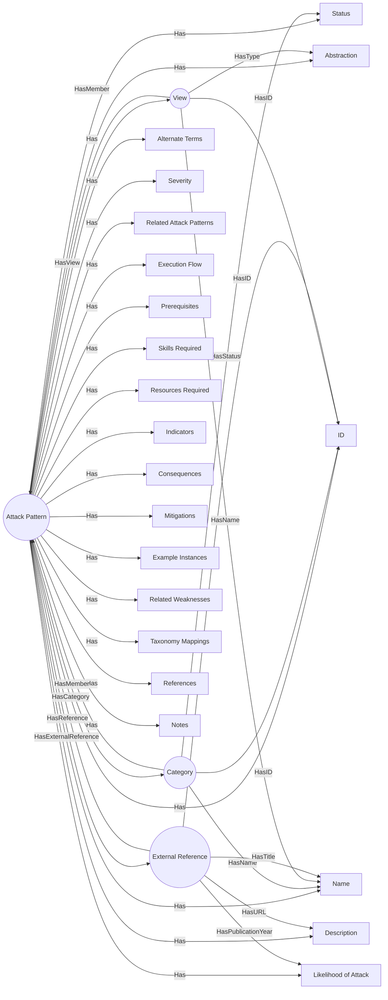

## 2.5 CAPEC (Common Attack Pattern Enumeration and Classification)

### 2.5.1 Summary
The **Common Attack Pattern Enumeration and Classification (CAPEC)** is a comprehensive dictionary of attack patterns that can be used to identify and categorize the methods attackers use to exploit vulnerabilities. Each CAPEC entry includes a unique identifier, a description of the attack pattern, and examples of how it can be executed.

### 2.5.2 Core Entities and Relationships
The CAPEC framework consists of several core entities that define the structure and relationships within the attack patterns:

#### Attack Pattern Catalog
The Attack pattern catalog is used to hold an enumerated catalog of common attack patterns and contains:

* **Attack Patterns**
* **Categories**
* **Views**
* **External References**

#### Attack Pattern
The Attack Pattern is an abstraction of an attack which has:

- **Attributes**: Each attack pattern has four attributes

  * **ID (integer)**: Attack pattern identifier. Example: 130
  * **Name (string)**: Attack pattern name. Example: "Excessive Allocation"
  * **Abstraction (AbstractionEnumeration)**: Defines the different abstraction levels of an attack pattern.
    * **Meta**: High level abstraction of attack patterns to architecture and design levels.
    * **Standard**: Specific technique used in a bigger attack. It is usually seen as a piece of the entire attack.
    * **Detailed**: Low level detail of a specific technique targeting a specific technology.
  * **Status (StatusEnumeration)**: Status of the specific Attack Pattern (Deprecated, Draft, Incomplete, Obsolete, Stable or Usable).

- **Elements**: Each attack pattern has several elements that provide detailed information about the attack pattern.

  - Mandatory:
    * ***Description:*** Representation of a high level description of the attack pattern.

  - Optional:
    * ***Alternate Terms:*** Alternative names to describe the same pattern.
    * ***Likelihood Of Attack:*** Captures the average probability that the attack uses a specific pattern to be successful.
      * Possibilities: High, Medium, Low, Unknown.
    * ***Typ Severity:*** Overall average severity value for attacks that leverage this attack pattern.
      * Possibilities: Very High, High, Medium, Low, Very Low.
    * ***Related Attack Patterns:*** Relates the CAPEC identifier to another attack pattern.
    * ***Execution Flow:*** Step-by-step description.
    * ***Prerequisites:*** Prerequisites to an attack.
    * ***Skills Required:*** Skills required to perform the attack.
      * Possibilities: High, Medium, Low.
    * ***Resources Required:*** Resources needed to execute the attack.
    * ***Indicators:*** Activities, events, conditions or behaviors that may indicate that an attack of leveraging this attack pattern is imminent, in progress, or has occurred.
    * ***Consecuences:*** Individual consequences associated with an attack pattern.
    * ***Mitigations:*** Actions to prevent or mitigate the risk of an attack that leverages this attack pattern.
    * ***Example Instances:*** Attack pattern examples.
    * ***Related Weakness:*** References to weaknesses associated with this attack pattern.
      * Example: <Related_Weakness CWE_ID="1021"/>.
    * ***Taxonomy Mappings:*** Similar categories in taxomomies outside of CAPEC.
    * ***References:*** External reference defined within the catalog.
    * ***Notes:*** Additional comments that cannot be captured using the other elements.
    * ***Content History:*** Track of the original author of an entry and any subsequent modifications to the content.

#### Category
Collection of attack patterns based on some common characteristic.

- Attributes: Each category has three attributes Mandatory:
  * ***ID:*** Unique identifier for each category.
  * ***Name:*** Descriptive title.
  * ***Status:*** Status level for each category.

- Elements
  - Mandatory:
    * ***Summary:*** Definition of the category.

  - Optional:
    * ***Relationships:*** Relationships with attack patterns, categories and views.
    * ***Taxonomy Mappings:*** Similar categories in taxomomies outside of CAPEC.
    * ***References:*** More defined information.
    * ***Notes:*** Additional comments that cannot be captured using the other elements.
    * ***Content History:*** Track of the original author of an entry and any subsequent modifications to the content.

#### View
Perspective with which one might look at the collection of attack patterns defined within CAPEC.

- Attributes: Each view has four Mandatory attributes:
  * ***ID:*** Unique identifier for each category.
  * ***Name:*** Descriptive title.
  * ***Type:*** Description about how each view is being constructed.
  * ***Status:*** Status level for each category.

- Elements
  - Mandatory:
    * ***Objective:*** Description about the perspective from which the view has been constructed.

  - Optional:
    * ***Audience:*** Reference of target stakeholders or group for whom the view is most relevant.
    * ***Members:*** Defined externally through memberOf relationships.
    * ***Filter:*** XSL query for identifying which attack patterns are members of an implicit slice.
    * ***References:*** More information about each view.
    * ***Notes:*** Additional comments that cannot be captured using the other elements.
    * ***Content History:*** Track of the original author of an entry and any subsequent modifications to the content.

#### External Reference
Collection of elements that provide a pointer to where more information and deeper insight can be obtained.

- Attributes:
  * ***Reference ID:*** Unique identifier for each reference.

- Elements:
  - Mandatory:
    * ***Title:*** Reference.

  - Optional:
    * ***Author:*** Reference.
    * ***Edition:*** Identification of the edition.
    * ***Publication:*** If the reference is part of a magazine or journal, this element should be used to identify the name of the publisher.
    * ***Publication Year***
    * ***Publication Month***
    * ***Publication Day***
    * ***Publisher:*** More specs about the publisher.
    * ***URL:*** Material being referenced.
    * ***URL Date:*** Date when the URL was validated to exist.

#### Global Types
- **Complex Type Summary:**
  * ***AlternateTermsType***
  * ***AudienceType***
  * ***ConsequencesType***
  * ***ContentHistoryType***
  * ***ExampleInstancesType***
  * ***ExcludeRelatedType***
  * ***ExecutionFlowType***
  * ***IndicatorsType***
  * ***MitigationsType***
  * ***NotesType***
  * ***PrerequisitesType***
  * ***ReferencesType***
  * ***RelatedAttackPatternType***
  * ***RelatedWeaknessesType***
  * ***RelationshipsType***
  * ***RequiredResourcesType***
  * ***SkillsType***
  * ***TaxonomyMappingsType***

#### Enumerations
- **Simple Type Summary:**
  * ***AbstractionEnumeration***: Defines the different abstraction levels of an attack pattern.  
    - Meta: High level abstraction of attack patterns to architecture and design levels.
    - Standard: Specific technique used in a bigger attack. It is usually seen as a piece of the entire attack.
    - Detailed: Low level detail of a specific technique targeting a specific technology.
  * ***ImportanceEnumeration***: The ImportanceEnumeration simple type lists different values for importance.
    - Normal: Normal importance.
    - Critical: Critical importance.
  * ***LikelihoodEnumeration***: The LikelihoodEnumeration simple type contains a list of values corresponding to different likelihoods. The value "Unknown" should be used when the actual likelihood of something occurring is not known.
    - High: Attack pattern is very likely to be used.
    - Medium: Attack pattern is moderately likely to be used.
    - Low: Attack pattern is not very likely to be used.
    - Unknown: Likelihood of attack pattern usage is unknown.
  * ***NoteTypeEnumeration***: The NoteTypeEnumeration simple type defines the different types of notes that can be associated with an attack pattern. A "Maintenance" note contains significant maintenance tasks within this entry that still need to be addressed, such as clarifying the concepts involved or improving relationships. A "Relationship" note provides clarifying details regarding the relationships between entities. A "Research Gap" note identifies potential opportunities for the research community to conduct further exploration of issues related to this attack pattern. A "Terminology" note contains a discussion of terminology issues related to this attack pattern, or clarifications when there is no established terminology, or if there are multiple uses of the same key term.
    - Maintenance: Significant maintenance tasks within this entry that still need to be addressed.
    - Relationship: Clarifying details regarding the relationships between entities.
    - Research Gap: Potential opportunities for the research community to conduct further exploration of issues related to this attack pattern.
    - Terminology: Discussion of terminology issues related to this attack pattern.
  * ***RelatedNatureEnumeration***: The RelatedNatureEnumeration simple type defines the different values that can be used to define the nature of a related attack pattern. A ChildOf nature denotes a related attack pattern as a higher level of abstraction. A ParentOf nature denotes a related attack pattern as a lower level of abstraction. The CanPrecede and CanFollow relationships are used to denote attack patterns that are part of a chaining structure. The CanAlsoBe relationship denotes a attack pattern that, in the proper environment and context, can also be perceived as the target attack pattern. Note that the CanAlsoBe relationship is not necessarily reciprocal. The PeerOf relationship is used to show some similarity with the target attack pattern which does not fit any of the other types of relationships.
    - ChildOf: Related attack pattern is a higher level of abstraction.
    - ParentOf: Related attack pattern is a lower level of abstraction.
    - CanPrecede: Related attack pattern can be part of a chaining structure.
    - CanFollow: Related attack pattern can be part of a chaining structure.
    - CanAlsoBe: Related attack pattern can also be perceived as the target attack pattern.
    - PeerOf: Related attack pattern shows some similarity with the target attack pattern.
  * ***ScopeEnumeration***: The ScopeEnumeration simple type defines the different areas of software security that can be affected by exploiting a weakness.
    - Confidentiality: The attack pattern affects the confidentiality of the system.
    - Integrity: The attack pattern affects the integrity of the system.
    - Availability: The attack pattern affects the availability of the system.
    - Access Control: The attack pattern affects the access control of the system.
    - Accountability: The attack pattern affects the accountability of the system.
    - Authorization: The attack pattern affects the authorization of the system.
    - Authentication: The attack pattern affects the authentication of the system.
    - Non-Repudiation: The attack pattern affects the non-repudiation of the system.
    - Other: The attack pattern affects other areas of software security.
  * ***SeverityEnumeration***: The SeverityEnumeration simple type contains a list of values corresponding to different severities.
    - Very High: Attack pattern is very severe.
    - High: Attack pattern is severe.
    - Medium: Attack pattern is moderately severe.
    - Low: Attack pattern is not very severe.
    - Very Low: Attack pattern is very low severity.
  * ***SkillLevelEnumeration***: The SkillLevelEnumeration simple type contains a list of values corresponding to different knowledge levels required to perform an attack. The value "Unknown" should be used when the actual skill level is not known.
    - High: Attack pattern requires a high level of knowledge.
    - Medium: Attack pattern requires a medium level of knowledge.
    - Low: Attack pattern requires a low level of knowledge.
    - Unknown: Skill level is unknown.
  * ***StakeholderEnumeration***: The StakeholderEnumeration simple type defines the different types of users within the CAPEC community.
    - Academic Researchers: Academic researchers who study attack patterns.
    - Applied Researchers: Applied researchers who study attack patterns.
    - Assessment Customers: Customers who assess attack patterns.
    - Assessment Vendors: Vendors who assess attack patterns.
    - CAPEC Team: The CAPEC team who maintain the attack patterns.
    - Educators: Educators who teach about attack patterns.
    - Information Providers: Information providers who provide information about attack patterns.
    - Software Customers: Customers who use software that may be affected by attack patterns.
    - Software Designers: Designers who design software that may be affected by attack patterns. 
    - Software Developers: Developers who develop software that may be affected by attack patterns.
    - Software Vendors: Vendors who provide software that may be affected by attack patterns.
    - Other: Other stakeholders who may be affected by attack patterns.
  * ***StatusEnumeration***: The StatusEnumeration simple type defines the different status values that an entity (view, category, attack pattern) can have.
    - Deprecated: The entity is deprecated.
    - Draft: The entity is in draft status.
    - Incomplete: The entity is incomplete.
    - Obsolete: The entity is obsolete.
    - Stable: The entity is stable.
    - Usable: The entity is usable.
  * ***TaxonomyMappingFitEnumeration***: The TaxonomyMappingFitEnumeration simple type defines the different values used to describe how close a certain mapping to CAPEC is.
    - Exact: Indicates that one attack pattern is an exact match to another in a different taxonomy.
    - CAPEC More Abstract: Indicates that one attack pattern is a more abstract version of another in a different taxonomy.
    - CAPEC More Specific: Indicates that one attack pattern is a more specific version of another in a different taxonomy.
    - Imprecise: Indicates that the mapping is not precise and may require further clarification.
    - Perspective: Indicates that the mapping is based on a specific perspective or context.
  * ***TaxonomyNameEnumeration***: The TaxonomyNameEnumeration simple type lists the different known taxomomies that can be mapped to CAPEC.
    - CAPEC: Common Attack Pattern Enumeration and Classification.
    - CWE: Common Weakness Enumeration.
    - CVE: Common Vulnerabilities and Exposures.
    - CVSS: Common Vulnerability Scoring System.
    - D3FEND: Detection, Denial, and Disruption Framework Empowering Network Defense.
    - OWASP: Open Web Application Security Project.
    - NVD: National Vulnerability Database.
    - WASC: Web Application Security Consortium.
    - PCI DSS: Payment Card Industry Data Security Standard.
    - CISQ: Consortium for IT Software Quality.
  * ***TechnicalImpactEnumeration***: The ImpactEnumeration simple type defines the different negative technical impacts that can results from an attack leveraging a given attack pattern. A negative technical impact is the specific effect of successfully violating a reasonable security policy for the system or network.
    - Modify Data: The attack pattern modifies data.
    - Read Data: The attack pattern reads data.
    - Unreliable Execution: The attack pattern causes unreliable execution.
    - Resource Consumption: The attack pattern consumes resources.
    - Execute Unauthorized Commands: The attack pattern executes unauthorized commands.
    - Gain Privileges: The attack pattern gains privileges.
    - Bypass Protection Mechanism: The attack pattern bypasses a protection mechanism.
    - Hide Activities: The attack pattern hides activities.
    - Alter Execution Logic: The attack pattern alters execution logic.
    - Other: The attack pattern has other negative technical impacts.
  * ***ViewTypeEnumeration***: The ViewTypeEnumeration simple type defines the different types of views that can be found within CAPEC. A graph is a hierarchical representation of attack patterns based on a specific vantage point that a user my take. The hierarchy often starts with a category, followed by a meta/standard attack pattern, and ends with a detailed attack pattern. An explicit slice is a subset of attack patterns that are related through some external factor. For example, a view may be used to represent mappings to external groupings like a Top-N list. An implicit slice is a subset of attack patterns that are related through a specific attribute. For example, a slice may refer to all attack patterns in draft status, or all existing meta attack patterns.
    - Graph: A hierarchical representation of attack patterns based on a specific vantage point.
    - Explicit Slice: A subset of attack patterns that are related through some external factor.
    - Implicit Slice: A subset of attack patterns that are related through a specific attribute.

#### Structured Text
- **Complex Type Summary:**
  * ***StructuredTextType***
  * ***StructuredTextWithLinkType***
  * ***StructuredTextWithLinkAndNoteType***

#### Relationships
The relationships within the CAPEC framework are categorized into two main types:

1. **Hierarchical Relationships**: These relationships define the parent-child structure of attack patterns, allowing for a clear understanding of how different patterns relate to one another in terms of abstraction levels.
   - **ChildOf**: Indicates that one attack pattern is a more specific version of another.
   - **ParentOf**: Indicates that one attack pattern is a more general version of another.
   - **PeerOf**: Indicates that two attack patterns are at the same level of abstraction.
   - **CanFollow**: Indicates that one attack pattern can be executed after another.
   - **CanPrecede**: Indicates that one attack pattern can be executed before another.
   - **CanAlsoBe**: Indicates that one attack pattern can be classified in multiple ways.
  
2. **Taxonomy Relationships**: The TaxonomyMappingsType complex type is used to provide a mapping from an entry (Attack Pattern or Category) in CAPEC to an equivalent entry in a different taxonomy. The required Taxonomy_Name attribute identifies the taxonomy to which the mapping is being made. The Entry_ID and Entry_Name elements identify the ID and name of the entry which is being mapped. The Mapping_Fit element identifies how close the CAPEC is to the entry in the taxonomy.  
The TaxonomyMappingFitEnumeration simple type defines the different values used to describe how close a certain mapping to CAPEC is.

   - **Exact**: Indicates that one attack pattern is an exact match to another in a different taxonomy.
   - **CAPEC More Abstract**: Indicates that one attack pattern is a more abstract version of another in a different taxonomy.
   - **CAPEC More Specific**: Indicates that one attack pattern is a more specific version of another in a different taxonomy.
   - **Imprecise**: Indicates that the mapping is not precise and may require further clarification.
   - **Perspective**: Indicates that the mapping is based on a specific perspective or context.

### 2.5.5 Graph Representation

[CAPEC - Graph](https://mermaid.live/edit#pako:eNp9VmtvozgU_SvI0kgZqa2apEkn-bASS9wZVF4L9LWTUeQGN7EKmDFmJtmm_31tCK_Uu_2S4nM49_r63GvewJpGGMzBhqFsq1n-MtXE36dPmkEZ1mDKCSc411Cu2YikmiPYecXRvcFA5xytXzUPcY5Z-vlzhRh6OBgYiOMNZft68d6ED4PBPcG_6xX4GK58eDMYwJ18G8Waj18ww-kaS0qTiQjCyHPB68Dm4vsSmIsl-FE9O7oNxYqDEtys6X8Goa8boek6AtKfc87QmhOaNowg1MO7QIABR7zIy_UmJIxxglN-DLiAgSGIC5yvGcl6KroVQt_RQ7gSv7aU0-NyMxxrIWZJ3jAt8xZa5jfXldlb5BXHZEtppNEXrapimxm8h74ZPsnc8C_MCN83mA8tEWyx0j2B-jgWcSKtfwptSPgIjdWN5T4ILtzhdSFT125i-ruheD704V93ZmCGUGbvMXEAPwuSE1nuJqNb07LKWr2SOM7FOQkKw1EnrcC9841Swsc5LdgaK2imszCFOVxf8sw0ImvEKWvjGK4TiGygUykZNM2FhDREy7HN0Pyqy4OVFFvYc4Pkvrrb1m3PKhXgDiVZjDUzzTnqydSFfID6rQODoFPOB4xeU5znHXaoP7qOaz-tbN3zTOerpIdoR1Oa7EVjZBlJN13tG1FVpy7H0dMt7rhVsR1aF7kxXpmD3M2WZE2faefnf2iHbyg_CO8rFmUDKJY7PaBAK__XoXuQ9LtKr-91BaP1uCrg0dYKqHW1AmxcrMB69lXFLI2rjHg0rKrGjUsVYNeiCrjjTuVWKmf-TwlqPyooH0yolKmtp_KJq6pSPagPcm5_QOXAPpTD-wNUj-3G4Yd6pDfXQMO1cfKMmfCQ194G_wkeVRq8E6CmdLXNRdsX3XV5IXSbo4tVQ7_tgg85dUV7wKlqDwz3GVY03umGuuKnWEh43AtwSrjzrW6LnsJe8RzLuSqGyBNGrN-U4Exc9CQC8xcU5_gMJOKKQvIZvEm1JeBbLG_Rufg3QkzcScv0XbyUofRvShMw56wQrzFabLb1Q5FFwkELgsQnRNIoi_OKMDNokXIwH06_lBpg_gZ2YD6aTi7Gw-vheHo5ml5PppOrM7AH8_PxbHJxdTW7nF3PJrOhILyfgX_KsMOL6fhqNB0NR5fj8ZfRbCbewBERl4ddfb6UXzHv_wJYxJwQ)
