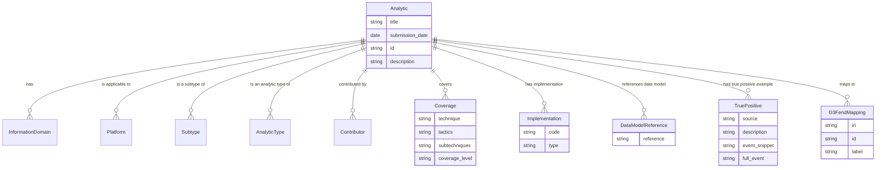
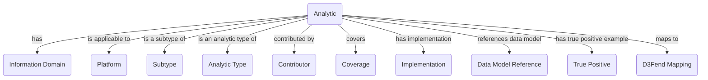

## 2.8 CAR (Cyber Attack Response)

### 2.8.1 Summary
The **Cyber Attack Response (CAR)** framework focuses on incident response strategies and protocols for mitigating cyberattacks. It provides organizations with a structured approach to responding to security incidents, including preparation, detection, analysis, containment, eradication, and recovery.

CAR focuses on incident response frameworks and strategies for mitigating cyberattacks. It acts as a central hub connecting defensive measures (D3FEND), attack patterns (ATT&CK), and mitigation protocols.

### 2.8.2 Framework Structure
- **Incident Response Phases**: Includes phases like detection, containment, eradication, recovery, and post-incident analysis.
- **Framework Alignment**: Aligns with NIST's incident response framework and other industry standards.

### 2.8.3 Integration with the Model
- **Nodes**: Represented as response hubs (e.g., "Incident Response Team", "Containment Protocol") with attributes like:
  - **Mass**: Reflects the urgency of the response phase (e.g., containment has higher mass than post-incident analysis).
  - **Energy**: Represents the resources required for execution.
- **Edges**: Represent relationships such as:
  - "CAR-XYZ triggers D3FEND-ABC" (edge with directionality and intensity based on urgency).

### 2.8.4 Relationships with Other Standards
- **CAR ↔ ATT&CK**: Direct mapping to attack patterns requiring specific response actions.
- **CAR ↔ D3FEND**: Integrated into mitigation workflows for real-time defense.
- **CAR ↔ CVSS**: Used to prioritize responses based on vulnerability severity (e.g., high-CVSS vulnerabilities trigger higher-priority CAR protocols).

### 2.8.5 Schema Representation
To create a schema for the YAML files representing Analytics objects from the CAR (Cyber Analytics Repository) standard, we need to identify common elements across these files. Here's a proposed schema based on the provided excerpts:

```yaml
title: ""
submission_date: ""
information_domain:
  - ""
platforms:
  - ""
subtypes:
  - ""
analytic_types:
  - ""
contributors:
  - ""
id: ""

description: ""

coverage:
  - technique: ""
    tactics:
      - ""
    subtechniques:
      - ""
    coverage_level: ""

implementations:
  - code: |-
      # Implementation code here
    type: ""

data_model_references:
  - ""

true_positives:
  - source: ""
    description: ""
    event_snippet: ""
    full_event: ""

d3fend_mappings:
  - iri: ""
    id: ""
    label: ""
```

#### Explanation:

- **Metadata Fields**:
  - `title`, `submission_date`, `id`: Basic identifiers for the analytic.
  - `information_domain`, `platforms`, `subtypes`, `analytic_types`, `contributors`: Categorize and describe the context of the analytic.

- **Content Fields**:
  - `description`: A brief explanation of what the analytic does or represents.
  
- **Coverage**:
  - Describes which techniques, tactics, and subtechniques are covered by this analytic, along with a coverage level (e.g., "Moderate").

- **Implementations**:
  - Contains code snippets for implementing the analytic in various formats (e.g., pseudocode).

- **Data Model References**:
  - Lists references to data models used within the analytic.

- **True Positives**:
  - Provides examples of events that are true positives for this analytic, including source information and event details.

- **D3Fend Mappings**:
  - Maps analytics to D3Fend's threat intelligence framework, specifying IRIs, IDs, and labels.

This schema captures the essential elements found in the provided YAML files while allowing flexibility for additional fields as needed.

### 2.8.6 ERD Representation

[](https://mermaid.live/edit#pako:eNqNVF2L4jAU_Sshz45oP6z2bVEW5kEYZudpESRNrxo2TTJJKuM6_vdNWlt1W9EiyP04OSf33twjpjIHnGLQC0a2mhQrgdz3QxB-sIyiY237z1jNxBZZZjlcvDmxgEyZFcwYJsXa2x0MyzuuHAzVTFmHqWOn-u8__u_vlxd5RK9iI3VBfPZCFoQJlKIV3hGzwv2AN06sh1R5zCCiFGeUZByQlfdAv8rMHhS0GH-vyiE39yCN_XGNE-53TnsAn0vhypGVVuoKTRsbcpQdPKrGzeUeNNlCXz-A7gT7LLtVt4Q6KtPx-1s1oG6UnqnWHPbAn-hNq62-gDPMRfhroTgUIGzVux75fv66yl3VWuY7E3F78HkcELtxX3QsiCVLR8XfYQMaBO0rpW5iD7h7DvP8Ldz4V0FQ4VMuEj50CW_SMMv2feRGlprC43dyFXMNEnZtBFMKbCe6KTlfVylPNPFGXFNM65xINV74Ir64VzUNf4LIl-5pebrujZhmz2wCTrKrObtT8Rsqr68gylRPGQ_wVrMcp17tABfg9oQ3cSVohe3OzcMKe0xO9B8v_-QwiojfUhYNTMtyu2uMUvktdl6IbYYTAHouS2FxGsTVCTg94i-cxsEwmc7G8SyORqMgTKLJAB9wOk4mw2A6i5NRPE6iJIxPA_y34hwNp-E4jMNwFo2DcDKJggGGnLktsKzXcbWVT_8AsWXN0A)

#### Explanation:

- **Entities**:
  - `Analytic`: Represents the main entity with basic metadata and descriptions.
  - `InformationDomain`, `Platform`, `Subtype`, `AnalyticType`, `Contributor`: Related entities that provide context for the analytic.
  - `Coverage`: Describes which techniques, tactics, and subtechniques are covered by the analytic.
  - `Implementation`: Contains code snippets for implementing the analytic.
  - `DataModelReference`: References to data models used within the analytic.
  - `TruePositive`: Examples of true positive events for this analytic.
  - `D3FendMapping`: Maps analytics to D3Fend's threat intelligence framework.

- **Relationships**:
  - The relationships are represented with one-to-many (`||--o{`) indicating that an analytic can have multiple entries in each related entity.

This ERD provides a visual representation of how the different components of your YAML files relate to each other.

### 2.8.7 Graph Representation
The CAR framework can be represented as a graph with nodes and edges, where:
Certainly! Below is a Mermaid code snippet that represents the schema of your YAML files as a Graph Diagram:



[](https://mermaid.live/edit#pako:eNp1lE2PmzAQhv-KNadWYqMkBAgcKq02qtRDpFWbU8XFASexFmzLmNWmIf-9Y4i9pCWIw3y8M8P4Eb5AIUsGGRw1VSey2-QiFwSfZ0Grs-HFlxycmcPXIfdDHKSuqeFSbGRNuUDRKEaGoJe_VtTYJKqc6XO_2r05K4apm-UzbupuSDuX7MaiFymM5vvWSI2akdcrnOadaXpkvWAwPzepVcVqJkz_4XaNu4DXbaihWzyo6ic7MM1EYbvZIOmjxId9xU637FU23PB3q7Uucf5n2_A7E-WWKsXF0XbsfXILjHbw2z89fetOtOn-ZzAh5A3BThUv6L5ixMjOo3ggJs0AgchD59A8kAp8byFfMUY2UVY4PKwk-3M3hje5Z2FpNZ0HOH0UhN8h6_5hOlGkHayGlBZhbRF2E4wfDDSWpbqxJOyD2oHdHfGJypqqpmdwBx0C_PN4CZltGkDNkKl14WJb5GBOuEoOGZol1W855OKKNYqK31LWrkzL9nhyTqtwK7bhFH9pVBxo1VgJzmT6RbbCQLZM-xaQXeADsmg5S9bpIkqj1Xy-DJNVHMAZskUSz5brNErm0SJZJWF0DeBPP3Q-W4eLMArDOEZ1GqdRAKzkyHE7XCb9nXL9C1Mkdio)

#### Explanation:

- **Nodes**:
  - `Analytic`: The central node representing the main entity.
  - Other nodes represent related entities like `InformationDomain`, `Platform`, etc.

- **Edges**:
  - Directed edges (`-->`) show relationships between the `Analytic` and other entities, with labels describing the nature of each relationship (e.g., "has", "is applicable to").

This graph diagram provides a visual representation of how different components are interconnected within your YAML files.
