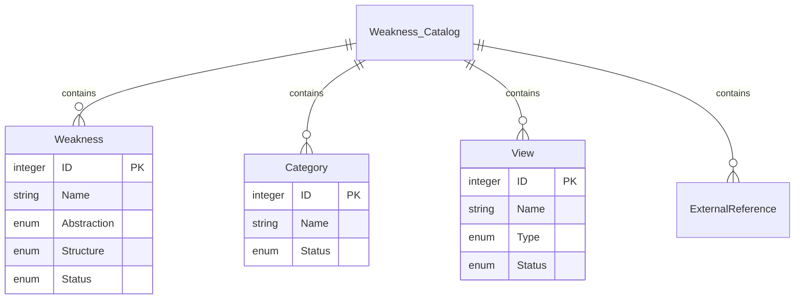
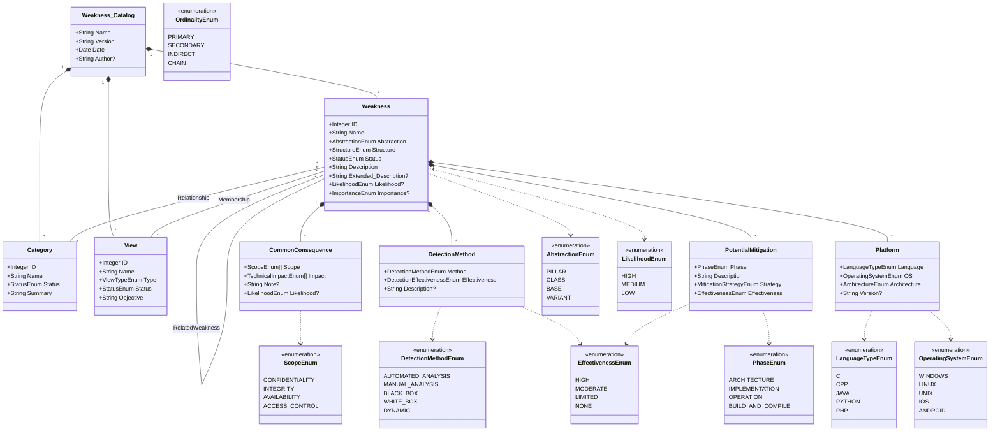
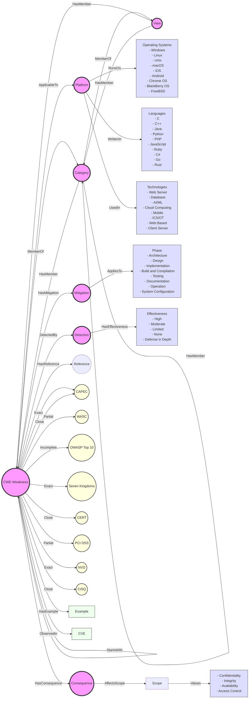

## 2.4 CWE (Common Weakness Enumeration)

### 2.4.1 Summary
The **Common Weakness Enumeration (CWE)** is a community-developed list of common software and hardware weaknesses. It provides a standardized way to identify and categorize weaknesses, helping organizations prioritize remediation efforts. Each CWE entry includes a unique identifier, a description, and examples of the weakness in practice.

### 2.4.2 Core Entities

The CWE entries form a hierarchical tree with different abstraction layers:

- **Pillar**
   - Highest-level abstractions
   - Example: CWE-118 (Incorrect Access of Indexable Resource)
   - Cannot have 'ChildOf' relationships

- **Class**
   - Language and technology independent
   - Example: CWE-119 (Improper Restriction of Operations within Memory Bounds)
   - Child of Pillar abstractions

- **Base**
   - More specific than classes
   - Example: CWE-787 (Out-Of-Bounds Write)
   - Child of Class abstractions

- **Variant**
   - Most specific weakness types
   - Example: CWE-121 (Stack-based Buffer Overflow)
   - Child of Base abstractions

Entities can have the following status:
- **Stable**: Verified and unlikely to change
- **Usable**: Extensively reviewed with critical elements verified
- **Draft**: Important elements filled but may have gaps
- **Incomplete**: Missing important elements
- **Obsolete**: Valid but no longer relevant
- **Deprecated**: Removed from CWE

#### Weakness_Catalog
```xml
Primary Attributes:
- Name (required): String
- Version (required): String
- Date (required): Date
- Author (optional): String

Contains:
- Weaknesses
- Categories
- Views
- External_References
```

#### Weakness
```xml
Primary Attributes:
- ID (required): Integer
- Name (required): String
- Abstraction (required): Enum
- Structure (required): Enum
- Status (required): Enum

Contains:
- Description
- Extended_Description
- Related_Weaknesses
- Common_Consequences
- Detection_Methods
- Potential_Mitigations
```

#### Category
```xml
Primary Attributes:
- ID (required): Integer
- Name (required): String
- Status (required): Enum

Contains:
- Summary
- Relationships
- Taxonomy_Mappings
```

#### View
```xml
Primary Attributes:
- ID (required): Integer
- Name (required): String
- Type (required): Enum
- Status (required): Enum

Contains:
- Objective
- Audience
- Members
- Filter
```

Here's a summary of the Weakness_Catalog and its core entities as a simple Entity-Relationship Model (ERD):



[erDiagram](https://mermaid.live/edit#pako:eNqlUl1Lw0AQ_CvHPqcld2nTJG_S-iCCiIqCBORMtmlos1cud9ia5r97jf2gKip0n25md2aH5RrIVI6QAOpJKQstq5SYqyeUc8K6fhlLIxeqYJtNr6eaA88SlikysqT6d4GDWCi9_rfgscS3fw9frgxqkos7nKJGyvBEeaplzSfeVkkuFWp2NWG310e6Nrqkgt3ICo8kkq3YxavrycyUir507o22mbEav_HS2F38dp_lcI1zsvzo3J3tHNeH9fLPRSmBB4Uuc0imclGjBxXqSm4xdLtTMDN01pC4Zy71PIWUWidaSnpWqoLEXcvJtLLFbA_sMndn2X2_wwRSjnqsLBlI-LBzgKSBlUN-2A-FP4oDHkaDURhwD9aOFrw_EEEQ8YHrCDESrQfv3VK_H4U85sEw5JHw4yiI2w-jh-uL)


### 2.4.2 Relationships

The nature of relationships depends on abstraction layers:
- **Hierarchical**
   - ChildOf: Points to higher abstraction
   - ParentOf: Points to lower abstraction
   - PeerOf: Same abstraction level

- **Sequential**
   - StartsWith: Initial weakness in chain
   - CanPrecede: Can lead to target weakness
   - CanFollow: Can result from target weakness

- **Compositional**
   - RequiredBy: Part of composite weakness
   - Requires: Depends on other weakness
   - CanAlsoBe: Alternative classification

Or is a Taxonomy Relationship:
- **Mapping Types**
   - Exact: Perfect match
   - Close: Almost complete match
   - Partial: Some overlap
   - Incomplete: Limited match

- **Target Systems**
   - CAPEC (Common Attack Pattern Enumeration and Classification)
   - WASC (Web Application Security Consortium)
   - OWASP Top 10
   - Seven Pernicious Kingdoms
   - CERT Secure Coding Standards
   - PCI DSS Requirements
   - NVD (National Vulnerability Database)
   - CISQ (Consortium for IT Software Quality)

### 2.4.3 Additional Properties

#### Common Consequences
Elements:
- **Scope**: Security property violated
- **Impact**: Technical impact of exploitation
- **Likelihood**: Relative probability
- **Note**: Additional context

#### Detection Methods
Contains:
- **Method**: Detection technique
- **Description**: Application context
- **Effectiveness**: Detection reliability
- **Effectiveness_Notes**: Strengths/limitations

#### Potential Mitigations
Elements:
- **Phase**: Development lifecycle stage
- **Strategy**: Protection approach
- **Effectiveness**: Prevention reliability
- **Description**: Implementation details

### 2.4.4 Model Representation

Here's a class diagram representation using Mermaid:



[classDiagram](https://mermaid.live/edit#pako:eNqdV21zozYQ_iuMPl5znthOHdtzkxsZ6Fk9XjyA46Z1x6OAgmkMuCB658vkv1eAbQQoCRd_8GhXj7SPVrur5Qm4sUfAFLg7nKZKgP0Eh-tIYr9CI60IfoxImm5kTPEu9qWncjb__WLTJIh8ycAhaWtvSZIGccRNKJgSKf9rg2FGt3HyuZx4XkciCjXTKKLEJ4mElDf5wPuUJtiljIwaZaHEyfW1mUuzhBSYs1RDYJqlx-l82LaskNRNgn1763xS_U5J5BFvw6E-czAteCS7YBvHXmGjEnkQCvdxQnHkljwrUew7dmvEj5PDe33X4cx2FoY4OQjN3wbk23tN52udw748Zz74OVrm_T-E3fF_ROyXOAzjSI6jlPybEea-ely7cWn3r7-lYszNOcTdRoGLd8z1LIiOqFIQnCmm5GfuuEFTIZQUgaoTlh9ejWRjrtivHIpA6sND6Y48kwpsTfNqKIu5LdjRIhrgnR7QwMc5sMZvscVpeXnFqGuyVLsxWB69h1NCFgKH7HSkJukdpg9xEtaYajjyM-yTc7SdFBzG3BNGgNG2DyklYQEzbb7KJO42yJ19KiG84sXqKHZts2JxZD99IkxTcImjm5tqYoE0DVqVLGvQ5vjNoK1W0i20EDScLjHXmQBcOqYOHVXZQANqdzbirOvQWEJNMDHToPx1MzP_qFSrOXLUukq5M6COZCHddhR0ITtHX-YcPVNRLUa90mhIZyy4ImWYhiq038jodxhXFbTUOdPmSmyoGaVdTMnccLGohN_hLeRi586ZmwYnzxdCCqIk6MJihQzFXNm8e40ld79LA3ES4vMKGoplnl6LJp3ECyK8C-ihe5ZYSIfWXaWwVdk0lJqKkUWWKjuc6-YQGUIK55ei222Yxm9IUQ0HQQ05NZOO-sWqqdgFIQ3OUB0IZVm17Q3byLFMTVziznW3U9Zacp5vsrO0uPBH-kJTdUYUOogPDHOR50lNNVsiLU95hZHSWRFqZkmrgVyD_hpIHz5-ZKMPbHQCdISfOpqO8LyLaFI5TrUYSFPJIuyBIJ6YU3Pdubk6rmOuTbfB_vVFRUs0ZS91eM-eABG8cd5mp_IGvlG-30ALHvG3Vhxf0JZTe72b5sMlQNTLZQloN2M58pxaJajZCuUQwVP1Mrj1UJRQURuTw89p9DrspV1PfUZx5kblFkAElRVcAD8JPDB9wLuUXACWvSHOZVDk9RrQLWENM5iyoYeTxzVYR89s0R5Hf8ZxCKbsE4YtS-LM356EbO-xmD1-5p0R-VdJIsdZRMF0UmwApk_gO5j2L0e90eDyejLsj8ZX16Nh_wIcmHrQ710NhsNx_4rNDAbXg-cL8KOwedkbj_qT_vDXUX88uJyMh5Pn_wHOolHN)

### 2.4.5 Graph Representation



[graphDiagram](https://mermaid.live/edit#pako:eNqFV3tv2zYQ_yqCigIuqjxsZ2niPwY4stJ4tWPPcuNucVHQEm0RkUiNpJJ4db77jpJIya8uQBTynuTx7neXn3bAQmx37BVHaWQNJnNqwc_795bLOLY8KokkWFhIWENEqHUP0qKQcWdeowEfa4bRE8VCfPhQMrpTYCCJV4yvNfGh780ajQeCX4zY6N4HOUYF_ifDNMCaMeyD_hD8rpAkjGpyzwNyD0sc1KnjgfI2jpFcMp5o6sS7bTQmeIm5NmzupUXhblmCee6ivNHI_zH9a-z5j3N7lOYsurL8tZA4KSVOrBmhIXsx2wGh2avefKXErBMUjHy9IdWyS0POSKi3bsRZgq2KfxOj4OkGc76uEW85xjd-b25_1xcZdO8_m8MOEF1laIXNqVyz-PhRL_9Az0ivx2sZMWp2d-O6kB9wkkpNmWSLtbH2Tq8-s4ovZO1cU8-9M-ea4iCiLGYrUh1thheWj_kz5prSQxItkMAmQv2z4cC4jFkWQi4maaZeQ5OHbEFio9F3_bPRtO7hBuxVMY4JplJ7rc46vuv63o-H7gCOOo7qJ-BBRFSeZdzQeliQlQlZP0ljnIDVPH3M22UkDi1EiwOTeIs5xaJ-gx4Lsj0DZdZVhCL5wBxdklVW8qobeLe35fm95VLVxTNWhai178gqqiIWKtu4StwErmhidM9o7apLDEVpQbn3cCqjmkOonyl6ZZQl6y0o6I49F2pZ_dElOOv6QFJfTRnBZtxo5H-sKUut5rlm-eMvjYaP4fjWFwhSyJIKTbyJghP4mpJ3-1Dxbt_q-b6m3T_0Gg34GK2-_ydowXer-HNQm-DiZURE0grLrJOT362NG8ETjpYbRdlhjRGAiTzCw5gf5riI3rI4Zi9HmGOOAxziQ9wJ4CLhOLxZ_4IrjtjtxoLdHDTrS8SlmBEZlVwTnR7YC2T1wkOUpvAawnoBYeuWAGud4t2Qea8okJsiB3bPETOBD7MgmpKgeJPnyQ6vTwOmCkyCbp4thz1C0hzxB8lyzB3kzWFrkDxHrEES1VOobGxnqpcdzKXutNC_Q2KIkwXm9Vc4xOxOd5gFRyWUaps7x6qYRlFJHfd5mKt095si9FdEYlH11jLZMipGdGM65C5_xomUmPZBpOpMu0JfAZOVRNUjdm7WTdOYBGgR4ynb5IpbpWsGhTOAX3izHW24XE1mk88X1aRReshhUvgBS0HCd0dj7zHffC9xSFEK0QcUZ6q6clKJsicFEoeAA5BMRJrO2KeQFLxG6D5DGBE0qTotCACclQnJWbyNqmauOasGn_37VbyNmpLMuFQLHxZ57HRr27FRuCkgBeYpM1gZD1t9ZKMbTCFnDmsGK5E3OyggVa1i_7xGcKMmsn1-qQl-vj2W6-87UqOFUH07Txz3wXuE33rcfLmOsepYhJLaJBfESAigWuql5NpakjjuvFteLx0BsX_CnXftdrtcn7yQUEadi_R1R1dqHCy1l-Fx7daeNobxstQMw1_4be5pch21Uh22_6NuwqFSYF0EpR4JFU4HKt5RUOCocnAgaxx4eCcvzyJKWwoKsh2FzU6OwA6AraNw1QEAdQArHQWLJkR1VY0RToUETlXyjqknxySpU6ZZHrO6Ke-bA-9dBcR24P8UEtqdJYoFdmyY3xOk9vZPpTa3ZQRT2dzuwDJE_Gluz-kbKKWI_s1YYnckz0CNs2wV6U2WhoDoPYLgP6BKAlMYl1yWUWl3mu3cgt35ab_C7vzy9LJ1_um63by8uvh02W469hrIrebpRavdvmpeAKfV-tR6c-x_c6fnp1eXzetm-7fL5lXr_Pqqff32H_1XC58)


