# Draft

## 📖 Table of Contents

- [Draft](#draft)
  - [📖 Table of Contents](#-table-of-contents)
- [Security Standards Model](#security-standards-model)
- [🎯 1. Objective](#-1-objective)
- [📚 2. Summary of Standards](#-2-summary-of-standards)
  - [**2.1 CPE (Common Platform Enumeration)**](#21-cpe-common-platform-enumeration)
    - [2.1.1 Summary](#211-summary)
    - [2.1.2 CPE Entity-Relationship Model (ERD)](#212-cpe-entity-relationship-model-erd)
  - [2.2 CVE (Common Vulnerabilities and Exposures)](#22-cve-common-vulnerabilities-and-exposures)
    - [2.2.1 Summary](#221-summary)
    - [2.2.2 Core Entities](#222-core-entities)
    - [2.2.3 CVE Entity-Relationship Model (ERD)](#223-cve-entity-relationship-model-erd)
  - [2.3 CVSS (Common Vulnerability Scoring System)](#23-cvss-common-vulnerability-scoring-system)
    - [2.3.1 Summary](#231-summary)
    - [2.3.2 CVSSv3 Entity-Relationship Model (ERD)](#232-cvssv3-entity-relationship-model-erd)
    - [2.3.3 Diagram Representation](#233-diagram-representation)
  - [2.4 CWE (Common Weakness Enumeration)](#24-cwe-common-weakness-enumeration)
    - [2.4.1 Summary](#241-summary)
    - [2.4.2 CWE Entity-Relationship Model (ERD)](#242-cwe-entity-relationship-model-erd)
    - [2.4.3 Graph Representation](#243-graph-representation)
  - [2.5 CAPEC (Common Attack Pattern Enumeration and Classification)](#25-capec-common-attack-pattern-enumeration-and-classification)
    - [2.5.1 Summary](#251-summary)
    - [2.5.2 CAPEC Entity-Relationship Model (ERD)](#252-capec-entity-relationship-model-erd)
    - [2.5.3 Graph Representation](#253-graph-representation)
  - [2.6 ATT\&CK (Adversarial Tactics, Techniques, and Common Knowledge)](#26-attck-adversarial-tactics-techniques-and-common-knowledge)
    - [2.6.1 Summary](#261-summary)
    - [2.6.2 ATT\&CK Entity-Relationship Model (ERD)](#262-attck-entity-relationship-model-erd)
- [3. Unified Model](#3-unified-model)
  - [3.1 Summary](#31-summary)
  - [3.2 Unified Entity-Relationship Model (ERD)](#32-unified-entity-relationship-model-erd)
  - [3.3 Graph Representation](#33-graph-representation)
  - [3.4 ERD complete](#34-erd-complete)
- [4. Unified Security Standards](#4-unified-security-standards)
  - [4.1 Unified Security Standards ERD](#41-unified-security-standards-erd)
    - [4.1.1 Key Relationships Explained](#411-key-relationships-explained)
  - [4.2 Enhanced Unified Security Standards ERD](#42-enhanced-unified-security-standards-erd)
    - [4.2.1 Key Enhancements](#421-key-enhancements)
  - [4.3 Enhanced Unified Security Standards ERD with Asset Modeling](#43-enhanced-unified-security-standards-erd-with-asset-modeling)
    - [4.3.1 Key Enhancements and Additions](#431-key-enhancements-and-additions)
      - [1. Asset Management Framework](#1-asset-management-framework)
      - [2. Risk Assessment Integration](#2-risk-assessment-integration)
      - [3. Defense Implementation Details](#3-defense-implementation-details)
      - [4. Tactical Implementation](#4-tactical-implementation)
  - [4.4 Corrected Unified Security Knowledge Graph (Mermaid)](#44-corrected-unified-security-knowledge-graph-mermaid)
    - [4.4.1 What This Corrected Diagram Fixes](#441-what-this-corrected-diagram-fixes)
      - [✅ Semantic correctness](#-semantic-correctness)
      - [✅ RAG-ready reasoning paths](#-rag-ready-reasoning-paths)
      - [✅ Explainability \& trust](#-explainability--trust)
- [5. Ontology Design](#5-ontology-design)
  - [5.1 Ontology Design Principles (Explicit)](#51-ontology-design-principles-explicit)
  - [5.2. Core Ontology Layers](#52-core-ontology-layers)
  - [5.3. Classes (Nodes)](#53-classes-nodes)
    - [5.3.1 Asset \& Environment](#531-asset--environment)
        - [`Asset`](#asset)
        - [`AssetGroup`](#assetgroup)
        - [`AssetConfiguration`](#assetconfiguration)
        - [`Platform (CPE)`](#platform-cpe)
    - [5.3.2 Vulnerability \& Weakness Layer](#532-vulnerability--weakness-layer)
        - [`Vulnerability (CVE)`](#vulnerability-cve)
      - [`VulnerabilityScore (CVSS)`](#vulnerabilityscore-cvss)
      - [`Weakness (CWE)`](#weakness-cwe)
      - [`AttackPattern (CAPEC)`](#attackpattern-capec)
    - [5.3.3 Adversary Tradecraft Layer (ATT\&CK)](#533-adversary-tradecraft-layer-attck)
      - [`Tactic (ATT&CK)`](#tactic-attck)
      - [`Technique (ATT&CK)`](#technique-attck)
      - [`SubTechnique (ATT&CK)`](#subtechnique-attck)
      - [`ThreatActor`](#threatactor)
      - [`Exploit`](#exploit)
      - [`AttackInstance`](#attackinstance)
    - [5.3.4 Defense / Detection / Deception](#534-defense--detection--deception)
      - [`DefensiveTechnique (D3FEND)`](#defensivetechnique-d3fend)
      - [`DetectionAnalytic (CAR)`](#detectionanalytic-car)
      - [`DeceptionTechnique (SHIELD)`](#deceptiontechnique-shield)
      - [`DataSource`](#datasource)
      - [`DataComponent`](#datacomponent)
    - [5.3.5 Engagement, Risk, Evidence](#535-engagement-risk-evidence)
      - [`EngagementConcept (ENGAGE)`](#engagementconcept-engage)
      - [`ResponseStrategy`](#responsestrategy)
      - [`RiskAssessment`](#riskassessment)
      - [`Reference`](#reference)
  - [5.4. Relationships (Edges)](#54-relationships-edges)
    - [5.4.1 Asset \& Configuration](#541-asset--configuration)
    - [5.4.2 Vulnerability Chain (Authoritative)](#542-vulnerability-chain-authoritative)
    - [5.4.3 Attack Abstraction (Conceptual)](#543-attack-abstraction-conceptual)
    - [5.4.4 Exploitation \& Incidents (Contextual)](#544-exploitation--incidents-contextual)
    - [5.4.5 Defense, Detection, Deception](#545-defense-detection-deception)
    - [5.4.6 Engagement \& Response (Strategic)](#546-engagement--response-strategic)
    - [5.4.7 Risk \& Governance](#547-risk--governance)
    - [5.4.8 Evidence \& Provenance (Critical for RAG)](#548-evidence--provenance-critical-for-rag)
  - [5.5. Why This Ontology Works for RAG](#55-why-this-ontology-works-for-rag)
    - [It enables **controlled traversal**](#it-enables-controlled-traversal)
    - [It avoids hallucination](#it-avoids-hallucination)
    - [It supports **explainable answers**](#it-supports-explainable-answers)
  - [5.6. Next Logical Steps](#56-next-logical-steps)
- [6. Align with MITRE schemas](#6-align-with-mitre-schemas)
  - [6.1. Alignment Rules (Critical)](#61-alignment-rules-critical)
    - [Rule 1 — Every ontology class must map to](#rule-1--every-ontology-class-must-map-to)
    - [Rule 2 — Every authoritative edge must be](#rule-2--every-authoritative-edge-must-be)
    - [Rule 3 — No ontology class replaces MITRE semantics](#rule-3--no-ontology-class-replaces-mitre-semantics)
  - [6.2. 1:1 Alignment by Standard](#62-11-alignment-by-standard)
    - [6.2.1 CPE → Platform](#621-cpe--platform)
        - [Source](#source)
        - [JSON structure](#json-structure)
        - [Ontology mapping](#ontology-mapping)
    - [6.2.2 CVE → Vulnerability](#622-cve--vulnerability)
      - [Source](#source-1)
      - [JSON structure](#json-structure-1)
      - [Ontology mapping](#ontology-mapping-1)
      - [Edge alignment](#edge-alignment)
    - [6.2.3 CVSS → VulnerabilityScore](#623-cvss--vulnerabilityscore)
      - [Source](#source-2)
      - [JSON structure](#json-structure-2)
      - [Ontology mapping](#ontology-mapping-2)
      - [Edge](#edge)
    - [6.2.4 CWE → Weakness](#624-cwe--weakness)
      - [Source](#source-3)
      - [JSON structure](#json-structure-3)
      - [Ontology mapping](#ontology-mapping-3)
      - [Edge alignment](#edge-alignment-1)
    - [6.2.5 CAPEC → AttackPattern](#625-capec--attackpattern)
      - [Source](#source-4)
      - [JSON structure](#json-structure-4)
      - [Ontology mapping](#ontology-mapping-4)
      - [Edge alignment](#edge-alignment-2)
    - [6.2.6 ATT\&CK → Technique / Tactic](#626-attck--technique--tactic)
      - [Source](#source-5)
      - [JSON object](#json-object)
      - [Ontology mapping](#ontology-mapping-5)
      - [Edge alignment](#edge-alignment-3)
    - [6.2.7 D3FEND → DefensiveTechnique](#627-d3fend--defensivetechnique)
      - [Source](#source-6)
      - [JSON object](#json-object-1)
      - [Ontology mapping](#ontology-mapping-6)
      - [Edge](#edge-1)
    - [6.2.8 CAR → DetectionAnalytic](#628-car--detectionanalytic)
      - [Source](#source-7)
      - [JSON structure](#json-structure-5)
      - [Ontology mapping](#ontology-mapping-7)
      - [Edge alignment](#edge-alignment-4)
    - [6.2.9 SHIELD → DeceptionTechnique](#629-shield--deceptiontechnique)
      - [Source](#source-8)
      - [JSON object](#json-object-2)
      - [Ontology mapping](#ontology-mapping-8)
      - [Edge](#edge-2)
    - [6.2.10 ENGAGE → EngagementConcept](#6210-engage--engagementconcept)
      - [Source](#source-9)
      - [Mapping](#mapping)
  - [6.3. What Is NOT in MITRE JSON (and must be modeled separately)](#63-what-is-not-in-mitre-json-and-must-be-modeled-separately)
  - [6.4. Resulting Guarantees](#64-resulting-guarantees)
  - [6.5. Sanity Check Example](#65-sanity-check-example)

# Security Standards Model

# 🎯 1. Objective  

Create a holistic and integrated model of security standards (CPE, CVE, CWE, CAPEC, ATT&CK, D3FEND, CAR, CVSS, SHIELD, ENGAGE and others) using concepts from physics, cosmology, or quantum mechanics. This document serves as a foundation for exploring applications in risk analysis, information management, and AI training.  

---  

# 📚 2. Summary of Standards  

A list of the standards included in this model, with brief descriptions:  

| **Acronym** | **Name** | **Description** |
|-------------|----------|-----------------|
| **CPE**     | Common Platform Enumeration | Identifies software and hardware components to standardize vulnerability reporting. |
| **CVE**     | Common Vulnerabilities and Exposures | Lists known vulnerabilities and exposures in software and hardware systems. |
| **CVSS**    | Common Vulnerability Scoring System | Provides a standardized scoring system to quantify the severity of vulnerabilities (e.g., CVEs). Maps well to node attributes like mass or charge.<br>- Metrics include base score, impact, exploitability, and temporal factors. |
| **CWE**     | Common Weakness Enumeration | Categorizes weaknesses that can lead to security vulnerabilities (e.g., buffer overflows, SQL injection). |
| **CAPEC**   | Common Attack Pattern Enumeration and Classification | Describes attack patterns used by threat actors to exploit vulnerabilities. |
| **ATT&CK**  | Adversarial Tactics, Techniques and Common Knowledge | A knowledge base of adversary behaviors, including techniques and procedures for attacks. |
| **D3FEND**  | Detection, Denial, and Disruption Framework Empowering Network Defense | A database of defensive techniques and tools designed to mitigate ATT&CK-based threats. |
| **ENGAGE**  | MITRE Engage (See below) | A framework for planning and discussing adversary engagement operations that empowers you to engage your adversaries and achieve your cybersecurity goals. |
| **CAR**     | Cyber Attack Response | Focuses on incident response frameworks and strategies for mitigating cyberattacks. |
| **SHIELD**  | MITRE SHIELD (See below) | A framework focused on threat modeling, defensive strategies, and incident response.<br>- Acts as a **central hub** for connecting defensive measures (D3FEND) to attack patterns (ATT&CK) and incident response protocols (CAR). |

## **2.1 CPE (Common Platform Enumeration)**  

### 2.1.1 Summary

CPE is a standardized way to identify software, hardware, and operating system components. The **Well-Formed Names (WFNs)** format in **Version 2.3** provides a structured and extensible approach for CPE identifiers, ensuring consistency in vulnerability reporting. A typical WFN follows this syntax:  

```
cpe:2.3:[part]:[vendor]:[product]:[version]:[update]:[edition]:[language]:[sw_edition]:[target_sw]:[target_hw]:[other]
```

### 2.1.2 CPE Entity-Relationship Model (ERD)

The CPE ontology can be represented as an Entity-Relationship Diagram (ERD) to visualize the relationships between the core entities and their attributes. Below is a simplified ERD representation:


This ERD captures the relationships between CPE components and their associations with vulnerabilities (CVE), weaknesses (CWE), and attack patterns (CAPEC). Each CPE entry can have multiple CVEs, CWEs, and CAPECs associated with it, allowing for a comprehensive representation of software/hardware configurations and their security implications.

## 2.2 CVE (Common Vulnerabilities and Exposures)  

### 2.2.1 Summary

The **Common Vulnerabilities and Exposures (CVE)** system provides a reference-method for publicly known information-security vulnerabilities and exposures. The CVE List is published by the [CVE Numbering Authority (CNA)](https://cve.mitre.org/cve/). The CVE List is a catalog of known vulnerabilities, and each entry in the list is assigned a unique identifier (CVE ID).

### 2.2.2 Core Entities

CVE entries are structured to provide detailed information about vulnerabilities, including their impact, affected products, and mitigation strategies.

The CVE ontology provides a comprehensive framework for describing vulnerabilities within information systems. It is designed to facilitate interoperability and data exchange between different security tools and databases.
The ontology is structured around a central class, `CVE`, which encapsulates all relevant details about a vulnerability. The ontology also includes supporting classes for CVSS V2 and V3 metrics, configurations, and other related entities.

### 2.2.3 CVE Entity-Relationship Model (ERD)

The CVE ontology can be represented as an Entity-Relationship Diagram (ERD) to visualize the relationships between the core entities and their attributes. Below is a simplified ERD representation:


This ERD captures the relationships between the CVE entity, its associated metrics, configurations, and weaknesses. Each CVE entry can have multiple metrics and configurations, allowing for a comprehensive representation of vulnerabilities.

## 2.3 CVSS (Common Vulnerability Scoring System)

### 2.3.1 Summary

The **Common Vulnerability Scoring System (CVSS)** is a standardized framework for assessing the severity of vulnerabilities in software and hardware systems. It provides a numerical score that reflects the potential impact of a vulnerability, helping organizations prioritize their response efforts.

### 2.3.2 CVSSv3 Entity-Relationship Model (ERD)

To create an Entity-Relationship Diagram (ERD) based on the official CVSS 3.0 JSON Schema, we need to identify entities and their relationships.

**Entities** can be represented as follows:

1. CVSSVersion
    - Attributes: `version` (e.g., "3.0")
2. VectorString
    - Attributes: `vectorString` (pattern as defined in the schema)
3. BaseMetrics
    - Attributes:
        - `attackVector`
        - `attackComplexity`
        - `privilegesRequired`
        - `userInteraction`
        - `scope`
        - `confidentialityImpact`
        - `integrityImpact`
        - `availabilityImpact`
        - `baseScore`
        - `baseSeverity`
4. TemporalMetrics
    - Attributes:
        - `exploitCodeMaturity`
        - `remediationLevel`
        - `reportConfidence`
        - `temporalScore`
        - `temporalSeverity`
5. EnvironmentalMetrics
    - Attributes:
        - `confidentialityRequirement`
        - `integrityRequirement`
        - `availabilityRequirement`
        - `environmentalScore`
        - `environmentalSeverity`
6. ModifiedMetrics
    - Attributes:
        - `modifiedAttackVector`
        - `modifiedAttackComplexity`
        - `modifiedPrivilegesRequired`
        - `modifiedUserInteraction`
        - `modifiedScope`
        - `modifiedConfidentialityImpact`
        - `modifiedIntegrityImpact`
        - `modifiedAvailabilityImpact`

**Relationships** can be defined as follows:

- **CVSSVersion** has a one-to-one relationship with:
  - **VectorString**
  - **BaseMetrics**
  - **TemporalMetrics**
  - **EnvironmentalMetrics**
  - **ModifiedMetrics**

### 2.3.3 Diagram Representation


This ERD captures the relationships between the CVSS version and its associated metrics, providing a structured representation of how CVSS scores are defined and calculated.

## 2.4 CWE (Common Weakness Enumeration)

### 2.4.1 Summary

The **Common Weakness Enumeration (CWE)** is a community-developed list of common software and hardware weaknesses that can lead to vulnerabilities. It provides a standardized way to identify and categorize weaknesses, enabling better communication and understanding among security professionals.

### 2.4.2 CWE Entity-Relationship Model (ERD)

The CWE ontology can be represented as an Entity-Relationship Diagram (ERD) to visualize the relationships between the core entities and their attributes. Below is a simplified ERD representation:


This ERD captures the relationships between CWE components and their associations with vulnerabilities (CVE) and attack patterns (CAPEC). Each CWE entry can have multiple CVEs and CAPECs associated with it, allowing for a comprehensive representation of software/hardware weaknesses and their security implications.

### 2.4.3 Graph Representation


This graph representation captures the relationships between CWE weaknesses, categories, views, consequences, mitigations, detections, platforms, and references. It also includes enumerations for operating systems, programming languages, technologies, and other relevant attributes.

## 2.5 CAPEC (Common Attack Pattern Enumeration and Classification)

### 2.5.1 Summary

The **Common Attack Pattern Enumeration and Classification (CAPEC)** is a comprehensive dictionary of attack patterns that can be used to identify and categorize the methods attackers use to exploit vulnerabilities. Each CAPEC entry includes a unique identifier, a description of the attack pattern, and examples of how it can be executed.

### 2.5.2 CAPEC Entity-Relationship Model (ERD)

The CAPEC ontology can be represented as an Entity-Relationship Diagram (ERD) to visualize the relationships between the core entities and their attributes. Below is a simplified ERD representation:


This ERD captures the relationships between CAPEC components and their associations with weaknesses (CWE) and vulnerabilities (CVE). Each CAPEC entry can have multiple CWEs and CVEs associated with it, allowing for a comprehensive representation of attack patterns and their security implications.

### 2.5.3 Graph Representation


This graph representation captures the relationships between attack patterns, categories, views, external references, and their attributes. It also includes enumerations for likelihood, severity, and other relevant attributes.

## 2.6 ATT&CK (Adversarial Tactics, Techniques, and Common Knowledge)

### 2.6.1 Summary

The **Adversarial Tactics, Techniques, and Common Knowledge (ATT&CK)** framework is a knowledge base of adversary behaviors, including tactics, techniques, and procedures (TTPs) used in cyberattacks. It provides a structured way to understand and analyze adversary behavior, enabling organizations to improve their defenses and incident response capabilities.

### 2.6.2 ATT&CK Entity-Relationship Model (ERD)

The ATT&CK ontology can be represented as an Entity-Relationship Diagram (ERD) to visualize the relationships between the core entities and their attributes. Below is a simplified ERD representation:


This ERD captures the relationships between ATT&CK components and their associations with tactics, techniques, and procedures. Each ATT&CK entry can have multiple tactics, techniques, and procedures associated with it, allowing for a comprehensive representation of adversary behaviors and their security implications.

# 3. Unified Model

## 3.1 Summary

The unified model integrates the various security standards into a cohesive framework, allowing for a holistic understanding of vulnerabilities, weaknesses, attack patterns, and defensive measures. The model leverages concepts from physics, cosmology, and quantum mechanics to represent the relationships between these standards in a structured manner.

## 3.2 Unified Entity-Relationship Model (ERD)


This ERD captures the relationships between the various security standards and their associations with vulnerabilities, weaknesses, attack patterns, and defensive measures. Each standard can have multiple associations with other standards, allowing for a comprehensive representation of the security landscape.

## 3.3 Graph Representation


This graph representation captures the relationships between the various security standards and their associations with vulnerabilities, weaknesses, attack patterns, and defensive measures. Each standard can have multiple associations with other standards, allowing for a comprehensive representation of the security landscape.

## 3.4 ERD complete


This ERD captures the relationships between the various security standards and their associations with assets, configurations, vulnerabilities, weaknesses, attack patterns, and defensive measures. Each standard can have multiple associations with other standards, allowing for a comprehensive representation of the security landscape.

# 4. Unified Security Standards

## 4.1 Unified Security Standards ERD

Here's a comprehensive ERD showing the relationships between all security standards:


[![](https://mermaid.ink/img/pako:eNrFV21v2zYQ_iuCgH5zg7Vd_PbNkN3MSGMHkbcArQeDks4SV4rUSMqtl_i_76gXW29OMwze9MWy7rnjcy88Hp9sXwRgj22QU0pCSeI1t_B588ZyhARrxjXVFFT-1bmfWU_5q3mUlpSHVkKktu5vW993wAMh23ApgtTXHXCpqOCt72kSEA2tzxAgsQ44IzxMSdhWUN8253Q0kSHojfp2ThK1JUJHUDh3WBcmnd-64kODrugEoHxJkzof46mVpB6jKoJgWvM7kzGi9J0I6JY2xWUUU8ZdTXSq2hHbEZYSLaQj4hi4Pg9wBUs7A3VEzOOElDmsuO-6P_Z_ywTRlkcUuD6WWAueSQCrgep9U4tmyzb0chF8T5igmniUoWInREOcCElY97pH6Zm1ge-oFNxErmbi5P7j67PPSQyvK4lCRjx8Qd-7ZKo73_iD-yxt85zcz5z_hymjX4HRSIigzbYV9g7vjj5MVquJc3s5J7RxwO-oET_i9M-0YswTggHhFlVu6nXIc80vv1sJI3orZNx0Zfrh42wxvZwrAWyBK7oDB_tFKOT-PGJVp3-kOFvcTG4uWNymYJBbm1koCGtV78PliEhQieAKVvukrZhE2JkabNxf5rNP_0XyJv4LdUrY0vsD8G3X5IfnuJsm2Ne0QddP8-lkNdm4y18fnMulFuveF4xBxv4T2eMZ_0-2hmHoLO_ul4vZYnXBKBNNXJFKH-aB9fG2weJuvprfTFbz5eJyDGC7zfPHQTWjgJ1uNf-XDVtFWAKLV7Gq1s4DYGZQoiKaVGbA5-e3b8VTNu6MrbVNMvIQbLz92j5NQkcUTgUGpsyZeQ70mJvySarqmMcTJju3DKo46-vATFpAi-PBYHFkYGAO7Rq6ABTwogUbeIwbJCQvgU0DMsi8VwSI1KICLmwV4KI_GLwZkzdie-L7UIKK9mpAzJyCOL2qElYYaCNxWmFin-FOWx18ZETk_keJK6JthkVczmOAPlSzcmiF8RRyHUmRhlFHgiphTCQ6wl_IUAXrixSR9dKoR7EMuWl2O0zOmeiUMF8IGVBeArs6YUd8CmeN68_P5aYz5jxggoeqEqJG9VT6qMEHoJvboQqpap16W84bR0vKVfcylTZ0rlDrUWsoHDcC2rd7dihpYI9xRISeHYOMiflrZ01mbePdBluFnXlD5Fdj_4A6CeGfhYhLtawOyj_5Na24RB4ReAUEvG9ggu3xu35mwR4_2d_t8Yf-1Sh7hoPB-_fD63c9e28wo6ufB6P-sD8ajkb960H_0LP_ytb86Wo4uO7Z5g4n5F1-a80ur4e_AREEiVk?type=png)](https://mermaid.live/edit#pako:eNrFV21v2zYQ_iuCgH5zg7Vd_PbNkN3MSGMHkbcArQeDks4SV4rUSMqtl_i_76gXW29OMwze9MWy7rnjcy88Hp9sXwRgj22QU0pCSeI1t_B588ZyhARrxjXVFFT-1bmfWU_5q3mUlpSHVkKktu5vW993wAMh23ApgtTXHXCpqOCt72kSEA2tzxAgsQ44IzxMSdhWUN8253Q0kSHojfp2ThK1JUJHUDh3WBcmnd-64kODrugEoHxJkzof46mVpB6jKoJgWvM7kzGi9J0I6JY2xWUUU8ZdTXSq2hHbEZYSLaQj4hi4Pg9wBUs7A3VEzOOElDmsuO-6P_Z_ywTRlkcUuD6WWAueSQCrgep9U4tmyzb0chF8T5igmniUoWInREOcCElY97pH6Zm1ge-oFNxErmbi5P7j67PPSQyvK4lCRjx8Qd-7ZKo73_iD-yxt85zcz5z_hymjX4HRSIigzbYV9g7vjj5MVquJc3s5J7RxwO-oET_i9M-0YswTggHhFlVu6nXIc80vv1sJI3orZNx0Zfrh42wxvZwrAWyBK7oDB_tFKOT-PGJVp3-kOFvcTG4uWNymYJBbm1koCGtV78PliEhQieAKVvukrZhE2JkabNxf5rNP_0XyJv4LdUrY0vsD8G3X5IfnuJsm2Ne0QddP8-lkNdm4y18fnMulFuveF4xBxv4T2eMZ_0-2hmHoLO_ul4vZYnXBKBNNXJFKH-aB9fG2weJuvprfTFbz5eJyDGC7zfPHQTWjgJ1uNf-XDVtFWAKLV7Gq1s4DYGZQoiKaVGbA5-e3b8VTNu6MrbVNMvIQbLz92j5NQkcUTgUGpsyZeQ70mJvySarqmMcTJju3DKo46-vATFpAi-PBYHFkYGAO7Rq6ABTwogUbeIwbJCQvgU0DMsi8VwSI1KICLmwV4KI_GLwZkzdie-L7UIKK9mpAzJyCOL2qElYYaCNxWmFin-FOWx18ZETk_keJK6JthkVczmOAPlSzcmiF8RRyHUmRhlFHgiphTCQ6wl_IUAXrixSR9dKoR7EMuWl2O0zOmeiUMF8IGVBeArs6YUd8CmeN68_P5aYz5jxggoeqEqJG9VT6qMEHoJvboQqpap16W84bR0vKVfcylTZ0rlDrUWsoHDcC2rd7dihpYI9xRISeHYOMiflrZ01mbePdBluFnXlD5Fdj_4A6CeGfhYhLtawOyj_5Na24RB4ReAUEvG9ggu3xu35mwR4_2d_t8Yf-1Sh7hoPB-_fD63c9e28wo6ufB6P-sD8ajkb960H_0LP_ytb86Wo4uO7Z5g4n5F1-a80ur4e_AREEiVk)

### 4.1.1 Key Relationships Explained

1. **CPE → CVE**: Software/hardware components are affected by specific vulnerabilities
2. **CVE → CVSS**: Vulnerabilities are scored for severity using CVSS
3. **CVE → CWE**: Vulnerabilities are instances of underlying weaknesses
4. **CWE → CAPEC**: Weaknesses can be exploited through specific attack patterns
5. **CAPEC → ATT&CK**: Attack patterns are implemented through specific adversary techniques
6. **ATT&CK → D3FEND**: Attack techniques are countered by defensive techniques
7. **ATT&CK → CAR**: Attack techniques trigger specific response protocols
8. **D3FEND → SHIELD**: Defensive techniques are part of broader defense strategies
9. **CAR → ENGAGE**: Response protocols leverage adversary engagement operations
10. **SHIELD → ENGAGE**: Defense frameworks employ engagement tactics

The diagram also shows important secondary relationships like how CPE components may be directly vulnerable to certain CWEs, and how D3FEND defensive measures can activate specific CAR response protocols.

## 4.2 Enhanced Unified Security Standards ERD

I've enriched the diagram with more details from the draft.md document, adding missing entities, attributes, and relationships to provide a more comprehensive view of how these security standards interconnect:


### 4.2.1 Key Enhancements

1. **More Detailed Attributes**:
   - Added specific enumerations and data types (e.g., CVSS severity levels)
   - Included domain-specific attributes for each standard (e.g., CAPEC's skillsRequired)
   - Added status fields showing maturity levels of different entries

2. **Supporting Entities**:
   - Added CVSS component entities (BaseMetrics, TemporalMetrics)
   - Included ATT&CK supporting entities (TACTIC, DATA_SOURCE, DATA_COMPONENT)
   - Added categorization entities (CWE_CATEGORY, CAPEC_CATEGORY, CWE_VIEW)

3. **Richer Relationships**:
   - Added hierarchical relationships (parent_child, subtechnique_of)
   - Included categorical relationships (belongs_to, viewed_in)
   - Added operational relationships (activates, coordinates, leverages)

4. **Cross-Standard Connections**:
   - Enhanced the connections between tactical standards (ATT&CK) and defensive standards (D3FEND)
   - Added relationships between identification standards (CPE) and exploitation standards (ATTACK)
   - Connected vulnerability standards (CVE) with mitigation frameworks (SHIELD, D3FEND)

This enriched diagram provides a more complete representation of how these security standards interrelate, supporting the holistic model described in your document that uses concepts from physics and cosmology to conceptualize the security landscape.

## 4.3 Enhanced Unified Security Standards ERD with Asset Modeling

I'll enhance the diagram with the critical Asset entity and its relationships to other standards, plus enrich several other entities with additional attributes and relationships:

```mermaid
erDiagram
    %% Core Asset Entity - New Addition
    ASSET {
        string id PK
        string name
        string type "server/workstation/network/cloud/IoT"
        string owner
        string location
        date commissionDate
        string status "active/inactive/decommissioned/deprecated"
        string criticality "critical/high/medium/low"
        string environment "production/testing/development"
        array tags
        json metadata
    }

    ASSET_GROUP {
        string id PK
        string name
        string description
        array memberAssets
        string owner
    }

    %% Core Standards Entities
    CPE {
        string part PK "a/o/h/c"
        string vendor PK
        string product PK
        string version PK
        string update
        string edition
        string language "RFC5646"
        string sw_edition "e.g. enterprise/community"
        string target_sw "environment"
        string target_hw "architecture"
        string other
    }

    CVE {
        string id PK
        string description
        date publishedDate
        date lastModifiedDate
        string vulnStatus
        string evaluatorComment
        string evaluatorSolution
        string evaluatorImpact
        string cisaExploitAdd
        date cisaActionDue
        string cisaRequiredAction
        string cisaVulnerabilityName
        array references
        array tags
    }

    CVSS {
        string version PK "e.g. 3.0, 3.1, 4.0"
        string vectorString
        float baseScore "0-10"
        string baseSeverity "NONE/LOW/MEDIUM/HIGH/CRITICAL"
        float temporalScore
        string temporalSeverity
        float environmentalScore
        string environmentalSeverity
    }

    CWE {
        string id PK
        string name
        string description
        string abstraction "PILLAR/CLASS/BASE/VARIANT"
        string structure
        string status "STABLE/USABLE/DRAFT/INCOMPLETE/OBSOLETE/DEPRECATED"
        string likelihood
        string importance
    }

    CAPEC {
        string id PK
        string name
        string description
        string abstraction "META/STANDARD/DETAILED"
        string likelihood "HIGH/MEDIUM/LOW/UNKNOWN"
        string severity "VERY HIGH/HIGH/MEDIUM/LOW/VERY LOW"
        string status "STABLE/USABLE/DRAFT/INCOMPLETE/OBSOLETE/DEPRECATED"
        array prerequisites
        array skillsRequired
        array resourcesRequired
    }

    ATTACK {
        string id PK "Txxxx/Txxxx.yyy for sub-techniques"
        string name
        string description
        string tactic
        string technique
        boolean isSubtechnique
        array platforms
        string detection
        array dataSources
        array defenseBypassed
        array permissionsRequired
        array effectivePermissions
    }

    D3FEND {
        string id PK
        string name
        string description
        string defensiveCategory "DETECT/DENY/DISRUPT/DEGRADE/DECEIVE/CONTAIN"
        string defensiveTechnique
        array applicablePlatforms
        array effectiveness
        boolean automatable
        float implementationCost "1-10 scale"
        string timeToImplement "IMMEDIATE/SHORT/MEDIUM/LONG"
        array maintenanceRequirements
    }

    ENGAGE {
        string id PK
        string name
        string description
        string strategy
        string goal
        array operationalPhases
        array technicalImplementations
    }

    CAR {
        string id PK
        string name
        string description
        string responseType "CONTAINMENT/ERADICATION/RECOVERY/ANALYSIS"
        string phase "PREPARATION/DETECTION/ANALYSIS/CONTAINMENT/ERADICATION/RECOVERY/POST-INCIDENT"
        array implementationGuidance
        array prerequisites
        float timeToExecute
        string automationLevel "MANUAL/SEMI-AUTOMATED/FULLY-AUTOMATED"
    }

    SHIELD {
        string id PK
        string name
        string description
        string defensiveAction
        string tacticalObjective
        array defensiveMethods
        array integrationPoints
    }

    %% Supporting Entities
    ASSET_VULNERABILITY {
        string assetId FK
        string cveId FK
        string status "EXPOSED/MITIGATED/REMEDIATED/ACCEPTED"
        date discoveryDate
        date remediationDeadline
        string assignedTo
        string remediationPlan
        float assetSpecificRisk "0-10"
        string notes
    }

    ASSET_CONFIGURATION {
        string assetId FK
        string cpeId FK
        string configType "OS/APPLICATION/HARDWARE/SERVICE"
        date installedDate
        date lastUpdated
        string version
        string patchLevel
        boolean isActive
        string status "CURRENT/OUTDATED/END-OF-LIFE/DEPRECATED"
    }

    TACTIC {
        string id PK "TAxxxx"
        string name
        string shortName
        string description
        array domains
    }

    TECHNIQUE_MITIGATION {
        string id PK "Mxxxx"
        string name
        string description
        array applicableTechniques
    }

    DATA_SOURCE {
        string id PK "DSxxxx"
        string name
        string description
        array collectionLayers "HOST/NETWORK/CLOUD/CONTAINER"
        array platforms
    }

    DATA_COMPONENT {
        string id PK
        string name
        string description
        string dataSourceId FK
    }

    RISK_ASSESSMENT {
        string id PK
        string assetId FK
        float inherentRisk
        float residualRisk
        array relatedVulnerabilities
        array appliedMitigations
        date assessmentDate
        string assessor
        array recommendations
    }

    %% Primary Asset Relationships - New
    ASSET ||--o{ ASSET_CONFIGURATION : "has_configuration"
    ASSET_CONFIGURATION }|--|| CPE : "maps_to"
    ASSET ||--o{ ASSET_VULNERABILITY : "exposed_to"
    ASSET_VULNERABILITY }|--|| CVE : "references"
    ASSET_GROUP ||--o{ ASSET : "contains"
    ASSET ||--o{ RISK_ASSESSMENT : "assessed_in"
    ASSET ||--o{ ATTACK : "targeted_by"
    ASSET ||--o{ D3FEND : "defended_by"

    %% Primary Standards Relationships
    CPE ||--o{ CVE : "affected_by"
    CVE ||--o{ CVSS : "scored_by"
    CVE ||--o{ CWE : "caused_by"
    CWE ||--o{ CAPEC : "exploited_by"
    CAPEC ||--o{ ATTACK : "implemented_as"
    ATTACK ||--o{ D3FEND : "mitigated_by"
    ATTACK ||--o{ CAR : "responded_to_by"
    D3FEND ||--o{ SHIELD : "part_of"
    CAR ||--o{ ENGAGE : "leverages"
    SHIELD ||--o{ ENGAGE : "employs"

    %% Secondary Relationships
    CVE }|--|| CVSS : "scored_with"
    ATTACK }|--|| TACTIC : "belongs_to"
    ATTACK ||--o{ DATA_SOURCE : "detected_by"
    DATA_SOURCE ||--o{ DATA_COMPONENT : "contains"
    CPE ||--o{ CWE : "vulnerable_to"
    CPE ||--o{ ATTACK : "target_of"
    CVE }|--o{ ATTACK : "exploited_through"
    CWE ||--o{ D3FEND : "prevented_by"
    CAPEC ||--o{ D3FEND : "countered_by"
    D3FEND ||--o{ CAR : "activates"
    SHIELD ||--o{ CAR : "coordinates"
    ATTACK ||--o{ ATTACK : "subtechnique_of"
    D3FEND ||--o{ ASSET_CONFIGURATION : "applies_to"
    ATTACK ||--o{ TECHNIQUE_MITIGATION : "mitigated_by"
    
    %% Risk Management Relationships
    RISK_ASSESSMENT ||--o{ CVE : "considers"
    RISK_ASSESSMENT ||--o{ D3FEND : "applies"
    ASSET_VULNERABILITY ||--o{ CVSS : "severity_based_on"
    ASSET_VULNERABILITY ||--o{ D3FEND : "mitigated_by"
    ASSET_VULNERABILITY ||--o{ CAR : "responded_with"
```



### 4.3.1 Key Enhancements and Additions

#### 1. Asset Management Framework

- **Asset Entity**: Comprehensive representation of IT assets with criticality, status, and environment attributes
- **Asset Groups**: Allows logical grouping of assets (e.g., production web servers, financial systems)
- **Asset Configuration**: Maps CPEs to specific assets with installation details and lifecycle status
- **Asset Vulnerability**: Tracks specific asset exposures to CVEs with remediation status and planning

#### 2. Risk Assessment Integration

- **Risk Assessment Entity**: Quantifies inherent and residual risk for assets
- **Asset-Specific Risk Scoring**: Contextualizes vulnerabilities based on asset importance and environment
- **Remediation Planning**: Tracks remediation status, deadlines, and responsibilities

#### 3. Defense Implementation Details

- **Enhanced D3FEND Entity**: Added implementation cost, time requirements, and automation capabilities
- **CAR Improvements**: Added execution time and automation level attributes
- **Asset-Defense Mappings**: Direct relationships between assets and defensive measures

#### 4. Tactical Implementation

- **ATTACK → Asset Targeting**: Shows which techniques may target specific asset types
- **Asset Configuration → CPE**: Provides concrete mapping between organizational assets and standardized configurations
- **D3FEND → Asset Configuration**: Links defensive measures to specific configurations

This enhanced model provides a much more comprehensive and practical framework for organizations to:

1. Map their actual assets to security standards
2. Assess risk in the context of their environment
3. Prioritize remediation based on asset criticality
4. Track the implementation status of defensive measures
5. Measure the effectiveness of security controls

The additions bridge the gap between abstract security standards and real-world IT infrastructure management.

## 4.4 Corrected Unified Security Knowledge Graph (Mermaid)


---

### 4.4.1 What This Corrected Diagram Fixes

#### ✅ Semantic correctness

- No direct **CVE → ATT&CK** without an **Exploit / Attack Instance**
- No false containment between **D3FEND / SHIELD**
- CAPEC ↔ ATT&CK treated as **conceptual mapping**, not implementation

#### ✅ RAG-ready reasoning paths

Examples:

- **“How is this CVE exploited and detected?”**

  ```
  CVE → CWE → CAPEC → ATT&CK → CAR
  ```

- **“How should we respond to this attack?”**

  ```
  ATT&CK → D3FEND / SHIELD → Response Strategy → ENGAGE
  ```

#### ✅ Explainability & trust

- Explicit `Reference` nodes
- Clean separation of:

  - Abstract knowledge
  - Real-world instances
  - Inferred vs authoritative edges

---

Great, this is a **very good moment** to lock the ontology down. Based on:

- Your **draft** (entity-centric, schema-aware, not naïve text KG)
- The **actual schemas and semantics** of CPE, CVE, CWE, CAPEC, ATT&CK, D3FEND, ENGAGE, SHIELD, CAR
- The requirement that this must work for **RAG, reasoning, and explainability**

Below is a **concrete, implementable ontology**:
✔ clear **classes**
✔ precise **edges with semantics**
✔ explicit separation of **authoritative vs contextual vs inferred** knowledge

This is **not a conceptual diagram**, but something you can directly translate into Neo4j / RDF / TigerGraph.

---

# 5. Ontology Design

## 5.1 Ontology Design Principles (Explicit)

Before the ontology itself, I am applying these rules (which align with your draft):

1. **IDs define entities** (CVE-*, T1059, CWE-79…)
2. **Framework abstractions ≠ real-world events**
3. **Vulnerabilities do not “do” attacks**
4. **Assets are first-class**
5. **ENGAGE is cognitive / strategic, not technical**
6. **Edges must be explainable**

---

## 5.2. Core Ontology Layers

The ontology is divided into **5 layers**:

1. Asset & Environment
2. Vulnerability & Weakness
3. Adversary Tradecraft
4. Defense / Detection / Deception
5. Context, Evidence, and Reasoning

---

## 5.3. Classes (Nodes)

### 5.3.1 Asset & Environment

##### `Asset`

Represents a real system, host, service, or application.

**Key properties**

- `asset_id`
- `name`
- `type` (host, application, service, network)
- `criticality`

---

##### `AssetGroup`

Logical grouping (business unit, environment, zone).

---

##### `AssetConfiguration`

Concrete, technical configuration state.

**Examples**

- OS + version
- Installed software
- Enabled services

---

##### `Platform (CPE)`

Canonical product identifier (from CPE).

---

### 5.3.2 Vulnerability & Weakness Layer

##### `Vulnerability (CVE)`

A specific, published vulnerability.

**Properties**

- `cve_id`
- `description`
- `published_date`
- `status`

---

#### `VulnerabilityScore (CVSS)`

Scoring object, versioned.

---

#### `Weakness (CWE)`

Abstract software or design weakness.

---

#### `AttackPattern (CAPEC)`

Abstract attack pattern describing *how* weaknesses are exploited.

---

### 5.3.3 Adversary Tradecraft Layer (ATT&CK)

#### `Tactic (ATT&CK)`

Adversary goal or intent (why).

---

#### `Technique (ATT&CK)`

Adversary behavior (how).

---

#### `SubTechnique (ATT&CK)`

Specialized form of a technique.

---

#### `ThreatActor`

Real or abstract adversary (APT, crimeware group).

---

#### `Exploit`

Concrete exploit code or method targeting a vulnerability.

---

#### `AttackInstance`

A contextualized execution of techniques against assets
(incident, campaign, alert, intrusion).

⚠️ This node is **critical** and often missing.

---

### 5.3.4 Defense / Detection / Deception

#### `DefensiveTechnique (D3FEND)`

How to counter an adversary technique.

---

#### `DetectionAnalytic (CAR)`

Logic to detect adversary behavior.

---

#### `DeceptionTechnique (SHIELD)`

Techniques to deceive or manipulate attackers.

---

#### `DataSource`

High-level telemetry source (process, network, auth).

---

#### `DataComponent`

Concrete telemetry signal.

---

### 5.3.5 Engagement, Risk, Evidence

#### `EngagementConcept (ENGAGE)`

Models adversary behavior, decision-making, and interaction.

---

#### `ResponseStrategy`

Human or automated response decision.

---

#### `RiskAssessment`

Risk evaluation object.

---

#### `Reference`

Authoritative or contextual evidence.

---

## 5.4. Relationships (Edges)

I’ll group them by **semantic domain** and mark **edge type**.

---

### 5.4.1 Asset & Configuration

| From               | Edge              | To                 | Type          |
| ------------------ | ----------------- | ------------------ | ------------- |
| AssetGroup         | contains          | Asset              | authoritative |
| Asset              | has_configuration | AssetConfiguration | authoritative |
| AssetConfiguration | maps_to           | Platform (CPE)     | authoritative |

---

### 5.4.2 Vulnerability Chain (Authoritative)

| From           | Edge         | To                        | Type          |
| -------------- | ------------ | ------------------------- | ------------- |
| Platform (CPE) | affected_by  | Vulnerability (CVE)       | authoritative |
| Vulnerability  | scored_by    | VulnerabilityScore (CVSS) | authoritative |
| Vulnerability  | caused_by    | Weakness (CWE)            | authoritative |
| Weakness       | exploited_by | AttackPattern (CAPEC)     | authoritative |

---

### 5.4.3 Attack Abstraction (Conceptual)

| From                  | Edge            | To                 | Type          |
| --------------------- | --------------- | ------------------ | ------------- |
| AttackPattern (CAPEC) | maps_to         | Technique (ATT&CK) | authoritative |
| Technique             | belongs_to      | Tactic             | authoritative |
| SubTechnique          | subtechnique_of | Technique          | authoritative |

---

### 5.4.4 Exploitation & Incidents (Contextual)

| From           | Edge            | To             | Type          |
| -------------- | --------------- | -------------- | ------------- |
| ThreatActor    | uses            | Technique      | inferred      |
| ThreatActor    | develops        | Exploit        | inferred      |
| Exploit        | targets         | Vulnerability  | authoritative |
| Technique      | instantiated_as | AttackInstance | contextual    |
| AttackInstance | targets         | Asset          | contextual    |
| AttackInstance | uses            | Exploit        | contextual    |

⚠️ This separation prevents **false certainty** in RAG.

---

### 5.4.5 Defense, Detection, Deception

| From               | Edge         | To                          | Type          |
| ------------------ | ------------ | --------------------------- | ------------- |
| Technique          | mitigated_by | DefensiveTechnique (D3FEND) | authoritative |
| Technique          | detected_by  | DetectionAnalytic (CAR)     | authoritative |
| Technique          | countered_by | DeceptionTechnique (SHIELD) | authoritative |
| DetectionAnalytic  | uses         | DataSource                  | authoritative |
| DataSource         | composed_of  | DataComponent               | authoritative |
| DefensiveTechnique | applies_to   | AssetConfiguration          | authoritative |

---

### 5.4.6 Engagement & Response (Strategic)

| From                       | Edge    | To                 | Type          |
| -------------------------- | ------- | ------------------ | ------------- |
| EngagementConcept (ENGAGE) | models  | ThreatActor        | authoritative |
| EngagementConcept          | informs | ResponseStrategy   | authoritative |
| ResponseStrategy           | guides  | DefensiveTechnique | inferred      |
| ResponseStrategy           | guides  | DetectionAnalytic  | inferred      |
| ResponseStrategy           | guides  | DeceptionTechnique | inferred      |

---

### 5.4.7 Risk & Governance

| From           | Edge       | To                 | Type          |
| -------------- | ---------- | ------------------ | ------------- |
| RiskAssessment | considers  | Vulnerability      | authoritative |
| RiskAssessment | considers  | Technique          | inferred      |
| RiskAssessment | reduced_by | DefensiveTechnique | inferred      |
| RiskAssessment | applies_to | Asset              | authoritative |

---

### 5.4.8 Evidence & Provenance (Critical for RAG)

| From               | Edge          | To        | Type          |
| ------------------ | ------------- | --------- | ------------- |
| Vulnerability      | documented_in | Reference | authoritative |
| Technique          | defined_in    | Reference | authoritative |
| DefensiveTechnique | specified_in  | Reference | authoritative |
| DetectionAnalytic  | specified_in  | Reference | authoritative |
| Relationship       | supported_by  | Reference | authoritative |

---

## 5.5. Why This Ontology Works for RAG

### It enables **controlled traversal**

Example query:

> “How can we detect and mitigate a CVE affecting this asset?”

Traversal:

```
Asset → Configuration → CPE → CVE → CWE → CAPEC → ATT&CK
                                         ↓
                                   CAR / D3FEND
```

### It avoids hallucination

- No CVE magically “using” a technique
- No defense magically “stopping” an attack without context

### It supports **explainable answers**

Every claim can be backed by:

- Node IDs
- Edge types
- References

---

## 5.6. Next Logical Steps

If you want, next I can:

1. Convert this into a **Neo4j schema (labels + constraints)**
2. Provide a **machine-readable ontology (OWL / JSON-LD)**
3. Define **RAG traversal templates** (SOAR, SOC, GRC)
4. Align this **1:1 with MITRE JSON schemas**
5. Review your draft and **diff it against this ontology**

If you answer *which one*, I’ll go straight into it.

---

# 6. Align with MITRE schemas

Below is a **1:1 alignment between the proposed ontology and the official MITRE / NVD JSON schemas**, with **no invented concepts**, only **schema-faithful abstractions** and **lossless mappings**.

I’ll structure this as:

1. **Alignment rules (non-negotiable)**
2. **Per-standard mapping tables (JSON → ontology)**
3. **Edge alignment (where relationships actually come from in JSON)**
4. **What is NOT in MITRE JSON (and how to model it safely)**
5. **Resulting guarantees (why this works for RAG + updates)**

---

## 6.1. Alignment Rules (Critical)

These rules ensure your KG stays **schema-faithful and updatable**.

### Rule 1 — Every ontology class must map to

- a **JSON object**, or
- a **stable JSON field group**, or
- a **derived-but-lossless view** (no new semantics)

### Rule 2 — Every authoritative edge must be

- explicitly present in JSON, **or**
- derivable from **explicit cross-references** (`external_references`, `x_mitre_*`)

### Rule 3 — No ontology class replaces MITRE semantics

Instead:

- Ontology = **normalized projection** of JSON

---

## 6.2. 1:1 Alignment by Standard

---

### 6.2.1 CPE → Platform

##### Source

**NVD CPE Dictionary JSON 2.3**

##### JSON structure

```json
{
  "cpeName": "cpe:2.3:a:vendor:product:version:*:*:*:*:*:*:*",
  "titles": [...],
  "deprecated": false
}
```

##### Ontology mapping

| Ontology Class   | JSON Path             |
| ---------------- | --------------------- |
| `Platform (CPE)` | `cpeName`             |
| `part`           | parsed from `cpeName` |
| `vendor`         | parsed                |
| `product`        | parsed                |
| `version`        | parsed                |
| `deprecated`     | `deprecated`          |

✅ **Exact 1:1 mapping**

---

### 6.2.2 CVE → Vulnerability

#### Source

**NVD CVE JSON 5.x**

#### JSON structure

```json
{
  "cve": {
    "id": "CVE-2023-1234",
    "descriptions": [...],
    "references": [...],
    "weaknesses": [...],
    "configurations": {...},
    "metrics": {...}
  }
}
```

#### Ontology mapping

| Ontology Class        | JSON Path                   |
| --------------------- | --------------------------- |
| `Vulnerability (CVE)` | `cve.id`                    |
| `description`         | `cve.descriptions[*].value` |
| `references`          | `cve.references`            |
| `status`              | `vulnStatus`                |
| `published_date`      | `published`                 |

#### Edge alignment

| Ontology Edge             | JSON Source                                  |
| ------------------------- | -------------------------------------------- |
| `CPE → CVE (affected_by)` | `configurations.nodes[].cpeMatch[].criteria` |
| `CVE → Reference`         | `references`                                 |

✅ Lossless

---

### 6.2.3 CVSS → VulnerabilityScore

#### Source

**CVSS v2 / v3 / v4 JSON**

#### JSON structure

```json
"metrics": {
  "cvssMetricV31": [{
    "cvssData": {
      "vectorString": "...",
      "baseScore": 9.8
    }
  }]
}
```

#### Ontology mapping

| Ontology Class              | JSON Path               |
| --------------------------- | ----------------------- |
| `VulnerabilityScore (CVSS)` | `metrics.cvssMetric*`   |
| `version`                   | inferred from key       |
| `vectorString`              | `cvssData.vectorString` |
| `baseScore`                 | `cvssData.baseScore`    |

#### Edge

```
CVE ── scored_by ── CVSS
```

✅ Exact

---

### 6.2.4 CWE → Weakness

#### Source

**CWE JSON (MITRE)**

#### JSON structure

```json
{
  "ID": "CWE-79",
  "Name": "Cross-site Scripting",
  "Description": {...},
  "Related_Weaknesses": {...},
  "Applicable_Platforms": {...}
}
```

#### Ontology mapping

| Ontology Class   | JSON Path     |
| ---------------- | ------------- |
| `Weakness (CWE)` | `ID`          |
| `name`           | `Name`        |
| `description`    | `Description` |
| `status`         | `Status`      |

#### Edge alignment

| Ontology Edge              | JSON Source                            |
| -------------------------- | -------------------------------------- |
| `CVE → CWE (caused_by)`    | `cve.weaknesses[].description[].value` |
| `CWE → CWE (parent_child)` | `Related_Weaknesses`                   |

⚠️ CVE→CWE is **string-based but authoritative** (MITRE confirms)

---

### 6.2.5 CAPEC → AttackPattern

#### Source

**CAPEC JSON**

#### JSON structure

```json
{
  "ID": "CAPEC-63",
  "Name": "...",
  "Related_Weaknesses": {...},
  "Related_Attack_Patterns": {...}
}
```

#### Ontology mapping

| Ontology Class          | JSON Path          |
| ----------------------- | ------------------ |
| `AttackPattern (CAPEC)` | `ID`               |
| `description`           | `Description`      |
| `prerequisites`         | `Prerequisites`    |
| `severity`              | `Typical_Severity` |

#### Edge alignment

| Ontology Edge                | JSON Source          |
| ---------------------------- | -------------------- |
| `CWE → CAPEC (exploited_by)` | `Related_Weaknesses` |

✅ Authoritative

---

### 6.2.6 ATT&CK → Technique / Tactic

#### Source

**MITRE ATT&CK STIX 2.1**

#### JSON object

```json
{
  "type": "attack-pattern",
  "external_references": [{
    "source_name": "mitre-attack",
    "external_id": "T1059"
  }],
  "kill_chain_phases": [...]
}
```

#### Ontology mapping

| Ontology Class | STIX Object                    |
| -------------- | ------------------------------ |
| `Technique`    | `type=attack-pattern`          |
| `SubTechnique` | `x_mitre_is_subtechnique=true` |
| `Tactic`       | `type=x-mitre-tactic`          |

#### Edge alignment

| Ontology Edge              | STIX Source                        |
| -------------------------- | ---------------------------------- |
| `Technique → Tactic`       | `kill_chain_phases.phase_name`     |
| `SubTechnique → Technique` | `x_mitre_is_subtechnique + parent` |

---

### 6.2.7 D3FEND → DefensiveTechnique

#### Source

**MITRE D3FEND STIX**

#### JSON object

```json
{
  "type": "course-of-action",
  "external_references": [{
    "source_name": "mitre-d3fend",
    "external_id": "D3-XXX"
  }]
}
```

#### Ontology mapping

| Ontology Class                | STIX               |
| ----------------------------- | ------------------ |
| `DefensiveTechnique (D3FEND)` | `course-of-action` |

#### Edge

| Ontology Edge                       | JSON Source               |
| ----------------------------------- | ------------------------- |
| `Technique → D3FEND (mitigated_by)` | `relationship: mitigates` |

✅ Explicit STIX relationship

---

### 6.2.8 CAR → DetectionAnalytic

#### Source

**MITRE CAR YAML / JSON**

#### JSON structure

```json
{
  "id": "CAR-2021-04-001",
  "techniques": ["T1059"],
  "data_sources": [...]
}
```

#### Ontology mapping

| Ontology Class            | JSON |
| ------------------------- | ---- |
| `DetectionAnalytic (CAR)` | `id` |

#### Edge alignment

| Ontology Edge                   | JSON Source      |
| ------------------------------- | ---------------- |
| `Technique → CAR (detected_by)` | `techniques[]`   |
| `CAR → DataSource`              | `data_sources[]` |

---

### 6.2.9 SHIELD → DeceptionTechnique

#### Source

**MITRE SHIELD STIX**

#### JSON object

```json
{
  "type": "attack-pattern",
  "external_references": [{
    "source_name": "mitre-shield"
  }]
}
```

#### Ontology mapping

| Ontology Class                | STIX             |
| ----------------------------- | ---------------- |
| `DeceptionTechnique (SHIELD)` | `attack-pattern` |

#### Edge

| Ontology Edge                       | Source          |
| ----------------------------------- | --------------- |
| `Technique → SHIELD (countered_by)` | SHIELD mappings |

---

### 6.2.10 ENGAGE → EngagementConcept

#### Source

**MITRE ENGAGE (conceptual, not STIX-heavy)**

#### Mapping

ENGAGE concepts **do not map to techniques**, but to:

- actors
- strategies
- phases

| Ontology Class      | Source            |
| ------------------- | ----------------- |
| `EngagementConcept` | ENGAGE model docs |

Edges are **strategic**, not technical.

---

## 6.3. What Is NOT in MITRE JSON (and must be modeled separately)

These **must NOT pretend to be MITRE data**:

| Ontology Class       | Source        |
| -------------------- | ------------- |
| `Asset`              | Organization  |
| `AssetConfiguration` | CMDB          |
| `AttackInstance`     | SIEM / SOAR   |
| `RiskAssessment`     | GRC           |
| `ResponseStrategy`   | SOC playbooks |

➡ These are **contextual nodes**, never authoritative.

---

## 6.4. Resulting Guarantees

By doing this:

✅ You can **re-ingest MITRE/NVD JSON without breaking the graph**
✅ You can **version nodes exactly like MITRE**
✅ You can **distinguish fact vs inference in RAG**
✅ You can **explain every edge with a JSON field**

---

## 6.5. Sanity Check Example

> “Why does this CVE relate to this ATT&CK technique?”

Answer path:

```
CVE → CWE → CAPEC → ATT&CK
```

Each hop:

- Exists in **official JSON**
- Has a **reference**
- Is **explainable**

---


