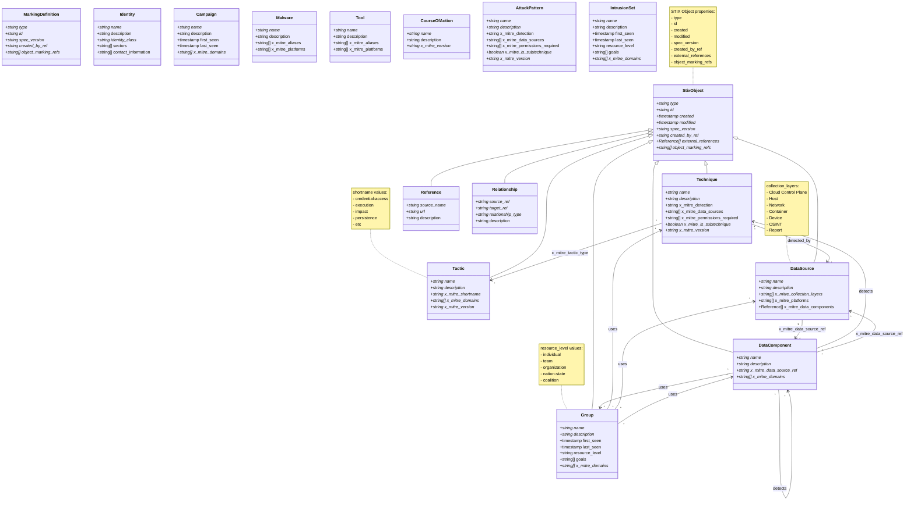
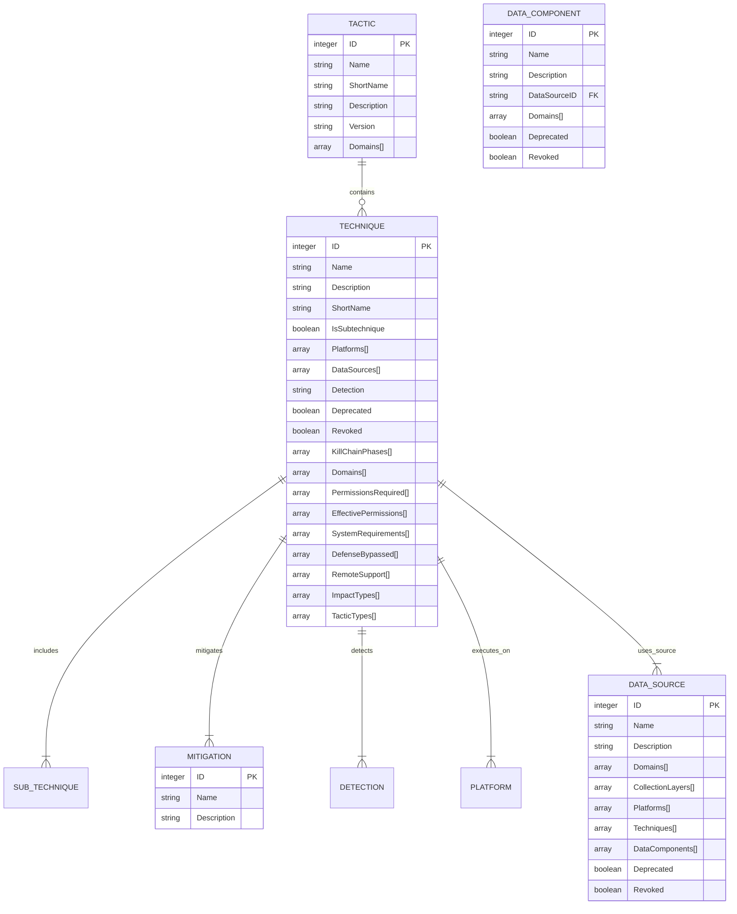

## 2.6 ATT&CK (Adversarial Tactics, Techniques, and Common Knowledge)

### 2.6.1 Summary
The **Adversarial Tactics, Techniques, and Common Knowledge (ATT&CK)** framework is a knowledge base of adversary tactics and techniques based on real-world observations. It provides a comprehensive view of the methods attackers use to compromise systems, allowing organizations to better understand and defend against potential threats.

### 2.6.2 Core Entities
The ATT&CK framework is organized into several categories, each representing a different phase of the attack lifecycle. Each category contains specific techniques that adversaries may use to achieve their objectives.

The ATT&CK framework consists of several core entities that define the structure and relationships within the attack patterns:

- **Tactic**: Represents a high-level objective that adversaries aim to achieve during an attack (e.g., Initial Access, Execution, Persistence).
- **Technique**: Represents a specific method used to achieve a tactic (e.g., T1018 - Remote System Discovery, T1074 - Data Staged).
- **Sub-techniques**: More granular methods that fall under a specific technique (e.g., T1018.001 - Remote System Discovery via WMI).
- **Mitigations**: Recommended defensive measures to counter specific techniques.
- **Detection**: Guidance on how to identify the use of specific techniques in an environment.
- **Platforms**: The operating systems or environments where the techniques can be executed (e.g., Windows, Linux, macOS).
- **Data Sources**: Types of data that can be used to detect the techniques (e.g., process creation logs, network traffic).
- **References**: Links to external resources or documentation related to the techniques.

### 2.6.3 The ATT&CK Data Model Schema
The ATT&CK data model schema is based on the STIX 2.0 specification, which provides a standardized way to represent and share threat intelligence. The schema defines the structure and relationships between different entities within the ATT&CK framework.

#### StixBundle
_Object containing the following properties:_

| Property | Description | Type |
| :------- |:----------- | :--- |
| **`id`** (\*) |        | `any` |
| **`type`** (\*)|       | `'bundle'` |
| **`spec_version`** (\*) | The version of the STIX specification used to represent this object. The value of this property MUST be 2.1 for STIX Objects defined according to this specification. If objects are found where this property is not present, the implicit value for all STIX Objects other than SCOs is 2.0. Since SCOs are now top-level objects in STIX 2.1, the default value for SCOs is 2.1. | `'2.0' \| '2.1'` |
| **`objects`** (\*) |   | [AttackObjects](#attackobjects) |

_(\*) Required._

#### AttackObjects
ATT&CK uses a mix of predefined and custom STIX objects to implement ATT&CK concepts. The following table is a mapping of ATT&CK concepts to STIX 2.0 objects:

| ATT&CK concept | STIX object type | Custom type? |
|:------------|:----------|:---|
| [Matrix](#matrices)              | `x-mitre-matrix` | yes |
| [Tactic](#tactics)               | `x-mitre-tactic` | yes |
| [Technique](#techniques)         | `attack-pattern` | no |
| [Sub-technique](#sub-techniques) | `attack-pattern` where `x_mitre_is_subtechnique = true` | no |
| [Procedure](#procedures)         | `relationship` where `relationship_type = "uses"` | no |
| [Mitigation](#mitigations)       | `course-of-action` | no |
| [Group](#groups)                 | `intrusion-set`  | no |
| [Software](#software)            | `malware` or `tool` | no |
| [Data Source](#data-sources)      | `x-mitre-data-source` | yes |
| [Campaign](#campaigns) | `campaign` | no |
| [Asset](#assets) | `x-mitre-asset` | yes |

#### Extensions of the STIX spec
There are three general ways that ATT&CK extends the STIX 2.0 format:

- **Custom object types**: Object types prefixed with `x-mitre-`, e.g `x-mitre-matrix`, are custom STIX types extending the STIX 2.0 spec.

- **Extensions of existing object types**: Fields extending the STIX 2.0 spec are prefixed with `x_mitre_`, e.g `x_mitre_platforms` in `attack-patterns`.

    All objects except relationships can have the following extended properties applied:

    | Field | Type | Description |
    |:------|:-----|:------------|
    | `x_mitre_version` | string | The version of the object in format `major.minor` where `major` and `minor` are integers. |
    | `x_mitre_contributors` | string[] | People and organizations who have contributed to the object. |
    | `x_mitre_deprecated` | boolean | Indicates if the object is deprecated. |

- **New relationship types**: Unlike custom object types and extended fields, custom relationship types are **not** prefixed with `x_mitre_`.

#### IDs in ATT&CK
Objects in ATT&CK may have several different kinds of IDs. The most commonly used ID format is what is referred to as the ATT&CK ID or simply ID. Each different type of ATT&CK object has its own variation upon the ATT&CK ID format:

| ATT&CK concept | ID format |
|:------------|:----------|
| [Matrix](#matrices)              | `MAxxxx` |
| [Tactic](#tactics)               | `TAxxxx` |
| [Technique](#techniques)         | `Txxxx` |
| [Sub-Technique](#sub-techniques) | `Txxxx.yyy` |
| [Mitigation](#mitigations)       | `Mxxxx` |
| [Group](#groups)                 | `Gxxxx`  |
| [Software](#software)            | `Sxxxx` |
| [Data Source](#data-sources)      | `DSxxxx` |
| [Campaign](#campaigns)           | `Cxxxx` |
| [Asset](#assets)                 | `Axxxx` |


### 2.6.4 ATT&CK Types and Relationships

#### Matrices
The overall layout of the ATT&CK Matrices is stored in `x-mitre-matrix` objects. Matrices extend the generic SDO format with the following field:

| Field | Type | Description |
|:------|:-----|-------------|
| `tactic_refs` | string[] | An ordered list of `x-mitre-tactic` STIX IDs corresponding to the tactics of the matrix. |

##### Mapping matrices, tactics and techniques
Techniques map into tactics by use of their `kill_chain_phases` property. Where the `kill_chain_name` is `mitre-attack`, `mitre-mobile-attack`, or `mitre-ics-attack`, the `phase_name` corresponds to the `x_mitre_shortname` property of an `x-mitre-tactic` object.

#### Tactics
A Tactic in ATT&CK is defined by an `x-mitre-tactic` object. Tactics extend the generic SDO format with the following field:

| Field | Type | Description |
|:------|:-----|-------------|
| `x_mitre_shortname` | string | Used for mapping techniques into the tactic. It corresponds to `kill_chain_phases.phase_name` of the techniques in the tactic. |

#### Techniques
A Technique in ATT&CK is defined as an `attack-pattern` object. Techniques depart from the attack-pattern format with the following fields:

| Field | Type | Applies to | Description |
|:------|:-----|:--------|:------------|
| `x_mitre_detection` | string | All techniques | Strategies for identifying if a technique has been used by an adversary. |
| `x_mitre_platforms` | string[] | All techniques | List of platforms that apply to the technique. |
| `x_mitre_data_sources` | string[] | Enterprise* & ICS domains | Sources of information that may be used to identify the action or result of the action being performed. |
| `x_mitre_is_subtechnique` | boolean | Enterprise domain | If true, this `attack-pattern` is a sub-technique. |
| `x_mitre_system_requirements` | string[] | Enterprise domain | Additional information on requirements the adversary needs to meet. |
| `x_mitre_tactic_type` | string[] | Mobile domain | "Post-Adversary Device Access", "Pre-Adversary Device Access", or "Without Adversary Device Access". |
| `x_mitre_permissions_required` | string[] | Enterprise domain in the _Privilege Escalation_ tactic | The lowest level of permissions the adversary is required to be operating within. |
| `x_mitre_effective_permissions` | string[] | Enterprise domain in the _Privilege Escalation_ tactic | The level of permissions the adversary will attain by performing the technique. |
| `x_mitre_defense_bypassed` | string[] | Enterprise domain in the _Defense Evasion_ tactic | List of defensive tools, methodologies, or processes the technique can bypass. |
| `x_mitre_remote_support` | boolean | Enterprise domain in the _Execution_ tactic | If true, the technique can be used to execute something on a remote system. |
| `x_mitre_impact_type` | string[] | Enterprise domain in the _Impact_ tactic | Denotes if the technique can be used for integrity or availability attacks. |

#### Sub-Techniques
A sub-technique in ATT&CK is represented as an `attack-pattern` and follows the same format as techniques. They differ in that they have a boolean field (`x_mitre_is_subtechnique`) marking them as sub-techniques, and a relationship of the type `subtechnique-of` where the `source_ref` is the sub-technique and the `target_ref` is the parent technique.

Additionally:
- Sub-technique ATT&CK IDs are a suffix of their parent IDs (e.g., `Txxxx.yyy`).
- Sub-techniques have the same tactics as their parent technique.
- Sub-techniques have a subset of their parent technique's platforms.

#### Procedures
ATT&CK does not represent procedures under their own STIX type. Instead, procedures are represented as relationships of type `uses` where the `target_ref` is a technique. This means that procedures can stem from usage by both groups (`intrusion-set`s) and software (`malware` or `tool`s).

#### Mitigations
A Mitigation in ATT&CK is defined as a `course-of-action` object. ATT&CK Mitigations do not depart from the STIX `course-of-action` spec.

#### Groups
A Group in ATT&CK is defined as an `intrusion-set` object. ATT&CK Groups do not depart from the STIX `intrusion-set` format.

#### Software
Software in ATT&CK is the union of two distinct STIX types: `malware` and `tool`. Both depart from the STIX format with the following fields:

| Field | Type | Description |
|:------|:-----|-------------|
| `x_mitre_platforms` | string[] | List of platforms that apply to the software. |
| `x_mitre_aliases` | string[] | List of aliases for the given software. |

#### Data Sources and Data Components
Data Sources and Data Components represent data which can be used to detect techniques:

- A Data Component can only have one parent Data Source.
- A Data Source can have any number of Data Components.
- Data Components can map to any number of techniques.

##### Data Sources
A Data Source in ATT&CK is defined by an `x-mitre-data-source` object with the following extended fields:

| Field | Type | Description |
|:------|:-----|-------------|
| `x_mitre_platforms` | string[] | List of platforms that apply to the data source. |
| `x_mitre_collection_layers` | string[] | List of places the data can be collected from. |

##### Data Components
A Data Component in ATT&CK is represented as an `x-mitre-data-component` object with the following extended field:

| Field | Type | Description |
|:------|:-----|-------------|
| `x_mitre_data_source_ref` | embedded relationship (string) | STIX ID of the data source this component is a part of. |

#### Campaigns
A Campaign in ATT&CK is defined as a `campaign` object with the following extended fields:

| Field | Type | Description |
|:------|:-----|-------------|
| `x_mitre_first_seen_citation` | string | One to many citations for when the Campaign was first reported. |
| `x_mitre_last_seen_citation` | string | One to many citations for when the Campaign was last reported. |

#### Assets
An Asset in ATT&CK is defined by an `x-mitre-asset` object with the following extended fields:

| Field | Type | Description |
|:------|:-----|-------------|
| `x_mitre_sectors` | string[] | List of industry sector(s) an asset may be commonly observed in. |
| `x_mitre_related_assets` | related_asset[] | Related assets describe sector specific device names or aliases. |

#### Relationships
Objects in ATT&CK are related to each other via STIX `relationship` objects. These relationships convey concepts like groups using techniques, the hierarchy of techniques and sub-techniques, and so on.

| Source Type | Relationship Type | Target Type | Custom Type? | About |
|:------------|:------------------|:------------|:----|:------|
| `intrusion-set` | `uses` | `malware` or `tool` | No | Group using a software. |
| `intrusion-set` | `uses` | `attack-pattern` | No | Group using a technique, which is also considered a procedure example. |
| `malware` or `tool` | `uses` | `attack-pattern` | No | Software using a technique, which is also considered a procedure example. |
| `campaign` | `uses` | `malware` or `tool` | No | Campaign using a software. |
| `campaign` | `uses` | `attack-pattern` | No | Campaign using a technique, which is also considered a procedure example. |
| `campaign` | `attributed-to` | `intrusion-set` | No | Campaign attributed to a group. |
| `course-of-action` | `mitigates` | `attack-pattern` | No | Mitigation mitigating a technique. |
| `attack-pattern` | `subtechnique-of` | `attack-pattern` | Yes | Sub-technique of a technique. |
| `x-mitre-data-component` | `detects` | `attack-pattern` | Yes | Data component detecting a technique. |
| `attack-pattern` | `targets` | `x-mitre-asset` | Yes | Technique targets an asset. |
| any type | `revoked-by` | any type | Yes | The target object is a replacement for the source object. |

### 2.6.5 UML Class Diagram
The ATT&CK data model is represented as a class diagram, which illustrates the relationships between the various entities within the framework. The diagram includes classes for StixObject, Technique, Tactic, Group, DataSource, and DataComponent, along with their attributes and relationships.



Note: The above diagram is a simplified representation of the ATT&CK data model. The actual implementation may include additional attributes and relationships based on specific use cases and requirements.

[classDiagram](https://mermaid.live/edit#pako:eNqtVk1v2zAM_SuCjl1cNKlTJ8awSwpsu7RDu9PmwVBkJtGqD1eSs2Rd_vtkO_5q7KLY6pNNPlGPTxTpJ0xVAjjElBNjrhlZayIiidxTWNC9Zbvb5U-gFj2V9vx5Z6xmco3sPoWzUzNL2kbLBBhLRIqoBmJhwClUwlas6z3GMynQeAvaMCV73Mew8XIfa1i1AXewAg2SwvcfCHYWtCQ8x5RGcxrL4VSRbSyIfnCGHF3hDpFsS_MV6Eayxwz6lJFE9CmTgKGapbY_kV0smNUQJ2AdBYfp41eDiCWxUZl2ibyES0ELZnLpjEvmMWMakhZ-qRQHIms4M7HJlrbK7QWW3QN5Lg5xCdA3V8ZslLb9EdrSKEGYNP_K_aNWWfr_1JvSXjFtbGwAZK_bbXriPYbWUJ5wzGELvC_ntSLcvF6MZ6leuyK6L3Z4q6Nq7UwV52Udx5zsneIvolNO7EppYQbub6fuqRKpkiCtGUxrUUHe_no2N-95w3mt-lJZQC7b6p5EuK5stCU8AxM2Ub28wyUuE0a4R6i776bthB3QrNstPMRE6iK3LWle8sbmanZWWxrhE1qtuojwyTl2uC24yhK0UNJqxdEXTmQn_idlOjRuwP5S-qETwa11IoFuG69hy7pMb-8_33xtG-4gdZo17Fuz6v0fz2sa9IC7kL7fV7SAflcjzbC_rr2KWjMrInwWYeR5H45vxwII64qxhSHOR2u5tnMW487ibp2HQxVaxinb2sn-NbMQZaYaJcN8W2xCVA6qYvTiEV5rluBw5foRjLBwY4fk37i4fhG2GxAQ4dC9Jm625sd2cItSIr8pJXBodeaWOY7rTfWRpS4ROP6V1AiQCeiFyqTF4cwvIuDwCe9wOJ-eB1fTi4l_ORuPp_PZfIT3OPRmwfmVP55cjufj6WQaBNPDCP8u9rw4nwe-fxEElxN_dhVM_PnhL91p3Fw)

### 2.6.6 Entity Relationship Diagram
Below is an example of how you can represent core ATT&CK entities using Mermaid syntax:

Example Relationships in Context
```
TACTIC (Initial Access) -- contains --
TECHNIQUE (Remote System Discovery - T1018)
SUB_TECHNIQUE (Remote System Discovery via WMI - T1018.001)
MITIGATION (Implement Multi-Factor Authentication)
DETECTION (Monitor process creation logs)

D3FEND (Firewall Rule) -- mitigates --
ATT&CK (T1018)
CAR (Containment Protocol) -- triggers --
D3FEND (Firewall Rule)
```
### 2.6.7 Relationships with Other Standards

#### CVE Integration
- Example: "ATT&CK-T1234 exploits a specific CVE node (high CVSS score) via a CAPEC pattern (exploit technique)."
  
#### CWE Integration
- Example: "ATT&CK-T1234 targets a specific CWE weakness (e.g., T1018 targets CWE-295 - Improper Input Validation)."

#### CAPEC Integration
- Example: "ATT&CK-T1234 uses a specific CAPEC attack pattern to exploit vulnerabilities."

#### D3FEND Integration
- Example: "ATT&CK-T1234 is mitigated by a D3FEND defensive technique (e.g., T1098 can be mitigated by implementing multi-factor authentication)."

#### CAR Integration
- Example: "CAR protocols trigger specific defense mechanisms when ATT&CK techniques are detected."

### 2.6.8 Visual Representation
Include visual diagrams or flowcharts illustrating the relationships between ATT&CK, CVE, CWE, CAPEC, D3FEND, and CAR.

