# Decision Flowcharts

### Flowchart 1: Where Does This Fact Belong?

```mermaid
graph TD
    A["New Fact to Model"] --> B{"Is it traceable to\nan external standard\n(CVE, CWE, CAPEC, etc)?"}
    B -->|No| C["❌ Reject or\nConsider as Extension"]
    B -->|Yes| D{"Does it have\na timestamp\nor time range?"}
    D -->|Yes| E{"Is it an\nobservation?"}
    E -->|Yes| F["📍 Incident Extension\n(ObservedTechnique,\nDetectionEvent)"]
    E -->|No| G["❌ Not allowed\nin Incident layer"]
    D -->|No| H{"Is it a\ndecision or\nassessment?"}
    H -->|Yes| I["⚖️ Risk Extension\n(RiskAssessment,\nRiskScenario)"]
    H -->|No| J{"Is it an\nattribution claim?"}
    J -->|Yes| K["🎭 ThreatActor Extension\n(ThreatActor,\nAttributionClaim)"]
    J -->|No| L["🔐 Core Ontology\n(Vulnerability, Weakness,\nTechnique, etc.)"]
```



### Flowchart 2: Is This RAG Traversal Safe?

```mermaid
graph TD
    A["Proposed Query Path"] --> B{"Does a pre-approved\ntemplate exist in\nRAG-travesal-templates?\n(T-CORE-01, T-TA-02, etc)"}
    B -->|Yes| C["✅ Use that template\nExecution is safe"]
    B -->|No| D{"Does this path\nskip layers?\n(CVE → Technique directly)"}
    D -->|Yes| E["❌ Forbidden\nAdd intermediate nodes"]
    D -->|No| F{"Does this cross\nextensions without\nexplicit allowance?"}
    F -->|Yes| G["❌ Forbidden\nCheck RAG templates"]
    F -->|No| H{"Does this traverse\nBACK into Core\nfrom an extension?"}
    H -->|Yes| I["❌ Forbidden\nCore is immutable input"]
    H -->|No| J{"Does it terminate\non authoritative\nCore nodes?"]
    J -->|No| K["⚠️ Questionable\nMay need confirmation"]
    J -->|Yes| L["✅ Path is RAG-safe\nDocument as new template"]
```

### Flowchart 3: Which SHACL Profile Applies?

```mermaid
graph TD
    A["Data Validation Required"] --> B{"Who is the\nprimary consumer?"}
    B -->|SOC, DFIR, IR Team| C["🔴 SOC Profile\n- Evidence mandatory\n- HIGH confidence only\n- No speculation"]
    B -->|CISO, Board, GRC| D["🟠 EXEC Profile\n- Decision clarity\n- Aggregation allowed\n- Risk context needed"]
    B -->|RAG, LLM, Agent| E["🔴 AI Profile\n- Hallucination prevention\n- Approved paths only\n- Conservative assertions"]
    C --> F["Run SHACL at:\nIngest → Pre-index →\nPre-query"]
    D --> F
    E --> F
    F --> G{"Does data pass\nSHACL shape?"}
    G -->|No| H["Reject or\nDowngrade confidence"]
    G -->|Yes| I["✅ Safe to reason over"]
```



### Flowchart 4: Modeling an Extension Concept

```mermaid
graph TD
    A["New Extension Concept"] --> B{"Does it reference\nCore classes\n(e.g., Technique, Weakness)?"}
    B -->|No| C["❌ Reconsider\nMay belong elsewhere"]
    B -->|Yes| D["✅ Create in extension\nlayer only"]
    D --> E{"Adding new\nproperties to\nCore class?"}
    E -->|Yes| F["❌ STOP\nCreate wrapper class\nin extension instead"]
    E -->|No| G{"Includes confidence,\nsource, or timestamp?"]
    G -->|No| H["❌ Reconsider\nExtension requires provenance"]
    G -->|Yes| I["✅ Ready for SHACL\nvalidation"]
    I --> J["Document relationship\nto Core concept"]
```

---

## When in Doubt

1. **Read `core-ontology-v1.0.md`** first—it answers 90% of structural questions
2. **Check `RAG-travesal-templates-extension.md`** before designing new query logic
3. **Consult `formal_ontology_draft.md`** for class/edge tables and Mermaid diagrams
4. **Validate against SHACL** before committing new data
5. **Trace to a standard.** If you can't point to CVE, CWE, ATT&CK, etc., it doesn't belong in Core

---

## Design Philosophies (Preserved Across All Work)

- **Objectivity in Core, Subjectivity in Extensions** — Core is authoritative fact; extensions are assessments
- **Provenance Always** — every claim outside Core must declare source, confidence, and timestamp
- **No Semantic Leakage** — extensions reference Core but never modify it
- **RAG Safety First** — approved traversals only; no free reasoning
- **Explainability** — every answer should trace back to sources and standards

