*Document Draft (Initial Version)*  
---  
 
## 📖 Table of Contents  
- [🎯 1. Objective](#-1-objective)
- [📚 2. Summary of Standards](#-2-summary-of-standards)
  - [2.1 CPE (Common Platform Enumeration)](#21-cpe-common-platform-enumeration)
    - [2.1.1 Summary](#211-summary)
    - [2.1.2 Key Components](#212-key-components)
      - [**Part (`[part]`)**](#part-part)
      - [**Vendor (`[vendor]`)**](#vendor-vendor)
      - [**Product (`[product]`)**](#product-product)
      - [**Version (`[version]`)**](#version-version)
      - [**Update (`[update]`)**](#update-update)
      - [**Edition (`[edition]`)**](#edition-edition)
      - [**Language (`[language]`)**](#language-language)
      - [**Software Edition (`[sw_edition]`)**](#software-edition-sw_edition)
      - [**Target Software (`[target_sw]`)**](#target-software-target_sw)
      - [**Target Hardware (`[target_hw]`)**](#target-hardware-target_hw)
      - [**Other (`[other]`)**](#other-other)
    - [2.1.3 Example WFNs with Extended Attributes](#213-example-wfns-with-extended-attributes)
    - [2.1.4 CPE Entity-Relationship Model (ERD)](#214-cpe-entity-relationship-model-erd)
  - [2.2 CVE (Common Vulnerabilities and Exposures)](#22-cve-common-vulnerabilities-and-exposures)
    - [2.2.1 Summary](#221-summary)
    - [2.2.2 Core Entities](#222-core-entities)
      - [Central Class: `CVE`](#central-class-cve)
      - [Metrics Class](#metrics-class)
      - [Configuration Class](#configuration-class)
      - [Tags and Weaknesses](#tags-and-weaknesses)
    - [2.2.3 CVE Entity-Relationship Model (ERD)](#223-cve-entity-relationship-model-erd)
    - [2.2.4 CVE Example](#224-cve-example)
  - [2.3 CVSS (Common Vulnerability Scoring System)](#23-cvss-common-vulnerability-scoring-system)
    - [2.3.1 Summary](#231-summary)
    - [2.3.2 Key Components](#232-key-components)
      - [Root Object Properties](#root-object-properties)
      - [Additional Schema Details](#additional-schema-details)
      - [Base Score and Severity](#base-score-and-severity)
    - [2.3.3 **Integration with the Model**](#233-integration-with-the-model)
    - [2.3.4 **Relationships with Other Standards**](#234-relationships-with-other-standards)
    - [2.3.5 CVSSv3 Entity-Relationship Model (ERD)](#235-cvssv3-entity-relationship-model-erd)
      - [Entities](#entities)
      - [Relationships](#relationships)
      - [Diagram Representation](#diagram-representation)
  - [2.4 CWE (Common Weakness Enumeration)](#24-cwe-common-weakness-enumeration)
    - [2.4.1 Summary](#241-summary)
    - [2.4.2 Core Entities](#242-core-entities)
      - [Weakness\_Catalog](#weakness_catalog)
      - [Weakness](#weakness)
      - [Category](#category)
      - [View](#view)
    - [2.4.2 Relationships](#242-relationships)
    - [2.4.3 Additional Properties](#243-additional-properties)
      - [Common Consequences](#common-consequences)
      - [Detection Methods](#detection-methods)
      - [Potential Mitigations](#potential-mitigations)
    - [2.4.4 Model Representation](#244-model-representation)
    - [2.4.5 Graph Representation](#245-graph-representation)
  - [2.5 CAPEC (Common Attack Pattern Enumeration and Classification)](#25-capec-common-attack-pattern-enumeration-and-classification)
    - [2.5.1 Summary](#251-summary)
    - [2.5.2 Core Entities and Relationships](#252-core-entities-and-relationships)
      - [Attack Pattern Catalog](#attack-pattern-catalog)
      - [Attack Pattern](#attack-pattern)
      - [Category](#category-1)
      - [View](#view-1)
      - [External Reference](#external-reference)
      - [Global Types](#global-types)
      - [Enumerations](#enumerations)
      - [Structured Text](#structured-text)
      - [Relationships](#relationships-1)
    - [2.5.5 Graph Representation](#255-graph-representation)
  - [2.6 ATT\&CK (Adversarial Tactics, Techniques, and Common Knowledge)](#26-attck-adversarial-tactics-techniques-and-common-knowledge)
    - [2.6.1 Summary](#261-summary)
    - [2.6.2 Core Entities](#262-core-entities)
    - [2.6.3 The ATT\&CK Data Model Schema](#263-the-attck-data-model-schema)
      - [StixBundle](#stixbundle)
      - [AttackObjects](#attackobjects)
      - [Extensions of the STIX spec](#extensions-of-the-stix-spec)
      - [IDs in ATT\&CK](#ids-in-attck)
    - [2.6.4 ATT\&CK Types and Relationships](#264-attck-types-and-relationships)
      - [Matrices](#matrices)
        - [Mapping matrices, tactics and techniques](#mapping-matrices-tactics-and-techniques)
      - [Tactics](#tactics)
      - [Techniques](#techniques)
      - [Sub-Techniques](#sub-techniques)
      - [Procedures](#procedures)
      - [Mitigations](#mitigations)
      - [Groups](#groups)
      - [Software](#software)
      - [Data Sources and Data Components](#data-sources-and-data-components)
        - [Data Sources](#data-sources)
        - [Data Components](#data-components)
      - [Campaigns](#campaigns)
      - [Assets](#assets)
      - [Relationships](#relationships-2)
    - [2.6.5 UML Class Diagram](#265-uml-class-diagram)
    - [2.6.6 Entity Relationship Diagram](#266-entity-relationship-diagram)
    - [2.6.7 Relationships with Other Standards](#267-relationships-with-other-standards)
      - [CVE Integration](#cve-integration)
      - [CWE Integration](#cwe-integration)
      - [CAPEC Integration](#capec-integration)
      - [D3FEND Integration](#d3fend-integration)
      - [CAR Integration](#car-integration)
    - [2.6.8 Visual Representation](#268-visual-representation)
  - [2.7 D3FEND (Detection, Denial, and Disruption Framework)](#27-d3fend-detection-denial-and-disruption-framework)
    - [2.7.1 Summary](#271-summary)
    - [2.7.2 Framework Structure](#272-framework-structure)
    - [2.7.3 Integration with the Model](#273-integration-with-the-model)
    - [2.7.4 Relationships with Other Standards](#274-relationships-with-other-standards)
    - [2.7.5 Schema Representation](#275-schema-representation)
      - [Classes](#classes)
      - [Object Properties](#object-properties)
      - [Data Properties](#data-properties)
      - [Relationships](#relationships-3)
    - [2.7.6 ERD Representation](#276-erd-representation)
    - [2.7.7 Graph Representation](#277-graph-representation)
  - [2.8 CAR (Cyber Attack Response)](#28-car-cyber-attack-response)
    - [2.8.1 Summary](#281-summary)
    - [2.8.2 Framework Structure](#282-framework-structure)
    - [2.8.3 Integration with the Model](#283-integration-with-the-model)
    - [2.8.4 Relationships with Other Standards](#284-relationships-with-other-standards)
    - [2.8.5 Schema Representation](#285-schema-representation)
      - [Explanation:](#explanation)
    - [2.8.6 ERD Representation](#286-erd-representation)
      - [Explanation:](#explanation-1)
    - [2.8.7 Graph Representation](#287-graph-representation)
      - [Explanation:](#explanation-2)

---

# 🎯 1. Objective  
Create a holistic and integrated model of security standards (CPE, CVE, CWE, CAPEC, ATT&CK, D3FEND, CAR, CVSS, SHIELD, ENGAGE and others) using concepts from physics, cosmology, or quantum mechanics. This document serves as a foundation for exploring applications in risk analysis, information management, and AI training.  

---  

# 📚 2. Summary of Standards  
A list of the standards included in this model, with brief descriptions:  

| **Acronym** | **Name** | **Description** |
|-------------|----------|-----------------|
| **CPE**     | Common Platform Enumeration | Identifies software and hardware components to standardize vulnerability reporting. |
| **CVE**     | Common Vulnerabilities and Exposures | Lists known vulnerabilities and exposures in software and hardware systems. |
| **CVSS**    | Common Vulnerability Scoring System | Provides a standardized scoring system to quantify the severity of vulnerabilities (e.g., CVEs). Maps well to node attributes like mass or charge.<br>- Metrics include base score, impact, exploitability, and temporal factors. |
| **CWE**     | Common Weakness Enumeration | Categorizes weaknesses that can lead to security vulnerabilities (e.g., buffer overflows, SQL injection). |
| **CAPEC**   | Common Attack Pattern Enumeration and Classification | Describes attack patterns used by threat actors to exploit vulnerabilities. |
| **ATT&CK**  | Adversarial Tactics, Techniques and Common Knowledge | A knowledge base of adversary behaviors, including techniques and procedures for attacks. |
| **D3FEND**  | Detection, Denial, and Disruption Framework Empowering Network Defense | A database of defensive techniques and tools designed to mitigate ATT&CK-based threats. |
| **ENGAGE**  | MITRE Engage (See below) | A framework for planning and discussing adversary engagement operations that empowers you to engage your adversaries and achieve your cybersecurity goals. |
| **CAR**     | Cyber Attack Response | Focuses on incident response frameworks and strategies for mitigating cyberattacks. |
| **SHIELD**  | MITRE SHIELD (See below) | A framework focused on threat modeling, defensive strategies, and incident response.<br>- Acts as a **central hub** for connecting defensive measures (D3FEND) to attack patterns (ATT&CK) and incident response protocols (CAR). |


## 2.1 CPE (Common Platform Enumeration)  

### 2.1.1 Summary
CPE is a standardized way to identify software, hardware, and operating system components. The **Well-Formed Names (WFNs)** format in **Version 2.3** provides a structured and extensible approach for CPE identifiers, ensuring consistency in vulnerability reporting. A typical WFN follows this syntax:  

```
cpe:2.3:[part]:[vendor]:[product]:[version]:[update]:[edition]:[language]:[sw_edition]:[target_sw]:[target_hw]:[other]
```

However, the full structure includes optional attributes that provide additional context about the component. Below is a breakdown of all **CPE 2.3 components**.

### 2.1.2 Key Components

#### **Part (`[part]`)**  
   - **Definition**: Specifies the type of component being described.  
   - **Values**:  
     - `a`: Class of applications (e.g., Apache HTTP Server).  
     - `o`: Class of operating systems (e.g., Linux kernel).  
     - `h`: Class of hardware devices (e.g., Cisco router).  
     - `c`: Containerized components (e.g., Docker images).  
   - **Example**: `cpe:2.3:a:apache:httpd:2.4.18:*:*:*:*:*:*:*:*` (application), `cpe:/o:microsoft:windows_server:10.0.19044` (operating system).

#### **Vendor (`[vendor]`)**  
   - **Definition**: The name of the organization or entity that manufactured or created the product. Must be registered with the [CPE Dictionary](https://nvd.nist.gov/products/cpe).  
   - **Example**: `apache`, `microsoft`, `linux`.

#### **Product (`[product]`)**  
   - **Definition**: The most common and recognizable title or name of the product (e.g., software, hardware device).  
   - **Example**: `httpd` (Apache HTTP Server), `windows_server`.

#### **Version (`[version]`)**  
   - **Definition**: A vendor-specific alphanumeric string characterizing the release version of the product.  
   - **Example**: `2.4.18`, `10.0.19044`.

#### **Update (`[update]`)**  
   - **Definition**: A vendor-specific alphanumeric string characterizing a service pack, point release, or patch for the version of the product.  
   - **Example**: `cpe:2.3:a:apache:httpd:2.4.18:patch:*:*:*:*:*:*:*:*`.

#### **Edition (`[edition]`)**  
   - **Status**: **Deprecated** in CPE 2.3 (assigned value `ANY` unless backward compatibility with Version 2.2 is required).  
   - **Purpose**: Previously used to describe variants of a product (e.g., "enterprise" vs. "community").  

#### **Language (`[language]`)**  
   - **Definition**: A valid language tag per [RFC5646](https://tools.ietf.org/html/rfc5646) defining the user interface language supported by the product.  
   - **Example**: `en`, `zh`, `es`. `cpe:2.3:a:mysql:mysql:8.0.26:*:*:*:en:*:*:*:*`

#### **Software Edition (`[sw_edition]`)**  
   - **Definition**: Describes how the product is tailored to a specific market or class of end users (e.g., "enterprise" vs. "consumer").  
   - **Example**: `cpe:2.3:a:mysql:mysql:8.0.26:*:*:*:*:*:community:*:*`.

#### **Target Software (`[target_sw]`)**  
   - **Definition**: Characterizes the software computing environment in which the product operates (e.g., operating system version or application stack).  
   - **Example**: HP Insight 7.4.0.1570 Online Edition 
for Windows 2003 x64 → `cpe:2.3:a:hp:insight:7.4.0.1570:-:*:*:online:win2003:x64:*`.

#### **Target Hardware (`[target_hw]`)**  
   - **Definition**: Characterizes the hardware computing environment in which the product operates (e.g., processor architecture, device class).  
   - **Example**: Foo\Bar Big$Money 2010 Special 
Edition for iPod Touch 80GB →  `cpe:2.3:a:foo\\bar:big\$money_2010:*:*:*:*:special:ipod_touch:80gb:*`.

#### **Other (`[other]`)**  
   - **Definition**: Captures additional vendor- or product-specific descriptive information that does not fit into other attributes (e.g., unique identifiers, licensing details).  

### 2.1.3 Example WFNs with Extended Attributes  
1. **Apache HTTP Server (community edition, x86 architecture)**:  
   
   ```plaintext
   cpe:2.3:a:apache:httpd:2.4.18:*:*:*:*:community:*:x86:*
   ```  

2. **MySQL on Linux 5.10 with specific target hardware**:  
   ```plaintext
   cpe:2.3:a:mysql:mysql:8.0.26:*:*:*:*:*:o:linux:kernel:5.10:x86_64:*
   ```

3. **Experimental Docker image (target_sw: Kubernetes)**:  

   ```plaintext
   cpe:2.3:c:example:image:1.0:*:*:*:*:experimental:*:kubernetes:*
   ```  

### 2.1.4 CPE Entity-Relationship Model (ERD)
The CPE ontology can be represented as an Entity-Relationship Diagram (ERD) to visualize the relationships between the core entities and their attributes. Below is a simplified ERD representation:

[CPE Entity-Relationship Diagram](https://mermaid.live/edit#pako:eNqtU01vgzAM_SuRz7SiJQWa28R6mib11EoTUhU1GUQrCTJh3Ub73xegHwfoZZpPtl_ei-PYDeyNkMBA4rPiGfIi1cRZsl6RpndbqywqnZGSoyXrl0H-U2phcAwp0Yh6_4CElTJ6DKpLwa0cpKVQ1jEG-QPXWc2zIaE67h5xLMdM2l11fITkQ8TYXGKfPaf63qjTaTIxDUk2K8JIzivnDMHtFdyOgE_rVXKBW_cmvhn7BSXGeiZktUdV3h97L3H7LypdjX_XAQ8yVALYOz9U0oNCYsHbGDrNFFxzC5kCc67g-JFCqltSyfWbMQUwi7Wjoamz_Br0c3IZ3JsyummUmJhaW2CzoJMA1sAXsPlsPg38eElD6lO6COYLD76B0WhKg4hG8TL0w5DGi7MHP92l_jSO3Jl2igy-9qvSbcz5F9X590M)

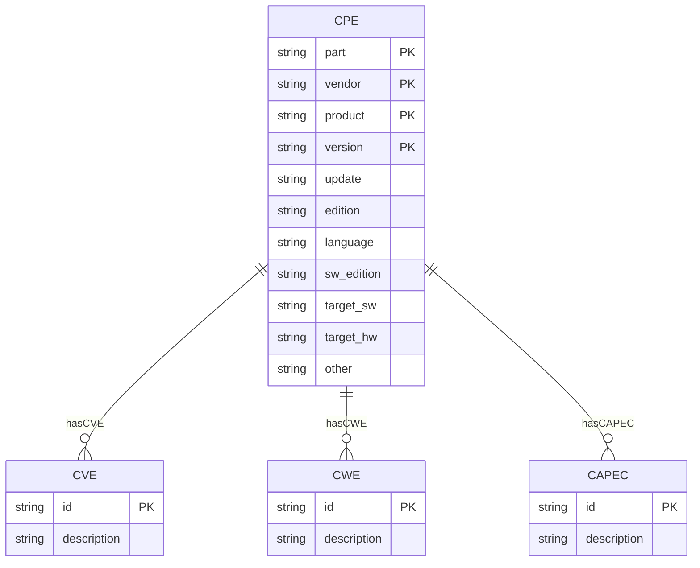
This ERD captures the relationships between CPE components and their associations with vulnerabilities (CVE), weaknesses (CWE), and attack patterns (CAPEC). Each CPE entry can have multiple CVEs, CWEs, and CAPECs associated with it, allowing for a comprehensive representation of software/hardware configurations and their security implications.

## 2.2 CVE (Common Vulnerabilities and Exposures)  

### 2.2.1 Summary
The **Common Vulnerabilities and Exposures (CVE)** system provides a reference-method for publicly known information-security vulnerabilities and exposures. The CVE List is published by the [CVE Numbering Authority (CNA)](https://cve.mitre.org/cve/). The CVE List is a catalog of known vulnerabilities, and each entry in the list is assigned a unique identifier (CVE ID).

### 2.2.2 Core Entities
CVE entries are structured to provide detailed information about vulnerabilities, including their impact, affected products, and mitigation strategies. 

The CVE ontology provides a comprehensive framework for describing vulnerabilities within information systems. It is designed to facilitate interoperability and data exchange between different security tools and databases.
The ontology is structured around a central class, `CVE`, which encapsulates all relevant details about a vulnerability. The ontology also includes supporting classes for CVSS V2 and V3 metrics, configurations, and other related entities.

#### Central Class: `CVE`

- **id**: A unique identifier for each CVE entry (e.g., "CVE-2025-1234").
- **Description**: The `CVE` class serves as the core entity, encapsulating all relevant details about a vulnerability.
  
- **Data Properties**:
  - **publishedDate**: Represents the date when the vulnerability was first published.
  - **lastModifiedDate**: Indicates the most recent modification date of the vulnerability record.

- **Object Properties**:
  - **metrics**: Links to individuals in the CVSS V2, V3, and V4 classes, providing scoring metrics for the vulnerability.
  - **configuration**: Connects to individuals within the Configuration class, specifying platforms affected by or immune to the vulnerability.
  - **cwe**: Relates to individuals in the CWE (Common Weakness Enumeration) class, categorizing the type of weakness associated with the vulnerability.
  - **vendor**: Although not currently utilized for classification, this property links to vendor-specific information for compatibility purposes.

- **Additional Attributes**:
  - **descriptions**: An array of language-specific descriptions providing detailed explanations of the vulnerability.
  - **references**: A list of references (e.g., URLs) that provide additional information or sources related to the CVE.
  - **vulnStatus**, **evaluatorComment**, **evaluatorSolution**, and **evaluatorImpact**: Insights from evaluators offering further context on each CVE.
  - **cisaExploitAdd**, **cisaActionDue**, **cisaRequiredAction**, and **cisaVulnerabilityName**: Fields related to CISA's perspective on vulnerabilities, indicating governmental or organizational actions.

#### Metrics Class
- **Purpose**: Represents the CVSS (Common Vulnerability Scoring System) metrics for a vulnerability.
- **Structure**:
  - **basicMetricV2**: Links to an individual that describes the vulnerability scoring according to CVSS V2 metrics.
    - Represents the scoring system for vulnerabilities as defined by CVSS V2.
    - Includes data properties such as `accessVector`, `accessComplexity`, and `baseScore`.
    - Incorporates NVD assessments like `severity` and `exploitabilityScore`.
  - **basicMetricV3**: Associates with an individual detailing the vulnerability scoring based on CVSS V3 metrics.
    - Defines vulnerability scoring according to the updated CVSS V3 framework.
    - Contains properties including `attackVector`, `scope`, and `environmentalScore`.
    - Also integrates NVD evaluations such as `exploitabilityScore`.
  - **basicMetricV4**: Connects to an individual that describes the vulnerability scoring according to CVSS V4 metrics.
    - Represents the latest CVSS V4 scoring system.
    - Includes properties like `attackVector`, `scope`, and `environmentalScore`.
    - Integrates NVD evaluations such as `exploitabilityScore`.
    - **Note**: CVSS V4 is still under development, and its properties may evolve over time.

#### Configuration Class

- **Purpose**: Describes specific configurations of platforms that are susceptible or resistant to a given CVE.
  
- **Structure**:
  - Each configuration is represented by an individual in the Configuration class, detailing combinations of vulnerable and non-vulnerable CPEs (Common Platform Enumerations).
  - The `vulnerableCPE` property identifies platforms affected by the vulnerability.
  - The `nonVulnerableCPE` property lists platforms that are not susceptible.

- **Applicability**:
  - Configurations are expressed through logical expressions, forming a disjunction of conjunctions where each conjunction represents a specific configuration scenario.

#### Tags and Weaknesses

- **cveTags**: Tags categorize CVEs based on certain characteristics (e.g., "unsupported-when-assigned").
- **weaknesses**: Provides details about the underlying issues associated with vulnerabilities, aiding in classification.

### 2.2.3 CVE Entity-Relationship Model (ERD)
The CVE ontology can be represented as an Entity-Relationship Diagram (ERD) to visualize the relationships between the core entities and their attributes. Below is a simplified ERD representation:

[CVE Entity-Relationship Diagram](https://mermaid.live/edit#pako:eNqFlNtu2zAMhl_F4LUbuLFy8l3n-GIYMhQL4AJDgEKxGEeYLXk6BO3SvPtkx00T2-t0JYofyV_U4QiZZAgRoFpymitaboTnRpwm3vE8rYc2iovc48x7_NZbZagzxSvDpfjwMWrQq-y24HqPbOmsjq-g2qwk4zvedbdpD7YQa0ON1T0XHmhhqZEqlmWJwvwbWMvC3grrEl_Limb9DBnXNHmpCsnNA2Md7bXzIavzLi0Ohv7A35YrZGdqEEnd_lDRLS-4ef1OyzbRadPiK3RspgeOYUs1z87udDx0ItdA-D-AXIBL6ViKHc-torX4AQGHVnqB8WMylF9IkQ4yHyXcBXt7u7uTx8tGI29PdWv0oFtJDXqz1O3ae1i6Xj-7JjUBX6779gke9vHwE5z0cTKwzfgpaXU_JeBDrjiDaEcLjT6UqEpa29A0ewNmj-5CQOSmjKpfG9iIkwuqqPgpZQmRUdaFKWnz_bthq_putq_4QqBg6J6JFQaiRZMAoiO8QDS-H4_CYL4gUxIQMgnHEx9eISKzEQlnZDZfTIPplMwnJx_-NCWD0Xw2Ca7GvQ_IuHtCq_MX0vwkp78OG15I)

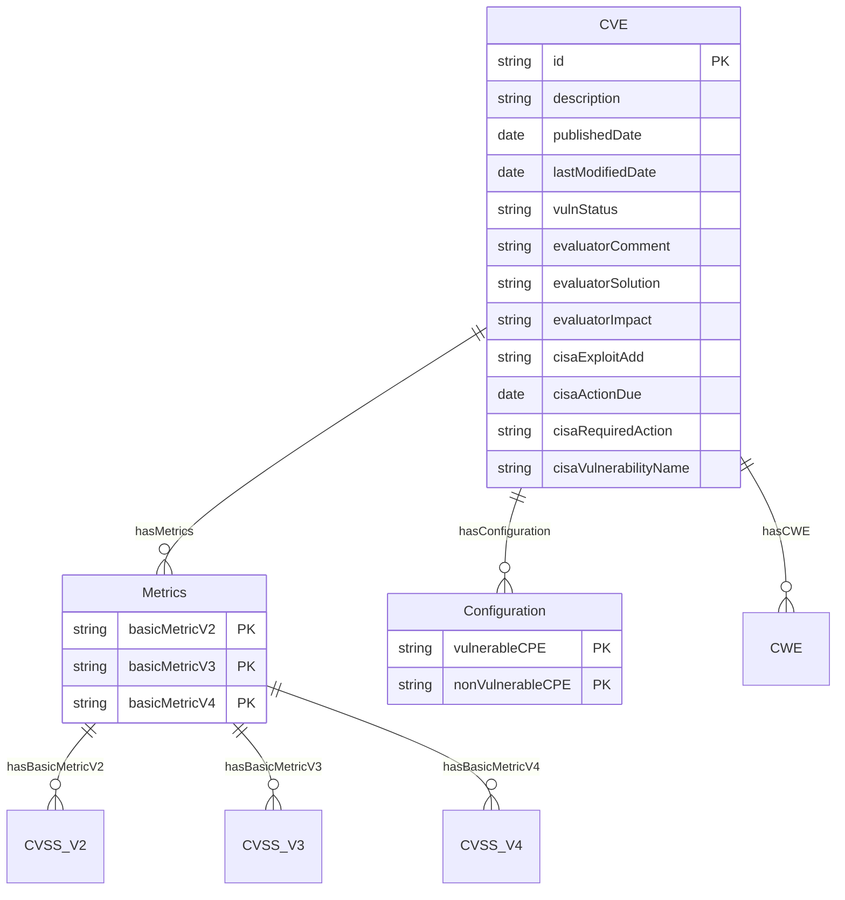
This ERD captures the relationships between the CVE entity, its associated metrics, configurations, and weaknesses. Each CVE entry can have multiple metrics and configurations, allowing for a comprehensive representation of vulnerabilities.

### 2.2.4 CVE Example
CVE entries are structured as follows (example XML representation):

```xml
<CVE>
    <ID>CVSS-2023-12345</ID>
    <Description>Buffer overflow in XYZ software version 1.0 allows remote attackers to execute arbitrary code.</Description>
    <PublishedDate>2023-01-01</PublishedDate>
    <LastModifiedDate>2023-01-15</LastModifiedDate>
    <CVSSScore>9.8</CVSSScore>
    <CWE>CWE-119</CWE>
    <References>
        <Reference>https://example.com/cve/CVSS-2023-12345</Reference>
        <Reference>https://nvd.nist.gov/vuln/detail/CVSS-2023-12345</Reference>
    </References>
    <AffectedProducts>
        <Product>
            <Name>XYZ Software</Name>
            <Version>1.0</Version>
            <Vendor>Example Corp</Vendor>
        </Product>
    </AffectedProducts>
    <Impact>
        <Confidentiality>High</Confidentiality>
        <Integrity>High</Integrity>
        <Availability>High</Availability>
    </Impact>
    <Mitigation>
        <Patch>https://example.com/patch/CVSS-2023-12345</Patch>
        <Workaround>Disable feature XYZ in configuration file.</Workaround>
    </Mitigation>
</CVE>
```
This XML structure captures essential information about a CVE, including its unique identifier, description, publication dates, CVSS score, associated CWE (Common Weakness Enumeration), references for further details, affected products, impact assessment, and mitigation strategies.


## 2.3 CVSS (Common Vulnerability Scoring System)

### 2.3.1 Summary
The **Common Vulnerability Scoring System (CVSS)** is a standardized framework for rating the severity of security vulnerabilities. It provides a numerical score (0-10) based on three metric groups: Base, Temporal, and Environmental. The Base score reflects the intrinsic characteristics of a vulnerability, while the Temporal and Environmental scores account for factors that may change over time or vary by environment.

CVSS scores are widely used in vulnerability management, risk assessment, and prioritization of remediation efforts. They help organizations understand the potential impact of vulnerabilities and make informed decisions about resource allocation.

### 2.3.2 Key Components
Metrics:
- **Base Score**: Determines the intrinsic severity of a vulnerability.  
- **Impact Metrics**: Measures damage potential (e.g., loss of confidentiality, integrity, availability).  
- **Exploitability Metrics**: Assesses how easy a vulnerability is to exploit (e.g., attack complexity, required privileges).  
- **Temporal Factors**: Reflects evolving conditions (e.g., patch availability, exploit maturity).  

Schema Definition 
The following schema defines the structure of a CVSS object, including its properties and relationships. It is designed to be compatible with both CVSS V3.0 and V3.1, allowing for flexibility in representing vulnerability scores.

#### Root Object Properties

| Property                  | Description                        | Type       | Enum Values                                                                 |
|---------------------------|------------------------------------|------------|-----------------------------------------------------------------------------|
| `version`                 | CVSS Version                       | string     | `"3.0"`                                                                     |
| `vectorString`            | Vector String                      | string     | Pattern: `^CVSS:3[.]0/((AV:[NALP]|AC:[LH]|PR:[UNLH]|UI:[NR]|S:[UC]|[CIA]:[NLH]|E:[XUPFH]|RL:[XOTWU]|RC:[XURC]|[CIA]R:[XLMH]|MAV:[XNALP]|MAC:[XLH]|MPR:[XUNLH]|MUI:[XNR]|MS:[XUC]|M[CIA]:[XNLH])/)*(AV:[NALP]|AC:[LH]|PR:[UNLH]|UI:[NR]|S:[UC]|[CIA]:[NLH]|E:[XUPFH]|RL:[XOTWU]|RC:[XURC]|[CIA]R:[XLMH]|MAV:[XNALP]|MAC:[XLH]|MPR:[XUNLH]|MUI:[XNR]|MS:[XUC]|M[CIA]:[XNLH])$` |
| `attackVector`            | Attack Vector                      | string     | `"N"`, `"A"`, `"L"`, `"P"`                                                  |
| `attackComplexity`        | Attack Complexity                  | string     | `"L"`, `"H"`                                                                |
| `privilegesRequired`      | Privileges Required                | string     | `"N"`, `"U"`, `"L"`, `"H"`                                                  |
| `userInteraction`         | User Interaction                   | string     | `"N"`, `"R"`                                                                |
| `scope`                   | Scope                              | string     | `"U"`, `"C"`                                                                |
| `confidentialityImpact`   | Confidentiality Impact             | string     | `"N"`, `"L"`, `"H"`                                                         |
| `integrityImpact`         | Integrity Impact                   | string     | `"N"`, `"L"`, `"H"`                                                         |
| `availabilityImpact`      | Availability Impact                | string     | `"N"`, `"L"`, `"H"`                                                         |
| `baseScore`               | Base Score                         | number     | 0.0 to 10.0                                                                 |
| `baseSeverity`            | Base Severity                      | string     | `"NONE"`, `"LOW"`, `"MEDIUM"`, `"HIGH"`, `"CRITICAL"`                       |
| `exploitCodeMaturity`     | Exploit Code Maturity              | string     | `"X"`, `"U"`, `"P"`, `"F"`, `"H"`                                           |
| `remediationLevel`        | Remediation Level                  | string     | `"X"`, `"O"`, `"T"`, `"W"`, `"U"`                                           |
| `reportConfidence`        | Report Confidence                  | string     | `"X"`, `"U"`, `"R"`, `"C"`                                                  |
| `temporalScore`           | Temporal Score                     | number     | 0.0 to 10.0                                                                 |
| `temporalSeverity`        | Temporal Severity                  | string     | `"NONE"`, `"LOW"`, `"MEDIUM"`, `"HIGH"`, `"CRITICAL"`                       |
| `confidentialityRequirement` | Confidentiality Requirement      | string     | `"X"`, `"L"`, `"M"`, `"H"`                                                  |
| `integrityRequirement`    | Integrity Requirement              | string     | `"X"`, `"L"`, `"M"`, `"H"`                                                  |
| `availabilityRequirement` | Availability Requirement           | string     | `"X"`, `"L"`, `"M"`, `"H"`                                                  |
| `modifiedAttackVector`    | Modified Attack Vector             | string     | `"N"`, `"A"`, `"L"`, `"P"`, `"X"`                                           |
| `modifiedAttackComplexity`| Modified Attack Complexity         | string     | `"L"`, `"H"`, `"X"`                                                         |
| `modifiedPrivilegesRequired` | Modified Privileges Required    | string     | `"N"`, `"U"`, `"L"`, `"H"`, `"X"`                                           |
| `modifiedUserInteraction` | Modified User Interaction          | string     | `"N"`, `"R"`, `"X"`                                                         |
| `modifiedScope`           | Modified Scope                     | string     | `"U"`, `"C"`, `"X"`                                                         |
| `modifiedConfidentialityImpact` | Modified Confidentiality Impact | string | `"N"`, `"L"`, `"H"`, `"X"`                                                  |
| `modifiedIntegrityImpact` | Modified Integrity Impact          | string     | `"N"`, `"L"`, `"H"`, `"X"`                                                  |
| `modifiedAvailabilityImpact` | Modified Availability Impact    | string     | `"N"`, `"L"`, `"H"`, `"X"`                                                  |
| `environmentalScore`      | Environmental Score                | number     | 0.0 to 10.0                                                                 |
| `environmentalSeverity`   | Environmental Severity             | string     | `"NONE"`, `"LOW"`, `"MEDIUM"`, `"HIGH"`, `"CRITICAL"`                       |

#### Additional Schema Details

- **Required Properties**: `version`, `vectorString`, `baseScore`, `baseSeverity`
- **Additional Properties**: Not allowed (`additionalProperties: false`)

#### Base Score and Severity
- **None**:
  - `baseScore`: 0.0
  - `baseSeverity`: `"NONE"`
- **Low**:
  - `baseScore`: 0.1 to 3.9
  - `baseSeverity`: `"LOW"`
- **Medium**:
  - `baseScore`: 4.0 to 6.9
  - `baseSeverity`: `"MEDIUM"`
- **High**:
  - `baseScore`: 7.0 to 8.9
  - `baseSeverity`: `"HIGH"`
- **Critical**:
  - `baseScore`: 9.0 to 10.0
  - `baseSeverity`: `"CRITICAL"`

This schema defines the structure and constraints for CVSS version 3.0, ensuring that each vulnerability is scored consistently according to its impact and exploitability.

### 2.3.3 **Integration with the Model**  
CVSS is a standardized scoring system to quantify the severity of vulnerabilities (e.g., CVEs). It maps well to node attributes like mass or charge, where higher scores correspond to greater risk impact. CVSS scores can be used as:
- **Node Attributes**: Assign a "mass" proportional to the base score (e.g., a CVE with a base score of 10 has higher mass than one with 4).
- **Edge Weights**: Represent exploitability or impact intensity in relationships between nodes (e.g., an edge from CWE to CVE could have weight based on CVSS's impact metric).

### 2.3.4 **Relationships with Other Standards**  
- **CVSS ↔ CVE**: Directly tied to specific CVE entries, providing severity context.
- **CVSS ↔ CWE**: Used to map weaknesses (CWE) to their associated vulnerability severities.

### 2.3.5 CVSSv3 Entity-Relationship Model (ERD)
To create an Entity-Relationship Diagram (ERD) based on the official CVSS 3.0 JSON Schema, we need to identify entities and their relationships. Here's a breakdown of how this can be structured:

#### Entities
Entities in the CVSS 3.0 schema can be represented as follows:

1. CVSSVersion
    - Attributes: `version` (e.g., "3.0")
2. VectorString
    - Attributes: `vectorString` (pattern as defined in the schema)
3. BaseMetrics
    - Attributes:
        - `attackVector`
        - `attackComplexity`
        - `privilegesRequired`
        - `userInteraction`
        - `scope`
        - `confidentialityImpact`
        - `integrityImpact`
        - `availabilityImpact`
        - `baseScore`
        - `baseSeverity`
4. TemporalMetrics 
    - Attributes:
        - `exploitCodeMaturity`
        - `remediationLevel`
        - `reportConfidence`
        - `temporalScore`
        - `temporalSeverity`
5. EnvironmentalMetrics 
    - Attributes:
        - `confidentialityRequirement`
        - `integrityRequirement`
        - `availabilityRequirement`
        - `environmentalScore`
        - `environmentalSeverity`
6. ModifiedMetrics 
    - Attributes:
        - `modifiedAttackVector`
        - `modifiedAttackComplexity`
        - `modifiedPrivilegesRequired`
        - `modifiedUserInteraction`
        - `modifiedScope`
        - `modifiedConfidentialityImpact`
        - `modifiedIntegrityImpact`
        - `modifiedAvailabilityImpact`

#### Relationships
- **CVSSVersion** has a one-to-one relationship with:
  - **VectorString**
  - **BaseMetrics**
  - **TemporalMetrics**
  - **EnvironmentalMetrics**
  - **ModifiedMetrics**

#### Diagram Representation

[CVSSv3 - ERD](https://mermaid.live/edit#pako:eNqNVU2TmkAQ_SvUnF3LVRSXW8LuwUqs2oqJhxSXWWhxamGGNIPlxvW_p-WrEAYNJ-j3Xs90N2_mxAIVAnMZ4LPgEfLElxY93naz2QJmQknrVIYuT6ZRyMg6VMjrtxI6-7J82UKgFW5KlknXgnvirzyDNRAYZAYt15oH7-UCA6CnkjSGo9AfPUKK4iBiiCD7AX9ygRD2KHkGuJIakAeaiuvhWaBS6EUDJXciBKkFj2nhVZKSvMcSlDfCYZwfuIj5mzCl2MWKa-uNmrMJFPZ3UCBAI2nqbjr6E5JUIY-HuwrHNFZCe_QTrLnO0dQ7hARCwS9N-U7rxAYCrUI5yk4E0N27rrZh3n-Dmmt4kQeBSibU4luFdOZQTfmiGh7GLVJ7IkZeWRq0d2eu75piLnKtQrETEA7Xl1SML7dscE26YYea-HrfFjX11x171LyN0SY16v2XXWr26o5tmnoH7NP0t32cfX4-PKjT9VHlWnuetSODsvYhVahagUFR14eFsBMcFBsNUGQwIYNpur9YkaETZCNG7Q6Zu-NxBiOWACb88s2KH9Jnek8u8JlLryHHd5_58kyilMvfSiXM1ZiTDFUe7euPPA25hupyaTIjyBDQU7nUzH10ihTMPbEjc6eP0_FssnyyF_bEtuez6XzEPphrO2N75tjO8mkxWSzs5fw8Yn-LRSfjpUMcOqNofOvyOitutfM_ETJPWw)

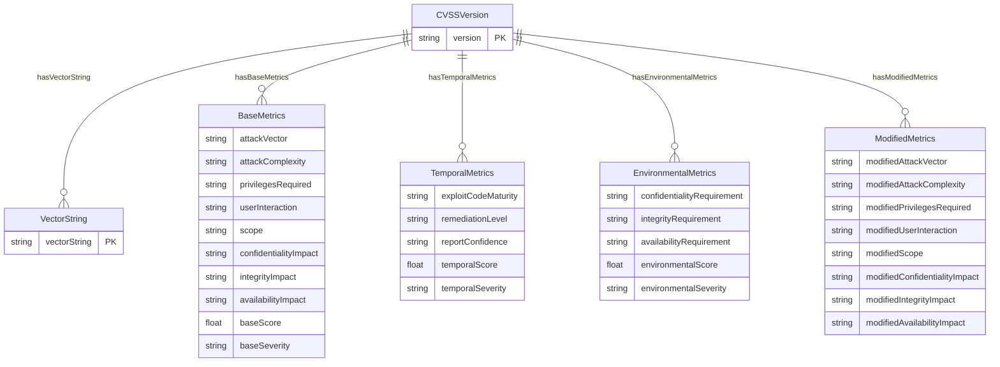
This ERD captures the relationships between the CVSS version and its associated metrics, providing a structured representation of how CVSS scores are defined and calculated.

## 2.4 CWE (Common Weakness Enumeration)

### 2.4.1 Summary
The **Common Weakness Enumeration (CWE)** is a community-developed list of common software and hardware weaknesses. It provides a standardized way to identify and categorize weaknesses, helping organizations prioritize remediation efforts. Each CWE entry includes a unique identifier, a description, and examples of the weakness in practice.

### 2.4.2 Core Entities

The CWE entries form a hierarchical tree with different abstraction layers:

- **Pillar**
   - Highest-level abstractions
   - Example: CWE-118 (Incorrect Access of Indexable Resource)
   - Cannot have 'ChildOf' relationships

- **Class**
   - Language and technology independent
   - Example: CWE-119 (Improper Restriction of Operations within Memory Bounds)
   - Child of Pillar abstractions

- **Base**
   - More specific than classes
   - Example: CWE-787 (Out-Of-Bounds Write)
   - Child of Class abstractions

- **Variant**
   - Most specific weakness types
   - Example: CWE-121 (Stack-based Buffer Overflow)
   - Child of Base abstractions

Entities can have the following status:
- **Stable**: Verified and unlikely to change
- **Usable**: Extensively reviewed with critical elements verified
- **Draft**: Important elements filled but may have gaps
- **Incomplete**: Missing important elements
- **Obsolete**: Valid but no longer relevant
- **Deprecated**: Removed from CWE

#### Weakness_Catalog
```xml
Primary Attributes:
- Name (required): String
- Version (required): String
- Date (required): Date
- Author (optional): String

Contains:
- Weaknesses
- Categories
- Views
- External_References
```

#### Weakness
```xml
Primary Attributes:
- ID (required): Integer
- Name (required): String
- Abstraction (required): Enum
- Structure (required): Enum
- Status (required): Enum

Contains:
- Description
- Extended_Description
- Related_Weaknesses
- Common_Consequences
- Detection_Methods
- Potential_Mitigations
```

#### Category
```xml
Primary Attributes:
- ID (required): Integer
- Name (required): String
- Status (required): Enum

Contains:
- Summary
- Relationships
- Taxonomy_Mappings
```

#### View
```xml
Primary Attributes:
- ID (required): Integer
- Name (required): String
- Type (required): Enum
- Status (required): Enum

Contains:
- Objective
- Audience
- Members
- Filter
```

Here's a summary of the Weakness_Catalog and its core entities as a simple Entity-Relationship Model (ERD):

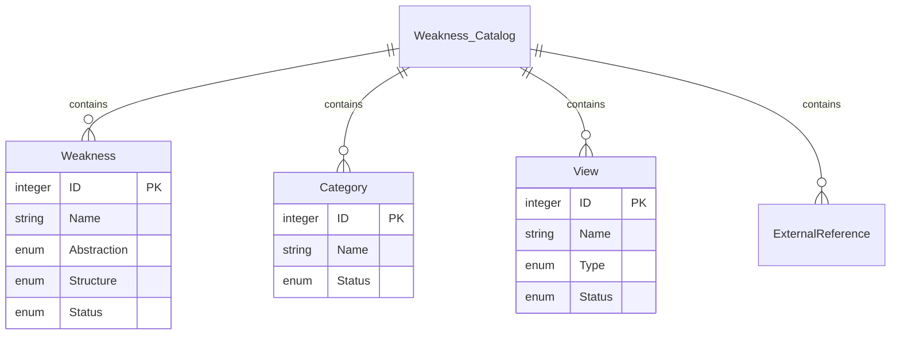

[erDiagram](https://mermaid.live/edit#pako:eNqlUl1Lw0AQ_CvHPqcld2nTJG_S-iCCiIqCBORMtmlos1cud9ia5r97jf2gKip0n25md2aH5RrIVI6QAOpJKQstq5SYqyeUc8K6fhlLIxeqYJtNr6eaA88SlikysqT6d4GDWCi9_rfgscS3fw9frgxqkos7nKJGyvBEeaplzSfeVkkuFWp2NWG310e6Nrqkgt3ICo8kkq3YxavrycyUir507o22mbEav_HS2F38dp_lcI1zsvzo3J3tHNeH9fLPRSmBB4Uuc0imclGjBxXqSm4xdLtTMDN01pC4Zy71PIWUWidaSnpWqoLEXcvJtLLFbA_sMndn2X2_wwRSjnqsLBlI-LBzgKSBlUN-2A-FP4oDHkaDURhwD9aOFrw_EEEQ8YHrCDESrQfv3VK_H4U85sEw5JHw4yiI2w-jh-uL)


### 2.4.2 Relationships

The nature of relationships depends on abstraction layers:
- **Hierarchical**
   - ChildOf: Points to higher abstraction
   - ParentOf: Points to lower abstraction
   - PeerOf: Same abstraction level

- **Sequential**
   - StartsWith: Initial weakness in chain
   - CanPrecede: Can lead to target weakness
   - CanFollow: Can result from target weakness

- **Compositional**
   - RequiredBy: Part of composite weakness
   - Requires: Depends on other weakness
   - CanAlsoBe: Alternative classification

Or is a Taxonomy Relationship:
- **Mapping Types**
   - Exact: Perfect match
   - Close: Almost complete match
   - Partial: Some overlap
   - Incomplete: Limited match

- **Target Systems**
   - CAPEC (Common Attack Pattern Enumeration and Classification)
   - WASC (Web Application Security Consortium)
   - OWASP Top 10
   - Seven Pernicious Kingdoms
   - CERT Secure Coding Standards
   - PCI DSS Requirements
   - NVD (National Vulnerability Database)
   - CISQ (Consortium for IT Software Quality)

### 2.4.3 Additional Properties

#### Common Consequences
Elements:
- **Scope**: Security property violated
- **Impact**: Technical impact of exploitation
- **Likelihood**: Relative probability
- **Note**: Additional context

#### Detection Methods
Contains:
- **Method**: Detection technique
- **Description**: Application context
- **Effectiveness**: Detection reliability
- **Effectiveness_Notes**: Strengths/limitations

#### Potential Mitigations
Elements:
- **Phase**: Development lifecycle stage
- **Strategy**: Protection approach
- **Effectiveness**: Prevention reliability
- **Description**: Implementation details

### 2.4.4 Model Representation

Here's a class diagram representation using Mermaid:

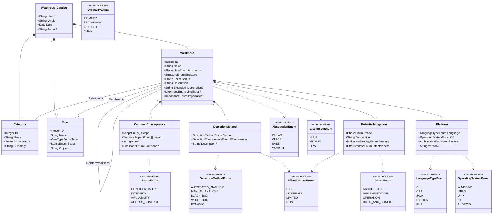

[classDiagram](https://mermaid.live/edit#pako:eNqdV21zozYQ_iuMPl5znthOHdtzkxsZ6Fk9XjyA46Z1x6OAgmkMuCB658vkv1eAbQQoCRd_8GhXj7SPVrur5Qm4sUfAFLg7nKZKgP0Eh-tIYr9CI60IfoxImm5kTPEu9qWncjb__WLTJIh8ycAhaWtvSZIGccRNKJgSKf9rg2FGt3HyuZx4XkciCjXTKKLEJ4mElDf5wPuUJtiljIwaZaHEyfW1mUuzhBSYs1RDYJqlx-l82LaskNRNgn1763xS_U5J5BFvw6E-czAteCS7YBvHXmGjEnkQCvdxQnHkljwrUew7dmvEj5PDe33X4cx2FoY4OQjN3wbk23tN52udw748Zz74OVrm_T-E3fF_ROyXOAzjSI6jlPybEea-ely7cWn3r7-lYszNOcTdRoGLd8z1LIiOqFIQnCmm5GfuuEFTIZQUgaoTlh9ejWRjrtivHIpA6sND6Y48kwpsTfNqKIu5LdjRIhrgnR7QwMc5sMZvscVpeXnFqGuyVLsxWB69h1NCFgKH7HSkJukdpg9xEtaYajjyM-yTc7SdFBzG3BNGgNG2DyklYQEzbb7KJO42yJ19KiG84sXqKHZts2JxZD99IkxTcImjm5tqYoE0DVqVLGvQ5vjNoK1W0i20EDScLjHXmQBcOqYOHVXZQANqdzbirOvQWEJNMDHToPx1MzP_qFSrOXLUukq5M6COZCHddhR0ITtHX-YcPVNRLUa90mhIZyy4ImWYhiq038jodxhXFbTUOdPmSmyoGaVdTMnccLGohN_hLeRi586ZmwYnzxdCCqIk6MJihQzFXNm8e40ld79LA3ES4vMKGoplnl6LJp3ECyK8C-ihe5ZYSIfWXaWwVdk0lJqKkUWWKjuc6-YQGUIK55ei222Yxm9IUQ0HQQ05NZOO-sWqqdgFIQ3OUB0IZVm17Q3byLFMTVziznW3U9Zacp5vsrO0uPBH-kJTdUYUOogPDHOR50lNNVsiLU95hZHSWRFqZkmrgVyD_hpIHz5-ZKMPbHQCdISfOpqO8LyLaFI5TrUYSFPJIuyBIJ6YU3Pdubk6rmOuTbfB_vVFRUs0ZS91eM-eABG8cd5mp_IGvlG-30ALHvG3Vhxf0JZTe72b5sMlQNTLZQloN2M58pxaJajZCuUQwVP1Mrj1UJRQURuTw89p9DrspV1PfUZx5kblFkAElRVcAD8JPDB9wLuUXACWvSHOZVDk9RrQLWENM5iyoYeTxzVYR89s0R5Hf8ZxCKbsE4YtS-LM356EbO-xmD1-5p0R-VdJIsdZRMF0UmwApk_gO5j2L0e90eDyejLsj8ZX16Nh_wIcmHrQ710NhsNx_4rNDAbXg-cL8KOwedkbj_qT_vDXUX88uJyMh5Pn_wHOolHN)

### 2.4.5 Graph Representation

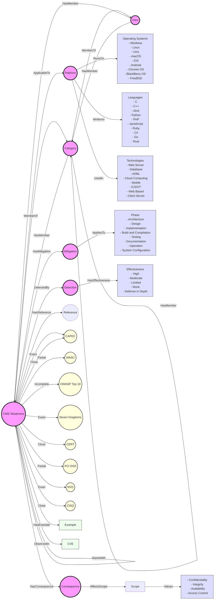

[graphDiagram](https://mermaid.live/edit#pako:eNqFV3tv2zYQ_yqCigIuqjxsZ2niPwY4stJ4tWPPcuNucVHQEm0RkUiNpJJ4db77jpJIya8uQBTynuTx7neXn3bAQmx37BVHaWQNJnNqwc_795bLOLY8KokkWFhIWENEqHUP0qKQcWdeowEfa4bRE8VCfPhQMrpTYCCJV4yvNfGh780ajQeCX4zY6N4HOUYF_ifDNMCaMeyD_hD8rpAkjGpyzwNyD0sc1KnjgfI2jpFcMp5o6sS7bTQmeIm5NmzupUXhblmCee6ivNHI_zH9a-z5j3N7lOYsurL8tZA4KSVOrBmhIXsx2wGh2avefKXErBMUjHy9IdWyS0POSKi3bsRZgq2KfxOj4OkGc76uEW85xjd-b25_1xcZdO8_m8MOEF1laIXNqVyz-PhRL_9Az0ivx2sZMWp2d-O6kB9wkkpNmWSLtbH2Tq8-s4ovZO1cU8-9M-ea4iCiLGYrUh1thheWj_kz5prSQxItkMAmQv2z4cC4jFkWQi4maaZeQ5OHbEFio9F3_bPRtO7hBuxVMY4JplJ7rc46vuv63o-H7gCOOo7qJ-BBRFSeZdzQeliQlQlZP0ljnIDVPH3M22UkDi1EiwOTeIs5xaJ-gx4Lsj0DZdZVhCL5wBxdklVW8qobeLe35fm95VLVxTNWhai178gqqiIWKtu4StwErmhidM9o7apLDEVpQbn3cCqjmkOonyl6ZZQl6y0o6I49F2pZ_dElOOv6QFJfTRnBZtxo5H-sKUut5rlm-eMvjYaP4fjWFwhSyJIKTbyJghP4mpJ3-1Dxbt_q-b6m3T_0Gg34GK2-_ydowXer-HNQm-DiZURE0grLrJOT362NG8ETjpYbRdlhjRGAiTzCw5gf5riI3rI4Zi9HmGOOAxziQ9wJ4CLhOLxZ_4IrjtjtxoLdHDTrS8SlmBEZlVwTnR7YC2T1wkOUpvAawnoBYeuWAGud4t2Qea8okJsiB3bPETOBD7MgmpKgeJPnyQ6vTwOmCkyCbp4thz1C0hzxB8lyzB3kzWFrkDxHrEES1VOobGxnqpcdzKXutNC_Q2KIkwXm9Vc4xOxOd5gFRyWUaps7x6qYRlFJHfd5mKt095si9FdEYlH11jLZMipGdGM65C5_xomUmPZBpOpMu0JfAZOVRNUjdm7WTdOYBGgR4ynb5IpbpWsGhTOAX3izHW24XE1mk88X1aRReshhUvgBS0HCd0dj7zHffC9xSFEK0QcUZ6q6clKJsicFEoeAA5BMRJrO2KeQFLxG6D5DGBE0qTotCACclQnJWbyNqmauOasGn_37VbyNmpLMuFQLHxZ57HRr27FRuCkgBeYpM1gZD1t9ZKMbTCFnDmsGK5E3OyggVa1i_7xGcKMmsn1-qQl-vj2W6-87UqOFUH07Txz3wXuE33rcfLmOsepYhJLaJBfESAigWuql5NpakjjuvFteLx0BsX_CnXftdrtcn7yQUEadi_R1R1dqHCy1l-Fx7daeNobxstQMw1_4be5pch21Uh22_6NuwqFSYF0EpR4JFU4HKt5RUOCocnAgaxx4eCcvzyJKWwoKsh2FzU6OwA6AraNw1QEAdQArHQWLJkR1VY0RToUETlXyjqknxySpU6ZZHrO6Ke-bA-9dBcR24P8UEtqdJYoFdmyY3xOk9vZPpTa3ZQRT2dzuwDJE_Gluz-kbKKWI_s1YYnckz0CNs2wV6U2WhoDoPYLgP6BKAlMYl1yWUWl3mu3cgt35ab_C7vzy9LJ1_um63by8uvh02W469hrIrebpRavdvmpeAKfV-tR6c-x_c6fnp1eXzetm-7fL5lXr_Pqqff32H_1XC58)


## 2.5 CAPEC (Common Attack Pattern Enumeration and Classification)

### 2.5.1 Summary
The **Common Attack Pattern Enumeration and Classification (CAPEC)** is a comprehensive dictionary of attack patterns that can be used to identify and categorize the methods attackers use to exploit vulnerabilities. Each CAPEC entry includes a unique identifier, a description of the attack pattern, and examples of how it can be executed.

### 2.5.2 Core Entities and Relationships
The CAPEC framework consists of several core entities that define the structure and relationships within the attack patterns:

#### Attack Pattern Catalog
The Attack pattern catalog is used to hold an enumerated catalog of common attack patterns and contains:

* **Attack Patterns**
* **Categories**
* **Views**
* **External References**

#### Attack Pattern
The Attack Pattern is an abstraction of an attack which has:

- **Attributes**: Each attack pattern has four attributes

  * **ID (integer)**: Attack pattern identifier. Example: 130
  * **Name (string)**: Attack pattern name. Example: "Excessive Allocation"
  * **Abstraction (AbstractionEnumeration)**: Defines the different abstraction levels of an attack pattern.
    * **Meta**: High level abstraction of attack patterns to architecture and design levels.
    * **Standard**: Specific technique used in a bigger attack. It is usually seen as a piece of the entire attack.
    * **Detailed**: Low level detail of a specific technique targeting a specific technology.
  * **Status (StatusEnumeration)**: Status of the specific Attack Pattern (Deprecated, Draft, Incomplete, Obsolete, Stable or Usable).

- **Elements**: Each attack pattern has several elements that provide detailed information about the attack pattern.

  - Mandatory:
    * ***Description:*** Representation of a high level description of the attack pattern.

  - Optional:
    * ***Alternate Terms:*** Alternative names to describe the same pattern.
    * ***Likelihood Of Attack:*** Captures the average probability that the attack uses a specific pattern to be successful.
      * Possibilities: High, Medium, Low, Unknown.
    * ***Typ Severity:*** Overall average severity value for attacks that leverage this attack pattern.
      * Possibilities: Very High, High, Medium, Low, Very Low.
    * ***Related Attack Patterns:*** Relates the CAPEC identifier to another attack pattern.
    * ***Execution Flow:*** Step-by-step description.
    * ***Prerequisites:*** Prerequisites to an attack.
    * ***Skills Required:*** Skills required to perform the attack.
      * Possibilities: High, Medium, Low.
    * ***Resources Required:*** Resources needed to execute the attack.
    * ***Indicators:*** Activities, events, conditions or behaviors that may indicate that an attack of leveraging this attack pattern is imminent, in progress, or has occurred.
    * ***Consecuences:*** Individual consequences associated with an attack pattern.
    * ***Mitigations:*** Actions to prevent or mitigate the risk of an attack that leverages this attack pattern.
    * ***Example Instances:*** Attack pattern examples.
    * ***Related Weakness:*** References to weaknesses associated with this attack pattern.
      * Example: <Related_Weakness CWE_ID="1021"/>.
    * ***Taxonomy Mappings:*** Similar categories in taxomomies outside of CAPEC.
    * ***References:*** External reference defined within the catalog.
    * ***Notes:*** Additional comments that cannot be captured using the other elements.
    * ***Content History:*** Track of the original author of an entry and any subsequent modifications to the content.

#### Category
Collection of attack patterns based on some common characteristic.

- Attributes: Each category has three attributes Mandatory:
  * ***ID:*** Unique identifier for each category.
  * ***Name:*** Descriptive title.
  * ***Status:*** Status level for each category.

- Elements
  - Mandatory:
    * ***Summary:*** Definition of the category.

  - Optional:
    * ***Relationships:*** Relationships with attack patterns, categories and views.
    * ***Taxonomy Mappings:*** Similar categories in taxomomies outside of CAPEC.
    * ***References:*** More defined information.
    * ***Notes:*** Additional comments that cannot be captured using the other elements.
    * ***Content History:*** Track of the original author of an entry and any subsequent modifications to the content.

#### View
Perspective with which one might look at the collection of attack patterns defined within CAPEC.

- Attributes: Each view has four Mandatory attributes:
  * ***ID:*** Unique identifier for each category.
  * ***Name:*** Descriptive title.
  * ***Type:*** Description about how each view is being constructed.
  * ***Status:*** Status level for each category.

- Elements
  - Mandatory:
    * ***Objective:*** Description about the perspective from which the view has been constructed.

  - Optional:
    * ***Audience:*** Reference of target stakeholders or group for whom the view is most relevant.
    * ***Members:*** Defined externally through memberOf relationships.
    * ***Filter:*** XSL query for identifying which attack patterns are members of an implicit slice.
    * ***References:*** More information about each view.
    * ***Notes:*** Additional comments that cannot be captured using the other elements.
    * ***Content History:*** Track of the original author of an entry and any subsequent modifications to the content.

#### External Reference
Collection of elements that provide a pointer to where more information and deeper insight can be obtained.

- Attributes:
  * ***Reference ID:*** Unique identifier for each reference.

- Elements:
  - Mandatory:
    * ***Title:*** Reference.

  - Optional:
    * ***Author:*** Reference.
    * ***Edition:*** Identification of the edition.
    * ***Publication:*** If the reference is part of a magazine or journal, this element should be used to identify the name of the publisher.
    * ***Publication Year***
    * ***Publication Month***
    * ***Publication Day***
    * ***Publisher:*** More specs about the publisher.
    * ***URL:*** Material being referenced.
    * ***URL Date:*** Date when the URL was validated to exist.

#### Global Types
- **Complex Type Summary:**
  * ***AlternateTermsType***
  * ***AudienceType***
  * ***ConsequencesType***
  * ***ContentHistoryType***
  * ***ExampleInstancesType***
  * ***ExcludeRelatedType***
  * ***ExecutionFlowType***
  * ***IndicatorsType***
  * ***MitigationsType***
  * ***NotesType***
  * ***PrerequisitesType***
  * ***ReferencesType***
  * ***RelatedAttackPatternType***
  * ***RelatedWeaknessesType***
  * ***RelationshipsType***
  * ***RequiredResourcesType***
  * ***SkillsType***
  * ***TaxonomyMappingsType***

#### Enumerations
- **Simple Type Summary:**
  * ***AbstractionEnumeration***: Defines the different abstraction levels of an attack pattern.  
    - Meta: High level abstraction of attack patterns to architecture and design levels.
    - Standard: Specific technique used in a bigger attack. It is usually seen as a piece of the entire attack.
    - Detailed: Low level detail of a specific technique targeting a specific technology.
  * ***ImportanceEnumeration***: The ImportanceEnumeration simple type lists different values for importance.
    - Normal: Normal importance.
    - Critical: Critical importance.
  * ***LikelihoodEnumeration***: The LikelihoodEnumeration simple type contains a list of values corresponding to different likelihoods. The value "Unknown" should be used when the actual likelihood of something occurring is not known.
    - High: Attack pattern is very likely to be used.
    - Medium: Attack pattern is moderately likely to be used.
    - Low: Attack pattern is not very likely to be used.
    - Unknown: Likelihood of attack pattern usage is unknown.
  * ***NoteTypeEnumeration***: The NoteTypeEnumeration simple type defines the different types of notes that can be associated with an attack pattern. A "Maintenance" note contains significant maintenance tasks within this entry that still need to be addressed, such as clarifying the concepts involved or improving relationships. A "Relationship" note provides clarifying details regarding the relationships between entities. A "Research Gap" note identifies potential opportunities for the research community to conduct further exploration of issues related to this attack pattern. A "Terminology" note contains a discussion of terminology issues related to this attack pattern, or clarifications when there is no established terminology, or if there are multiple uses of the same key term.
    - Maintenance: Significant maintenance tasks within this entry that still need to be addressed.
    - Relationship: Clarifying details regarding the relationships between entities.
    - Research Gap: Potential opportunities for the research community to conduct further exploration of issues related to this attack pattern.
    - Terminology: Discussion of terminology issues related to this attack pattern.
  * ***RelatedNatureEnumeration***: The RelatedNatureEnumeration simple type defines the different values that can be used to define the nature of a related attack pattern. A ChildOf nature denotes a related attack pattern as a higher level of abstraction. A ParentOf nature denotes a related attack pattern as a lower level of abstraction. The CanPrecede and CanFollow relationships are used to denote attack patterns that are part of a chaining structure. The CanAlsoBe relationship denotes a attack pattern that, in the proper environment and context, can also be perceived as the target attack pattern. Note that the CanAlsoBe relationship is not necessarily reciprocal. The PeerOf relationship is used to show some similarity with the target attack pattern which does not fit any of the other types of relationships.
    - ChildOf: Related attack pattern is a higher level of abstraction.
    - ParentOf: Related attack pattern is a lower level of abstraction.
    - CanPrecede: Related attack pattern can be part of a chaining structure.
    - CanFollow: Related attack pattern can be part of a chaining structure.
    - CanAlsoBe: Related attack pattern can also be perceived as the target attack pattern.
    - PeerOf: Related attack pattern shows some similarity with the target attack pattern.
  * ***ScopeEnumeration***: The ScopeEnumeration simple type defines the different areas of software security that can be affected by exploiting a weakness.
    - Confidentiality: The attack pattern affects the confidentiality of the system.
    - Integrity: The attack pattern affects the integrity of the system.
    - Availability: The attack pattern affects the availability of the system.
    - Access Control: The attack pattern affects the access control of the system.
    - Accountability: The attack pattern affects the accountability of the system.
    - Authorization: The attack pattern affects the authorization of the system.
    - Authentication: The attack pattern affects the authentication of the system.
    - Non-Repudiation: The attack pattern affects the non-repudiation of the system.
    - Other: The attack pattern affects other areas of software security.
  * ***SeverityEnumeration***: The SeverityEnumeration simple type contains a list of values corresponding to different severities.
    - Very High: Attack pattern is very severe.
    - High: Attack pattern is severe.
    - Medium: Attack pattern is moderately severe.
    - Low: Attack pattern is not very severe.
    - Very Low: Attack pattern is very low severity.
  * ***SkillLevelEnumeration***: The SkillLevelEnumeration simple type contains a list of values corresponding to different knowledge levels required to perform an attack. The value "Unknown" should be used when the actual skill level is not known.
    - High: Attack pattern requires a high level of knowledge.
    - Medium: Attack pattern requires a medium level of knowledge.
    - Low: Attack pattern requires a low level of knowledge.
    - Unknown: Skill level is unknown.
  * ***StakeholderEnumeration***: The StakeholderEnumeration simple type defines the different types of users within the CAPEC community.
    - Academic Researchers: Academic researchers who study attack patterns.
    - Applied Researchers: Applied researchers who study attack patterns.
    - Assessment Customers: Customers who assess attack patterns.
    - Assessment Vendors: Vendors who assess attack patterns.
    - CAPEC Team: The CAPEC team who maintain the attack patterns.
    - Educators: Educators who teach about attack patterns.
    - Information Providers: Information providers who provide information about attack patterns.
    - Software Customers: Customers who use software that may be affected by attack patterns.
    - Software Designers: Designers who design software that may be affected by attack patterns. 
    - Software Developers: Developers who develop software that may be affected by attack patterns.
    - Software Vendors: Vendors who provide software that may be affected by attack patterns.
    - Other: Other stakeholders who may be affected by attack patterns.
  * ***StatusEnumeration***: The StatusEnumeration simple type defines the different status values that an entity (view, category, attack pattern) can have.
    - Deprecated: The entity is deprecated.
    - Draft: The entity is in draft status.
    - Incomplete: The entity is incomplete.
    - Obsolete: The entity is obsolete.
    - Stable: The entity is stable.
    - Usable: The entity is usable.
  * ***TaxonomyMappingFitEnumeration***: The TaxonomyMappingFitEnumeration simple type defines the different values used to describe how close a certain mapping to CAPEC is.
    - Exact: Indicates that one attack pattern is an exact match to another in a different taxonomy.
    - CAPEC More Abstract: Indicates that one attack pattern is a more abstract version of another in a different taxonomy.
    - CAPEC More Specific: Indicates that one attack pattern is a more specific version of another in a different taxonomy.
    - Imprecise: Indicates that the mapping is not precise and may require further clarification.
    - Perspective: Indicates that the mapping is based on a specific perspective or context.
  * ***TaxonomyNameEnumeration***: The TaxonomyNameEnumeration simple type lists the different known taxomomies that can be mapped to CAPEC.
    - CAPEC: Common Attack Pattern Enumeration and Classification.
    - CWE: Common Weakness Enumeration.
    - CVE: Common Vulnerabilities and Exposures.
    - CVSS: Common Vulnerability Scoring System.
    - D3FEND: Detection, Denial, and Disruption Framework Empowering Network Defense.
    - OWASP: Open Web Application Security Project.
    - NVD: National Vulnerability Database.
    - WASC: Web Application Security Consortium.
    - PCI DSS: Payment Card Industry Data Security Standard.
    - CISQ: Consortium for IT Software Quality.
  * ***TechnicalImpactEnumeration***: The ImpactEnumeration simple type defines the different negative technical impacts that can results from an attack leveraging a given attack pattern. A negative technical impact is the specific effect of successfully violating a reasonable security policy for the system or network.
    - Modify Data: The attack pattern modifies data.
    - Read Data: The attack pattern reads data.
    - Unreliable Execution: The attack pattern causes unreliable execution.
    - Resource Consumption: The attack pattern consumes resources.
    - Execute Unauthorized Commands: The attack pattern executes unauthorized commands.
    - Gain Privileges: The attack pattern gains privileges.
    - Bypass Protection Mechanism: The attack pattern bypasses a protection mechanism.
    - Hide Activities: The attack pattern hides activities.
    - Alter Execution Logic: The attack pattern alters execution logic.
    - Other: The attack pattern has other negative technical impacts.
  * ***ViewTypeEnumeration***: The ViewTypeEnumeration simple type defines the different types of views that can be found within CAPEC. A graph is a hierarchical representation of attack patterns based on a specific vantage point that a user my take. The hierarchy often starts with a category, followed by a meta/standard attack pattern, and ends with a detailed attack pattern. An explicit slice is a subset of attack patterns that are related through some external factor. For example, a view may be used to represent mappings to external groupings like a Top-N list. An implicit slice is a subset of attack patterns that are related through a specific attribute. For example, a slice may refer to all attack patterns in draft status, or all existing meta attack patterns.
    - Graph: A hierarchical representation of attack patterns based on a specific vantage point.
    - Explicit Slice: A subset of attack patterns that are related through some external factor.
    - Implicit Slice: A subset of attack patterns that are related through a specific attribute.

#### Structured Text
- **Complex Type Summary:**
  * ***StructuredTextType***
  * ***StructuredTextWithLinkType***
  * ***StructuredTextWithLinkAndNoteType***

#### Relationships
The relationships within the CAPEC framework are categorized into two main types:

1. **Hierarchical Relationships**: These relationships define the parent-child structure of attack patterns, allowing for a clear understanding of how different patterns relate to one another in terms of abstraction levels.
   - **ChildOf**: Indicates that one attack pattern is a more specific version of another.
   - **ParentOf**: Indicates that one attack pattern is a more general version of another.
   - **PeerOf**: Indicates that two attack patterns are at the same level of abstraction.
   - **CanFollow**: Indicates that one attack pattern can be executed after another.
   - **CanPrecede**: Indicates that one attack pattern can be executed before another.
   - **CanAlsoBe**: Indicates that one attack pattern can be classified in multiple ways.
  
2. **Taxonomy Relationships**: The TaxonomyMappingsType complex type is used to provide a mapping from an entry (Attack Pattern or Category) in CAPEC to an equivalent entry in a different taxonomy. The required Taxonomy_Name attribute identifies the taxonomy to which the mapping is being made. The Entry_ID and Entry_Name elements identify the ID and name of the entry which is being mapped. The Mapping_Fit element identifies how close the CAPEC is to the entry in the taxonomy.  
The TaxonomyMappingFitEnumeration simple type defines the different values used to describe how close a certain mapping to CAPEC is.

   - **Exact**: Indicates that one attack pattern is an exact match to another in a different taxonomy.
   - **CAPEC More Abstract**: Indicates that one attack pattern is a more abstract version of another in a different taxonomy.
   - **CAPEC More Specific**: Indicates that one attack pattern is a more specific version of another in a different taxonomy.
   - **Imprecise**: Indicates that the mapping is not precise and may require further clarification.
   - **Perspective**: Indicates that the mapping is based on a specific perspective or context.

### 2.5.5 Graph Representation

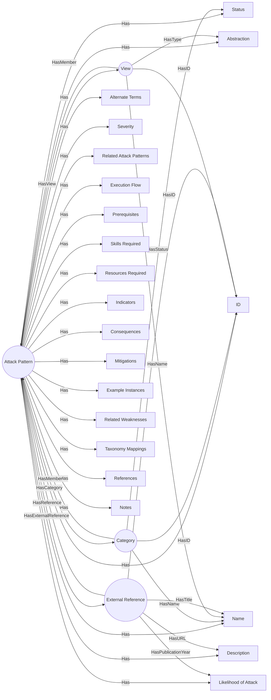

[CAPEC - Graph](https://mermaid.live/edit#pako:eNp9VmtvozgU_SvI0kgZqa2apEkn-bASS9wZVF4L9LWTUeQGN7EKmDFmJtmm_31tCK_Uu_2S4nM49_r63GvewJpGGMzBhqFsq1n-MtXE36dPmkEZ1mDKCSc411Cu2YikmiPYecXRvcFA5xytXzUPcY5Z-vlzhRh6OBgYiOMNZft68d6ED4PBPcG_6xX4GK58eDMYwJ18G8Waj18ww-kaS0qTiQjCyHPB68Dm4vsSmIsl-FE9O7oNxYqDEtys6X8Goa8boek6AtKfc87QmhOaNowg1MO7QIABR7zIy_UmJIxxglN-DLiAgSGIC5yvGcl6KroVQt_RQ7gSv7aU0-NyMxxrIWZJ3jAt8xZa5jfXldlb5BXHZEtppNEXrapimxm8h74ZPsnc8C_MCN83mA8tEWyx0j2B-jgWcSKtfwptSPgIjdWN5T4ILtzhdSFT125i-ruheD704V93ZmCGUGbvMXEAPwuSE1nuJqNb07LKWr2SOM7FOQkKw1EnrcC9841Swsc5LdgaK2imszCFOVxf8sw0ImvEKWvjGK4TiGygUykZNM2FhDREy7HN0Pyqy4OVFFvYc4Pkvrrb1m3PKhXgDiVZjDUzzTnqydSFfID6rQODoFPOB4xeU5znHXaoP7qOaz-tbN3zTOerpIdoR1Oa7EVjZBlJN13tG1FVpy7H0dMt7rhVsR1aF7kxXpmD3M2WZE2faefnf2iHbyg_CO8rFmUDKJY7PaBAK__XoXuQ9LtKr-91BaP1uCrg0dYKqHW1AmxcrMB69lXFLI2rjHg0rKrGjUsVYNeiCrjjTuVWKmf-TwlqPyooH0yolKmtp_KJq6pSPagPcm5_QOXAPpTD-wNUj-3G4Yd6pDfXQMO1cfKMmfCQ194G_wkeVRq8E6CmdLXNRdsX3XV5IXSbo4tVQ7_tgg85dUV7wKlqDwz3GVY03umGuuKnWEh43AtwSrjzrW6LnsJe8RzLuSqGyBNGrN-U4Exc9CQC8xcU5_gMJOKKQvIZvEm1JeBbLG_Rufg3QkzcScv0XbyUofRvShMw56wQrzFabLb1Q5FFwkELgsQnRNIoi_OKMDNokXIwH06_lBpg_gZ2YD6aTi7Gw-vheHo5ml5PppOrM7AH8_PxbHJxdTW7nF3PJrOhILyfgX_KsMOL6fhqNB0NR5fj8ZfRbCbewBERl4ddfb6UXzHv_wJYxJwQ)

## 2.6 ATT&CK (Adversarial Tactics, Techniques, and Common Knowledge)

### 2.6.1 Summary
The **Adversarial Tactics, Techniques, and Common Knowledge (ATT&CK)** framework is a knowledge base of adversary tactics and techniques based on real-world observations. It provides a comprehensive view of the methods attackers use to compromise systems, allowing organizations to better understand and defend against potential threats.

### 2.6.2 Core Entities
The ATT&CK framework is organized into several categories, each representing a different phase of the attack lifecycle. Each category contains specific techniques that adversaries may use to achieve their objectives.

The ATT&CK framework consists of several core entities that define the structure and relationships within the attack patterns:

- **Tactic**: Represents a high-level objective that adversaries aim to achieve during an attack (e.g., Initial Access, Execution, Persistence).
- **Technique**: Represents a specific method used to achieve a tactic (e.g., T1018 - Remote System Discovery, T1074 - Data Staged).
- **Sub-techniques**: More granular methods that fall under a specific technique (e.g., T1018.001 - Remote System Discovery via WMI).
- **Mitigations**: Recommended defensive measures to counter specific techniques.
- **Detection**: Guidance on how to identify the use of specific techniques in an environment.
- **Platforms**: The operating systems or environments where the techniques can be executed (e.g., Windows, Linux, macOS).
- **Data Sources**: Types of data that can be used to detect the techniques (e.g., process creation logs, network traffic).
- **References**: Links to external resources or documentation related to the techniques.

### 2.6.3 The ATT&CK Data Model Schema
The ATT&CK data model schema is based on the STIX 2.0 specification, which provides a standardized way to represent and share threat intelligence. The schema defines the structure and relationships between different entities within the ATT&CK framework.

#### StixBundle
_Object containing the following properties:_

| Property | Description | Type |
| :------- |:----------- | :--- |
| **`id`** (\*) |        | `any` |
| **`type`** (\*)|       | `'bundle'` |
| **`spec_version`** (\*) | The version of the STIX specification used to represent this object. The value of this property MUST be 2.1 for STIX Objects defined according to this specification. If objects are found where this property is not present, the implicit value for all STIX Objects other than SCOs is 2.0. Since SCOs are now top-level objects in STIX 2.1, the default value for SCOs is 2.1. | `'2.0' \| '2.1'` |
| **`objects`** (\*) |   | [AttackObjects](#attackobjects) |

_(\*) Required._

#### AttackObjects
ATT&CK uses a mix of predefined and custom STIX objects to implement ATT&CK concepts. The following table is a mapping of ATT&CK concepts to STIX 2.0 objects:

| ATT&CK concept | STIX object type | Custom type? |
|:------------|:----------|:---|
| [Matrix](#matrices)              | `x-mitre-matrix` | yes |
| [Tactic](#tactics)               | `x-mitre-tactic` | yes |
| [Technique](#techniques)         | `attack-pattern` | no |
| [Sub-technique](#sub-techniques) | `attack-pattern` where `x_mitre_is_subtechnique = true` | no |
| [Procedure](#procedures)         | `relationship` where `relationship_type = "uses"` | no |
| [Mitigation](#mitigations)       | `course-of-action` | no |
| [Group](#groups)                 | `intrusion-set`  | no |
| [Software](#software)            | `malware` or `tool` | no |
| [Data Source](#data-sources)      | `x-mitre-data-source` | yes |
| [Campaign](#campaigns) | `campaign` | no |
| [Asset](#assets) | `x-mitre-asset` | yes |

#### Extensions of the STIX spec
There are three general ways that ATT&CK extends the STIX 2.0 format:

- **Custom object types**: Object types prefixed with `x-mitre-`, e.g `x-mitre-matrix`, are custom STIX types extending the STIX 2.0 spec.

- **Extensions of existing object types**: Fields extending the STIX 2.0 spec are prefixed with `x_mitre_`, e.g `x_mitre_platforms` in `attack-patterns`.

    All objects except relationships can have the following extended properties applied:

    | Field | Type | Description |
    |:------|:-----|:------------|
    | `x_mitre_version` | string | The version of the object in format `major.minor` where `major` and `minor` are integers. |
    | `x_mitre_contributors` | string[] | People and organizations who have contributed to the object. |
    | `x_mitre_deprecated` | boolean | Indicates if the object is deprecated. |

- **New relationship types**: Unlike custom object types and extended fields, custom relationship types are **not** prefixed with `x_mitre_`.

#### IDs in ATT&CK
Objects in ATT&CK may have several different kinds of IDs. The most commonly used ID format is what is referred to as the ATT&CK ID or simply ID. Each different type of ATT&CK object has its own variation upon the ATT&CK ID format:

| ATT&CK concept | ID format |
|:------------|:----------|
| [Matrix](#matrices)              | `MAxxxx` |
| [Tactic](#tactics)               | `TAxxxx` |
| [Technique](#techniques)         | `Txxxx` |
| [Sub-Technique](#sub-techniques) | `Txxxx.yyy` |
| [Mitigation](#mitigations)       | `Mxxxx` |
| [Group](#groups)                 | `Gxxxx`  |
| [Software](#software)            | `Sxxxx` |
| [Data Source](#data-sources)      | `DSxxxx` |
| [Campaign](#campaigns)           | `Cxxxx` |
| [Asset](#assets)                 | `Axxxx` |


### 2.6.4 ATT&CK Types and Relationships

#### Matrices
The overall layout of the ATT&CK Matrices is stored in `x-mitre-matrix` objects. Matrices extend the generic SDO format with the following field:

| Field | Type | Description |
|:------|:-----|-------------|
| `tactic_refs` | string[] | An ordered list of `x-mitre-tactic` STIX IDs corresponding to the tactics of the matrix. |

##### Mapping matrices, tactics and techniques
Techniques map into tactics by use of their `kill_chain_phases` property. Where the `kill_chain_name` is `mitre-attack`, `mitre-mobile-attack`, or `mitre-ics-attack`, the `phase_name` corresponds to the `x_mitre_shortname` property of an `x-mitre-tactic` object.

#### Tactics
A Tactic in ATT&CK is defined by an `x-mitre-tactic` object. Tactics extend the generic SDO format with the following field:

| Field | Type | Description |
|:------|:-----|-------------|
| `x_mitre_shortname` | string | Used for mapping techniques into the tactic. It corresponds to `kill_chain_phases.phase_name` of the techniques in the tactic. |

#### Techniques
A Technique in ATT&CK is defined as an `attack-pattern` object. Techniques depart from the attack-pattern format with the following fields:

| Field | Type | Applies to | Description |
|:------|:-----|:--------|:------------|
| `x_mitre_detection` | string | All techniques | Strategies for identifying if a technique has been used by an adversary. |
| `x_mitre_platforms` | string[] | All techniques | List of platforms that apply to the technique. |
| `x_mitre_data_sources` | string[] | Enterprise* & ICS domains | Sources of information that may be used to identify the action or result of the action being performed. |
| `x_mitre_is_subtechnique` | boolean | Enterprise domain | If true, this `attack-pattern` is a sub-technique. |
| `x_mitre_system_requirements` | string[] | Enterprise domain | Additional information on requirements the adversary needs to meet. |
| `x_mitre_tactic_type` | string[] | Mobile domain | "Post-Adversary Device Access", "Pre-Adversary Device Access", or "Without Adversary Device Access". |
| `x_mitre_permissions_required` | string[] | Enterprise domain in the _Privilege Escalation_ tactic | The lowest level of permissions the adversary is required to be operating within. |
| `x_mitre_effective_permissions` | string[] | Enterprise domain in the _Privilege Escalation_ tactic | The level of permissions the adversary will attain by performing the technique. |
| `x_mitre_defense_bypassed` | string[] | Enterprise domain in the _Defense Evasion_ tactic | List of defensive tools, methodologies, or processes the technique can bypass. |
| `x_mitre_remote_support` | boolean | Enterprise domain in the _Execution_ tactic | If true, the technique can be used to execute something on a remote system. |
| `x_mitre_impact_type` | string[] | Enterprise domain in the _Impact_ tactic | Denotes if the technique can be used for integrity or availability attacks. |

#### Sub-Techniques
A sub-technique in ATT&CK is represented as an `attack-pattern` and follows the same format as techniques. They differ in that they have a boolean field (`x_mitre_is_subtechnique`) marking them as sub-techniques, and a relationship of the type `subtechnique-of` where the `source_ref` is the sub-technique and the `target_ref` is the parent technique.

Additionally:
- Sub-technique ATT&CK IDs are a suffix of their parent IDs (e.g., `Txxxx.yyy`).
- Sub-techniques have the same tactics as their parent technique.
- Sub-techniques have a subset of their parent technique's platforms.

#### Procedures
ATT&CK does not represent procedures under their own STIX type. Instead, procedures are represented as relationships of type `uses` where the `target_ref` is a technique. This means that procedures can stem from usage by both groups (`intrusion-set`s) and software (`malware` or `tool`s).

#### Mitigations
A Mitigation in ATT&CK is defined as a `course-of-action` object. ATT&CK Mitigations do not depart from the STIX `course-of-action` spec.

#### Groups
A Group in ATT&CK is defined as an `intrusion-set` object. ATT&CK Groups do not depart from the STIX `intrusion-set` format.

#### Software
Software in ATT&CK is the union of two distinct STIX types: `malware` and `tool`. Both depart from the STIX format with the following fields:

| Field | Type | Description |
|:------|:-----|-------------|
| `x_mitre_platforms` | string[] | List of platforms that apply to the software. |
| `x_mitre_aliases` | string[] | List of aliases for the given software. |

#### Data Sources and Data Components
Data Sources and Data Components represent data which can be used to detect techniques:

- A Data Component can only have one parent Data Source.
- A Data Source can have any number of Data Components.
- Data Components can map to any number of techniques.

##### Data Sources
A Data Source in ATT&CK is defined by an `x-mitre-data-source` object with the following extended fields:

| Field | Type | Description |
|:------|:-----|-------------|
| `x_mitre_platforms` | string[] | List of platforms that apply to the data source. |
| `x_mitre_collection_layers` | string[] | List of places the data can be collected from. |

##### Data Components
A Data Component in ATT&CK is represented as an `x-mitre-data-component` object with the following extended field:

| Field | Type | Description |
|:------|:-----|-------------|
| `x_mitre_data_source_ref` | embedded relationship (string) | STIX ID of the data source this component is a part of. |

#### Campaigns
A Campaign in ATT&CK is defined as a `campaign` object with the following extended fields:

| Field | Type | Description |
|:------|:-----|-------------|
| `x_mitre_first_seen_citation` | string | One to many citations for when the Campaign was first reported. |
| `x_mitre_last_seen_citation` | string | One to many citations for when the Campaign was last reported. |

#### Assets
An Asset in ATT&CK is defined by an `x-mitre-asset` object with the following extended fields:

| Field | Type | Description |
|:------|:-----|-------------|
| `x_mitre_sectors` | string[] | List of industry sector(s) an asset may be commonly observed in. |
| `x_mitre_related_assets` | related_asset[] | Related assets describe sector specific device names or aliases. |

#### Relationships
Objects in ATT&CK are related to each other via STIX `relationship` objects. These relationships convey concepts like groups using techniques, the hierarchy of techniques and sub-techniques, and so on.

| Source Type | Relationship Type | Target Type | Custom Type? | About |
|:------------|:------------------|:------------|:----|:------|
| `intrusion-set` | `uses` | `malware` or `tool` | No | Group using a software. |
| `intrusion-set` | `uses` | `attack-pattern` | No | Group using a technique, which is also considered a procedure example. |
| `malware` or `tool` | `uses` | `attack-pattern` | No | Software using a technique, which is also considered a procedure example. |
| `campaign` | `uses` | `malware` or `tool` | No | Campaign using a software. |
| `campaign` | `uses` | `attack-pattern` | No | Campaign using a technique, which is also considered a procedure example. |
| `campaign` | `attributed-to` | `intrusion-set` | No | Campaign attributed to a group. |
| `course-of-action` | `mitigates` | `attack-pattern` | No | Mitigation mitigating a technique. |
| `attack-pattern` | `subtechnique-of` | `attack-pattern` | Yes | Sub-technique of a technique. |
| `x-mitre-data-component` | `detects` | `attack-pattern` | Yes | Data component detecting a technique. |
| `attack-pattern` | `targets` | `x-mitre-asset` | Yes | Technique targets an asset. |
| any type | `revoked-by` | any type | Yes | The target object is a replacement for the source object. |

### 2.6.5 UML Class Diagram
The ATT&CK data model is represented as a class diagram, which illustrates the relationships between the various entities within the framework. The diagram includes classes for StixObject, Technique, Tactic, Group, DataSource, and DataComponent, along with their attributes and relationships.

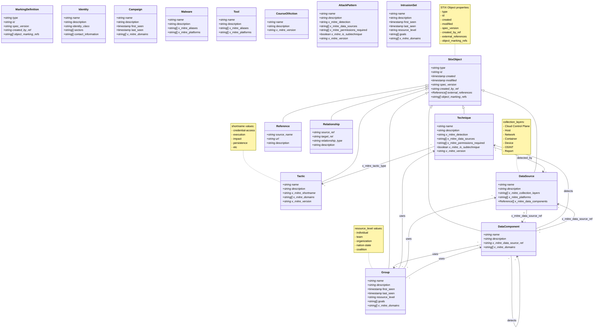

Note: The above diagram is a simplified representation of the ATT&CK data model. The actual implementation may include additional attributes and relationships based on specific use cases and requirements.

[classDiagram](https://mermaid.live/edit#pako:eNqtVk1v2zAM_SuCjl1cNKlTJ8awSwpsu7RDu9PmwVBkJtGqD1eSs2Rd_vtkO_5q7KLY6pNNPlGPTxTpJ0xVAjjElBNjrhlZayIiidxTWNC9Zbvb5U-gFj2V9vx5Z6xmco3sPoWzUzNL2kbLBBhLRIqoBmJhwClUwlas6z3GMynQeAvaMCV73Mew8XIfa1i1AXewAg2SwvcfCHYWtCQ8x5RGcxrL4VSRbSyIfnCGHF3hDpFsS_MV6Eayxwz6lJFE9CmTgKGapbY_kV0smNUQJ2AdBYfp41eDiCWxUZl2ibyES0ELZnLpjEvmMWMakhZ-qRQHIms4M7HJlrbK7QWW3QN5Lg5xCdA3V8ZslLb9EdrSKEGYNP_K_aNWWfr_1JvSXjFtbGwAZK_bbXriPYbWUJ5wzGELvC_ntSLcvF6MZ6leuyK6L3Z4q6Nq7UwV52Udx5zsneIvolNO7EppYQbub6fuqRKpkiCtGUxrUUHe_no2N-95w3mt-lJZQC7b6p5EuK5stCU8AxM2Ub28wyUuE0a4R6i776bthB3QrNstPMRE6iK3LWle8sbmanZWWxrhE1qtuojwyTl2uC24yhK0UNJqxdEXTmQn_idlOjRuwP5S-qETwa11IoFuG69hy7pMb-8_33xtG-4gdZo17Fuz6v0fz2sa9IC7kL7fV7SAflcjzbC_rr2KWjMrInwWYeR5H45vxwII64qxhSHOR2u5tnMW487ibp2HQxVaxinb2sn-NbMQZaYaJcN8W2xCVA6qYvTiEV5rluBw5foRjLBwY4fk37i4fhG2GxAQ4dC9Jm625sd2cItSIr8pJXBodeaWOY7rTfWRpS4ROP6V1AiQCeiFyqTF4cwvIuDwCe9wOJ-eB1fTi4l_ORuPp_PZfIT3OPRmwfmVP55cjufj6WQaBNPDCP8u9rw4nwe-fxEElxN_dhVM_PnhL91p3Fw)

### 2.6.6 Entity Relationship Diagram
Below is an example of how you can represent core ATT&CK entities using Mermaid syntax:
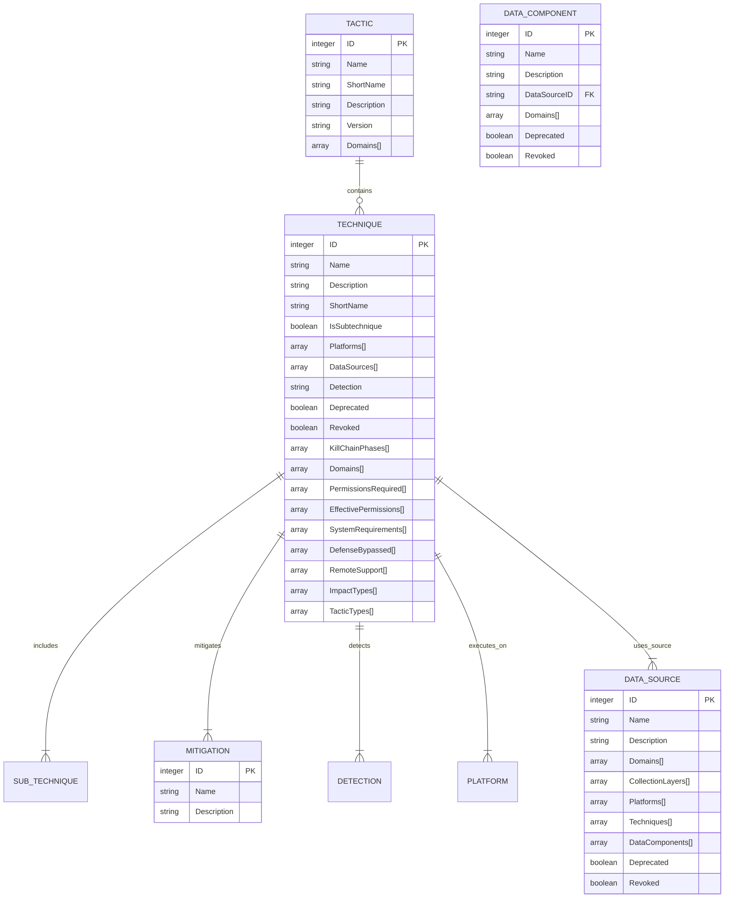
Example Relationships in Context
```
TACTIC (Initial Access) -- contains --
TECHNIQUE (Remote System Discovery - T1018)
SUB_TECHNIQUE (Remote System Discovery via WMI - T1018.001)
MITIGATION (Implement Multi-Factor Authentication)
DETECTION (Monitor process creation logs)

D3FEND (Firewall Rule) -- mitigates --
ATT&CK (T1018)
CAR (Containment Protocol) -- triggers --
D3FEND (Firewall Rule)
```
### 2.6.7 Relationships with Other Standards

#### CVE Integration
- Example: "ATT&CK-T1234 exploits a specific CVE node (high CVSS score) via a CAPEC pattern (exploit technique)."
  
#### CWE Integration
- Example: "ATT&CK-T1234 targets a specific CWE weakness (e.g., T1018 targets CWE-295 - Improper Input Validation)."

#### CAPEC Integration
- Example: "ATT&CK-T1234 uses a specific CAPEC attack pattern to exploit vulnerabilities."

#### D3FEND Integration
- Example: "ATT&CK-T1234 is mitigated by a D3FEND defensive technique (e.g., T1098 can be mitigated by implementing multi-factor authentication)."

#### CAR Integration
- Example: "CAR protocols trigger specific defense mechanisms when ATT&CK techniques are detected."

### 2.6.8 Visual Representation
Include visual diagrams or flowcharts illustrating the relationships between ATT&CK, CVE, CWE, CAPEC, D3FEND, and CAR.

## 2.7 D3FEND (Detection, Denial, and Disruption Framework)

### 2.7.1 Summary
The **Detection, Denial, and Disruption Framework Empowering Network Defense (D3FEND)** is a framework that provides a comprehensive set of defensive techniques and tools designed to mitigate adversarial tactics and techniques. It serves as a companion to the ATT&CK framework, offering organizations guidance on how to implement effective defenses against known attack patterns.

D3FEND is a database of defensive techniques and tools designed to mitigate threats described in ATT&CK. It acts as a central hub for defense strategies, connecting mitigations to attack patterns.

### 2.7.2 Framework Structure
- **Defensive Techniques**: Categorized into phases like detection, denial, disruption, and response.
- **Relationships with ATT&CK**: Each defensive technique in D3FEND is explicitly tied to one or more ATT&CK techniques, creating a direct "mitigation → attack" mapping.  
- **Mitigation Strategies**: Include various defensive measures, such as firewalls, intrusion detection systems, and incident response protocols.
- **Standard Integrations**:
  - • **CPE Integration**: D3FEND can be linked to CPE entries, allowing organizations to identify which defensive techniques are applicable to specific software or hardware configurations.  
  - • **CVE Integration**: D3FEND can also be linked to CVE entries, enabling organizations to understand which defensive techniques are effective against specific vulnerabilities.
  - • **CWE Integration**: D3FEND can be linked to CWE entries, allowing organizations to identify which defensive techniques are effective against specific weaknesses.  
  - • **CAPEC Integration**: D3FEND can be linked to CAPEC entries, enabling organizations to understand which defensive techniques are effective against specific attack patterns.

### 2.7.3 Integration with the Model
- **Nodes**: Represented as defensive particles (e.g., firewalls, intrusion detection systems) with attributes like:
  - **Mass**: Reflects the efficacy of the technique in mitigating high-severity threats.
  - **Charge**: Represents how broadly applicable the technique is across different attack vectors.
- **Edges**: Represent relationships such as:
  - "D3FEND-XYZ mitigates ATT&CK-T1234" (edge with intensity based on CVSS score of the associated vulnerability).

### 2.7.4 Relationships with Other Standards
- **D3FEND ↔ ATT&CK**: Direct mapping via mitigation relationships.
- **D3FEND ↔ CAR**: Connected to incident response protocols for post-mitigation actions.
- **D3FEND ↔ SHIELD**: Links defensive strategies to attack patterns and incident response protocols.
- **D3FEND ↔ CVE**: Links defensive techniques to specific vulnerabilities.

### 2.7.5 Schema Representation
To create a schema based on the provided OWL (Web Ontology Language) snippet for the D3FEND standard, we need to extract and organize the key components such as classes, properties, and relationships. Here's an outline of how you might structure this schema:

#### Classes

1. **Agent**
   - Represents entities that perform actions or have capabilities.

2. **Capability**
   - A general class for abilities or features.

3. **DefensiveTactic**
   - Specific tactics used in defense strategies.

4. **DefensiveTechnique**
   - Techniques employed for defensive purposes.

5. **Document**
   - Represents documents within the ontology.

6. **InformationContentEntity**
   - General class for entities containing information.

7. **License**
   - Represents licensing terms or agreements.

8. **OffensiveTechnique**
   - Techniques used in offensive strategies.

9. **Product**
   - Represents products within the D3FEND framework.

10. **Proposition**
    - Represents statements or propositions.

11. **Service**
    - Represents services offered or utilized.

12. **SourceCode**
    - Represents source code entities.

13. **Statement**
    - General class for statements.

14. **TargetAudience**
    - Represents the intended audience for a product or service.

15. **TechniqueReference**
    - References to specific techniques.

16. **UseCase**
    - Represents use cases within the ontology.

17. **UseCaseGoal**
    - Goals associated with use cases.

18. **UseCasePrerequisite**
    - Prerequisites needed for use cases.

19. **UseCaseProcedure**
    - Procedures involved in use cases.

20. **UseCaseStep**
    - Steps involved in executing a use case.

21. **D3FENDCatalogThing**
    - Represents catalog items within D3FEND.

22. **D3FENDKBThing**
    - Knowledge base entities within D3FEND.

23. **D3FENDUseCase**
    - Specific use cases defined by D3FEND.

#### Object Properties

1. **creator**
   - Links an agent to the creation of a document or entity.

2. **hasCreator**
   - Inverse property of `creator`.

3. **hasEvidence**
   - Links evidence to assessments or claims.

4. **hasFeature**
   - Associates features with capabilities or techniques.

5. **hasImplementation**
   - Links implementations to capabilities or techniques.

6. **hasPrerequisite**
   - Associates prerequisites with use cases.

7. **hasProcedure**
   - Links procedures to use cases.

8. **hasStep**
   - Associates steps with use case procedures.

9. **hasTechniqueReference**
   - References techniques within entities.

10. **implements**
    - Indicates that a capability or technique is implemented by something else.

11. **isAssessedBy**
    - Links assessments to the entity being assessed.

12. **isClaimedBy**
    - Associates claims with capabilities or features.

13. **isCountermeasureTo**
    - Indicates defensive measures against techniques.

14. **isDocumentedBy**
    - Links documents to entities they describe.

15. **isEnabledBy**
    - Indicates enabling of a technique by another entity.

16. **isEvidenceOf**
    - Associates evidence with assessments or claims.

17. **isGoalOf**
    - Links goals to use cases.

18. **isImplementationOf**
    - Indicates that an implementation is for a capability or technique.

19. **isPrerequisiteFor**
    - Associates prerequisites with use cases.

20. **isProcedureOf**
    - Links procedures to use cases.

21. **isStepOf**
    - Associates steps with use case procedures.

22. **license**
    - Links licenses to products or services.

23. **provides**
    - Indicates that a service is provided by an entity.

24. **refersTo**
    - References techniques within entities.

25. **supports**
    - Indicates support for capabilities or features.

26. **targets**
    - Associates target audiences with products or services.

#### Data Properties

1. **archivedAt**
   - Date when a document was archived.

2. **archivedBy**
   - Agent responsible for archiving a document.

3. **archivedFrom**
   - Source from which a document was archived.

4. **assessedOn**
   - Date of assessment.

5. **claimedOn**
   - Date when a claim was made.

6. **createdOn**
   - Creation date of an entity.

7. **description**
   - Description of an entity.

8. **evidenceDate**
   - Date associated with evidence.

9. **hasCountermeasure**
   - Indicates countermeasures against techniques.

10. **hasEvidence**
    - Evidence supporting assessments or claims.

11. **hasFeature**
    - Features associated with capabilities or techniques.

12. **hasImplementation**
    - Implementations of capabilities or techniques.

13. **hasPrerequisite**
    - Prerequisites for use cases.

14. **hasProcedure**
    - Procedures involved in use cases.

15. **hasStep**
    - Steps within use case procedures.

16. **hasTechniqueReference**
    - Technique references associated with entities.

17. **implementedOn**
    - Date of implementation.

18. **isAssessedBy**
    - Entity assessing capabilities or techniques.

19. **isClaimedBy**
    - Entity claiming capabilities or features.

20. **isCountermeasureTo**
    - Techniques countered by defensive measures.

21. **isDocumentedBy**
    - Documents describing entities.

22. **isEnabledBy**
    - Entities enabling techniques.

23. **isEvidenceOf**
    - Assessments or claims supported by evidence.

24. **isGoalOf**
    - Goals associated with use cases.

25. **isImplementationOf**
    - Capabilities or techniques implemented by something else.

26. **isPrerequisiteFor**
    - Use cases requiring prerequisites.

27. **isProcedureOf**
    - Procedures linked to use cases.

28. **isStepOf**
    - Steps within use case procedures.

29. **license**
    - Licenses associated with products or services.

30. **provides**
    - Services provided by entities.

31. **refersTo**
    - Techniques referenced by entities.

32. **supports**
    - Capabilities or features supported by something else.

33. **targets**
    - Target audiences for products or services.

#### Relationships

- **AllDisjointClasses**: Ensures that certain classes do not overlap, maintaining clear distinctions between different types of entities.

This schema provides a structured representation of the D3FEND standard based on the OWL snippet you provided. Adjustments may be necessary depending on additional context or requirements specific to your application.

### 2.7.6 ERD Representation
Below is a Mermaid code snippet that represents the schema of D3FEND as an Entity-Relationship Diagram (ERD):

```mermaid
erDiagram
    AGENT ||--o{ DOCUMENT : creator
    AGENT ||--1 CAPABILITY : hasCreator
    AGENT ||--1 DEFENSIVETACTIC : hasCreator
    AGENT ||--1 DEFENSIVETECHNIQUE : hasCreator
    AGENT ||--1 INFORMATIONCONTENTENTITY : hasCreator
    AGENT ||--1 LICENSE : hasCreator
    AGENT ||--0+ OFFENSIVETECHNIQUE : hasCreator
    AGENT ||--0+ PRODUCT : hasCreator
    AGENT ||--0+ PROPOSITION : hasCreator
    AGENT ||--0+ SERVICE : hasCreator
    AGENT ||--0+ SOURCECODE : hasCreator
    AGENT ||--0+ STATEMENT : hasCreator
    AGENT ||--o{ USECASE : hasCreator

    CAPABILITY ||--0+ DEFENSIVETACTIC : hasFeature
    CAPABILITY ||--0+ DEFENSIVETECHNIQUE : hasFeature
    CAPABILITY ||--0+ OFFENSIVETECHNIQUE : hasFeature
    CAPABILITY ||--o{ IMPLEMENTATION : implements

    DEFENSIVETACTIC ||--0+ DEFENSIVETECHNIQUE : hasFeature
    DEFENSIVETACTIC ||--o{ IMPLEMENTATION : implements

    DEFENSIVETECHNIQUE ||--0+ OFFENSIVETECHNIQUE : isCountermeasureTo
    DEFENSIVETECHNIQUE ||--o{ IMPLEMENTATION : implements

    DOCUMENT 1--0+ ARCHIVEDAT : archivedAt
    DOCUMENT 1--1 AGENT : archivedBy
    DOCUMENT 1--1 SOURCECODE : archivedFrom

    CAPABILITY ||--0+ ASSESSMENT : isAssessedBy
    CAPABILITY ||--0+ CLAIM : isClaimedBy
    CAPABILITY ||--o{ IMPLEMENTATION : isImplementationOf

    DEFENSIVETACTIC ||--0+ ASSESSMENT : isAssessedBy
    DEFENSIVETACTIC ||--0+ CLAIM : isClaimedBy
    DEFENSIVETACTIC ||--o{ IMPLEMENTATION : isImplementationOf

    DEFENSIVETECHNIQUE ||--0+ ASSESSMENT : isAssessedBy
    DEFENSIVETECHNIQUE ||--0+ CLAIM : isClaimedBy
    DEFENSIVETECHNIQUE ||--o{ IMPLEMENTATION : isImplementationOf

    INFORMATIONCONTENTENTITY ||--0+ ASSESSMENT : isAssessedBy
    INFORMATIONCONTENTENTITY ||--0+ CLAIM : isClaimedBy

    OFFENSIVETECHNIQUE ||--0+ ASSESSMENT : isAssessedBy
    OFFENSIVETECHNIQUE ||--0+ CLAIM : isClaimedBy

    PRODUCT 1--0+ LICENSE : license

    USECASE 1--0+ USECASEGOAL : hasGoal
    USECASE 1--0+ USECASEPREREQUISITE : hasPrerequisite
    USECASE 1--0+ USECASEPROCEDURE : hasProcedure
    USECASEPROCEDURE 1--0+ USECASESTEP : hasStep

    CAPABILITY ||--0+ USECASE : supports
    DEFENSIVETACTIC ||--0+ USECASE : supports
    DEFENSIVETECHNIQUE ||--0+ USECASE : supports
    OFFENSIVETECHNIQUE ||--0+ USECASE : targets
    PRODUCT 1--0+ TARGETAUDIENCE : targets
    SERVICE 1--0+ TARGETAUDIENCE : targets

    AGENT 1--0+ DOCUMENT : creator
    CAPABILITY 1--0+ DEFENSIVETACTIC : hasFeature
    CAPABILITY 1--0+ DEFENSIVETECHNIQUE : hasFeature
    CAPABILITY 1--0+ OFFENSIVETECHNIQUE : hasFeature
    DOCUMENT 1--0+ ARCHIVEDAT : archivedAt
    DOCUMENT 1--1 AGENT : archivedBy
    DOCUMENT 1--1 SOURCECODE : archivedFrom
    DEFENSIVETACTIC 1--0+ DEFENSIVETECHNIQUE : hasFeature
    DEFENSIVETACTIC 1--0+ IMPLEMENTATION : implements
    DEFENSIVETECHNIQUE 1--0+ OFFENSIVETECHNIQUE : isCountermeasureTo
    DEFENSIVETECHNIQUE 1--0+ IMPLEMENTATION : implements
    PRODUCT 1--0+ LICENSE : license
    USECASE 1--0+ USECASEGOAL : hasGoal
    USECASE 1--0+ USECASEPREREQUISITE : hasPrerequisite
    USECASE 1--0+ USECASEPROCEDURE : hasProcedure
    USECASEPROCEDURE 1--0+ USECASESTEP : hasStep
```

This ERD represents the relationships and entities defined in your D3FEND schema. Adjustments can be made based on additional details or specific requirements you might have.

### 2.7.7 Graph Representation

Certainly! Below is a Mermaid code snippet that represents the D3FEND schema as a graph diagram:

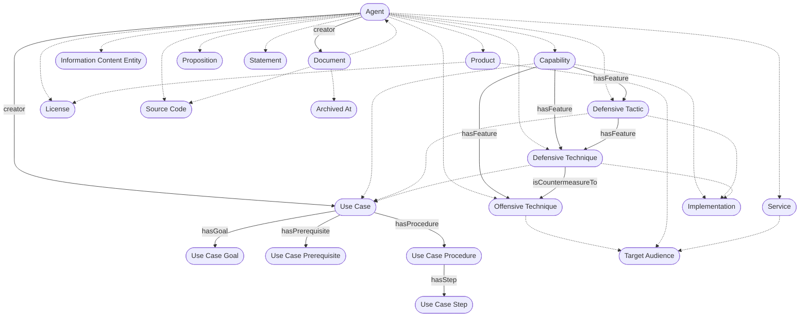
[![](https://mermaid.ink/img/pako:eNqNVttuozAQ_RXkp66URkkpuT1U8honRUoC5VJpt9kHLzgJ2gRTB6rttv33NRAIxKFqxEOYOXPxnJkxb8BnAQUTsOEk3iquvopWkSJ-cIaX7tUT3NAo-fWtkOkm8ha5WGd-uq9pELTgd2NuuD-unhCJye9wFyavlR2e4qVjPGIXItdAwpyuaXQIX6jiEj8JfRmI0f3SePBwA0v9bRQ-p7SEG8upaS-ga5hLZC5dnD95Dka0ZnxPkpBFCmJRIlJVcJTUcpobSIQS_uehL_xXPs2pnIK5bk3Bsk3dQ6IiFmdB6ic1uWU6RpZarovZIcyyKfUOth9FBldPDuUvIoNKbno2wsjUMxVLuU9F_sFJ7UIXFxQ4CUlonQPPwQhmJ_IOwogUR6qRqVxf3737nJKE8feKywage31Xo1JSnfH4ib6snQRpo0wCHvmR5DI_EuTIySV5yYmkO_Ihyys-ZFXJRWuNj4yULJwqm8O25DAVwJTT98uV_RK-WYVPTNoKVzfJGVpY8_xYsGheYx_v8j4jZf9eHOovpyjZyUHlEKWLPEp4QCwVM833lBxELJe1n-6Si08CHoeiwEAb3QtLHWZ7kPtbsQACBUrb8AieVZ3QVNQ7qLEzzvq8McRlNWeM7Ko-mplwfppuJdOdzX5pZnHK6XMaip1DK3PLxjZ-8AwxAbUlodSxre6YT4Oc1cqXibDu2U1HR9SZlwpbunMSGleeHBdbNSeZ7tRj571ZDVRrI7UgmuQ3QHLnFCAX2jPh2tMNvMwWtUv4hiYKTIOQRv75BXDJprHpLwFAR1y7YQAmCU9pB-xFR5PsFbxlpiuQbMXgrcBE_A0I_7MCq-hD2MQk-snYvjTjLN1sy5c0DsS1oIdE3OcCsSa7QwahUUB5PjVgoqq5CzB5A3_BRLvpDkfjvjbWbnu9G3V4O-iAVzDpDwfdm9FYG_a0_vB2qGofHfAvD9rrjtS-qqnqYCDQ48FY6wAahGLhLYovifyD4uM_SDZsbA?type=png)](https://mermaid.live/edit#pako:eNqNVttuozAQ_RXkp66URkkpuT1U8honRUoC5VJpt9kHLzgJ2gRTB6rttv33NRAIxKFqxEOYOXPxnJkxb8BnAQUTsOEk3iquvopWkSJ-cIaX7tUT3NAo-fWtkOkm8ha5WGd-uq9pELTgd2NuuD-unhCJye9wFyavlR2e4qVjPGIXItdAwpyuaXQIX6jiEj8JfRmI0f3SePBwA0v9bRQ-p7SEG8upaS-ga5hLZC5dnD95Dka0ZnxPkpBFCmJRIlJVcJTUcpobSIQS_uehL_xXPs2pnIK5bk3Bsk3dQ6IiFmdB6ic1uWU6RpZarovZIcyyKfUOth9FBldPDuUvIoNKbno2wsjUMxVLuU9F_sFJ7UIXFxQ4CUlonQPPwQhmJ_IOwogUR6qRqVxf3737nJKE8feKywage31Xo1JSnfH4ib6snQRpo0wCHvmR5DI_EuTIySV5yYmkO_Ihyys-ZFXJRWuNj4yULJwqm8O25DAVwJTT98uV_RK-WYVPTNoKVzfJGVpY8_xYsGheYx_v8j4jZf9eHOovpyjZyUHlEKWLPEp4QCwVM833lBxELJe1n-6Si08CHoeiwEAb3QtLHWZ7kPtbsQACBUrb8AieVZ3QVNQ7qLEzzvq8McRlNWeM7Ko-mplwfppuJdOdzX5pZnHK6XMaip1DK3PLxjZ-8AwxAbUlodSxre6YT4Oc1cqXibDu2U1HR9SZlwpbunMSGleeHBdbNSeZ7tRj571ZDVRrI7UgmuQ3QHLnFCAX2jPh2tMNvMwWtUv4hiYKTIOQRv75BXDJprHpLwFAR1y7YQAmCU9pB-xFR5PsFbxlpiuQbMXgrcBE_A0I_7MCq-hD2MQk-snYvjTjLN1sy5c0DsS1oIdE3OcCsSa7QwahUUB5PjVgoqq5CzB5A3_BRLvpDkfjvjbWbnu9G3V4O-iAVzDpDwfdm9FYG_a0_vB2qGofHfAvD9rrjtS-qqnqYCDQ48FY6wAahGLhLYovifyD4uM_SDZsbA)

This graph diagram visually represents the entities and their relationships as defined in your D3FEND schema. Adjustments can be made based on additional details or specific requirements you might have.

## 2.8 CAR (Cyber Attack Response)

### 2.8.1 Summary
The **Cyber Attack Response (CAR)** framework focuses on incident response strategies and protocols for mitigating cyberattacks. It provides organizations with a structured approach to responding to security incidents, including preparation, detection, analysis, containment, eradication, and recovery.

CAR focuses on incident response frameworks and strategies for mitigating cyberattacks. It acts as a central hub connecting defensive measures (D3FEND), attack patterns (ATT&CK), and mitigation protocols.

### 2.8.2 Framework Structure
- **Incident Response Phases**: Includes phases like detection, containment, eradication, recovery, and post-incident analysis.
- **Framework Alignment**: Aligns with NIST's incident response framework and other industry standards.

### 2.8.3 Integration with the Model
- **Nodes**: Represented as response hubs (e.g., "Incident Response Team", "Containment Protocol") with attributes like:
  - **Mass**: Reflects the urgency of the response phase (e.g., containment has higher mass than post-incident analysis).
  - **Energy**: Represents the resources required for execution.
- **Edges**: Represent relationships such as:
  - "CAR-XYZ triggers D3FEND-ABC" (edge with directionality and intensity based on urgency).

### 2.8.4 Relationships with Other Standards
- **CAR ↔ ATT&CK**: Direct mapping to attack patterns requiring specific response actions.
- **CAR ↔ D3FEND**: Integrated into mitigation workflows for real-time defense.
- **CAR ↔ CVSS**: Used to prioritize responses based on vulnerability severity (e.g., high-CVSS vulnerabilities trigger higher-priority CAR protocols).

### 2.8.5 Schema Representation
To create a schema for the YAML files representing Analytics objects from the CAR (Cyber Analytics Repository) standard, we need to identify common elements across these files. Here's a proposed schema based on the provided excerpts:

```yaml
title: ""
submission_date: ""
information_domain:
  - ""
platforms:
  - ""
subtypes:
  - ""
analytic_types:
  - ""
contributors:
  - ""
id: ""

description: ""

coverage:
  - technique: ""
    tactics:
      - ""
    subtechniques:
      - ""
    coverage_level: ""

implementations:
  - code: |-
      # Implementation code here
    type: ""

data_model_references:
  - ""

true_positives:
  - source: ""
    description: ""
    event_snippet: ""
    full_event: ""

d3fend_mappings:
  - iri: ""
    id: ""
    label: ""
```

#### Explanation:

- **Metadata Fields**:
  - `title`, `submission_date`, `id`: Basic identifiers for the analytic.
  - `information_domain`, `platforms`, `subtypes`, `analytic_types`, `contributors`: Categorize and describe the context of the analytic.

- **Content Fields**:
  - `description`: A brief explanation of what the analytic does or represents.
  
- **Coverage**:
  - Describes which techniques, tactics, and subtechniques are covered by this analytic, along with a coverage level (e.g., "Moderate").

- **Implementations**:
  - Contains code snippets for implementing the analytic in various formats (e.g., pseudocode).

- **Data Model References**:
  - Lists references to data models used within the analytic.

- **True Positives**:
  - Provides examples of events that are true positives for this analytic, including source information and event details.

- **D3Fend Mappings**:
  - Maps analytics to D3Fend's threat intelligence framework, specifying IRIs, IDs, and labels.

This schema captures the essential elements found in the provided YAML files while allowing flexibility for additional fields as needed.

### 2.8.6 ERD Representation
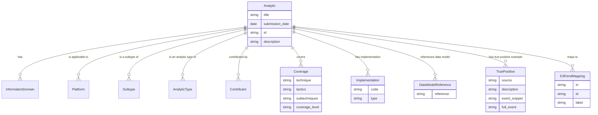
[](https://mermaid.live/edit#pako:eNqNVF2L4jAU_Sshz45oP6z2bVEW5kEYZudpESRNrxo2TTJJKuM6_vdNWlt1W9EiyP04OSf33twjpjIHnGLQC0a2mhQrgdz3QxB-sIyiY237z1jNxBZZZjlcvDmxgEyZFcwYJsXa2x0MyzuuHAzVTFmHqWOn-u8__u_vlxd5RK9iI3VBfPZCFoQJlKIV3hGzwv2AN06sh1R5zCCiFGeUZByQlfdAv8rMHhS0GH-vyiE39yCN_XGNE-53TnsAn0vhypGVVuoKTRsbcpQdPKrGzeUeNNlCXz-A7gT7LLtVt4Q6KtPx-1s1oG6UnqnWHPbAn-hNq62-gDPMRfhroTgUIGzVux75fv66yl3VWuY7E3F78HkcELtxX3QsiCVLR8XfYQMaBO0rpW5iD7h7DvP8Ldz4V0FQ4VMuEj50CW_SMMv2feRGlprC43dyFXMNEnZtBFMKbCe6KTlfVylPNPFGXFNM65xINV74Ir64VzUNf4LIl-5pebrujZhmz2wCTrKrObtT8Rsqr68gylRPGQ_wVrMcp17tABfg9oQ3cSVohe3OzcMKe0xO9B8v_-QwiojfUhYNTMtyu2uMUvktdl6IbYYTAHouS2FxGsTVCTg94i-cxsEwmc7G8SyORqMgTKLJAB9wOk4mw2A6i5NRPE6iJIxPA_y34hwNp-E4jMNwFo2DcDKJggGGnLktsKzXcbWVT_8AsWXN0A)

#### Explanation:

- **Entities**:
  - `Analytic`: Represents the main entity with basic metadata and descriptions.
  - `InformationDomain`, `Platform`, `Subtype`, `AnalyticType`, `Contributor`: Related entities that provide context for the analytic.
  - `Coverage`: Describes which techniques, tactics, and subtechniques are covered by the analytic.
  - `Implementation`: Contains code snippets for implementing the analytic.
  - `DataModelReference`: References to data models used within the analytic.
  - `TruePositive`: Examples of true positive events for this analytic.
  - `D3FendMapping`: Maps analytics to D3Fend's threat intelligence framework.

- **Relationships**:
  - The relationships are represented with one-to-many (`||--o{`) indicating that an analytic can have multiple entries in each related entity.

This ERD provides a visual representation of how the different components of your YAML files relate to each other.

### 2.8.7 Graph Representation
The CAR framework can be represented as a graph with nodes and edges, where:
Certainly! Below is a Mermaid code snippet that represents the schema of your YAML files as a Graph Diagram:

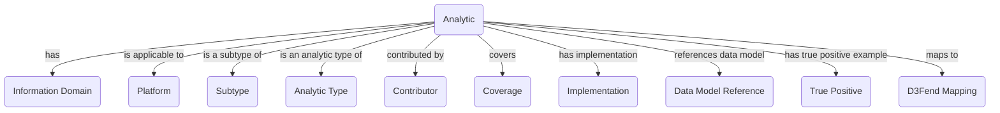

[](https://mermaid.live/edit#pako:eNp1lE2PmzAQhv-KNadWYqMkBAgcKq02qtRDpFWbU8XFASexFmzLmNWmIf-9Y4i9pCWIw3y8M8P4Eb5AIUsGGRw1VSey2-QiFwSfZ0Grs-HFlxycmcPXIfdDHKSuqeFSbGRNuUDRKEaGoJe_VtTYJKqc6XO_2r05K4apm-UzbupuSDuX7MaiFymM5vvWSI2akdcrnOadaXpkvWAwPzepVcVqJkz_4XaNu4DXbaihWzyo6ic7MM1EYbvZIOmjxId9xU637FU23PB3q7Uucf5n2_A7E-WWKsXF0XbsfXILjHbw2z89fetOtOn-ZzAh5A3BThUv6L5ixMjOo3ggJs0AgchD59A8kAp8byFfMUY2UVY4PKwk-3M3hje5Z2FpNZ0HOH0UhN8h6_5hOlGkHayGlBZhbRF2E4wfDDSWpbqxJOyD2oHdHfGJypqqpmdwBx0C_PN4CZltGkDNkKl14WJb5GBOuEoOGZol1W855OKKNYqK31LWrkzL9nhyTqtwK7bhFH9pVBxo1VgJzmT6RbbCQLZM-xaQXeADsmg5S9bpIkqj1Xy-DJNVHMAZskUSz5brNErm0SJZJWF0DeBPP3Q-W4eLMArDOEZ1GqdRAKzkyHE7XCb9nXL9C1Mkdio)

#### Explanation:

- **Nodes**:
  - `Analytic`: The central node representing the main entity.
  - Other nodes represent related entities like `InformationDomain`, `Platform`, etc.

- **Edges**:
  - Directed edges (`-->`) show relationships between the `Analytic` and other entities, with labels describing the nature of each relationship (e.g., "has", "is applicable to").

This graph diagram provides a visual representation of how different components are interconnected within your YAML files.
